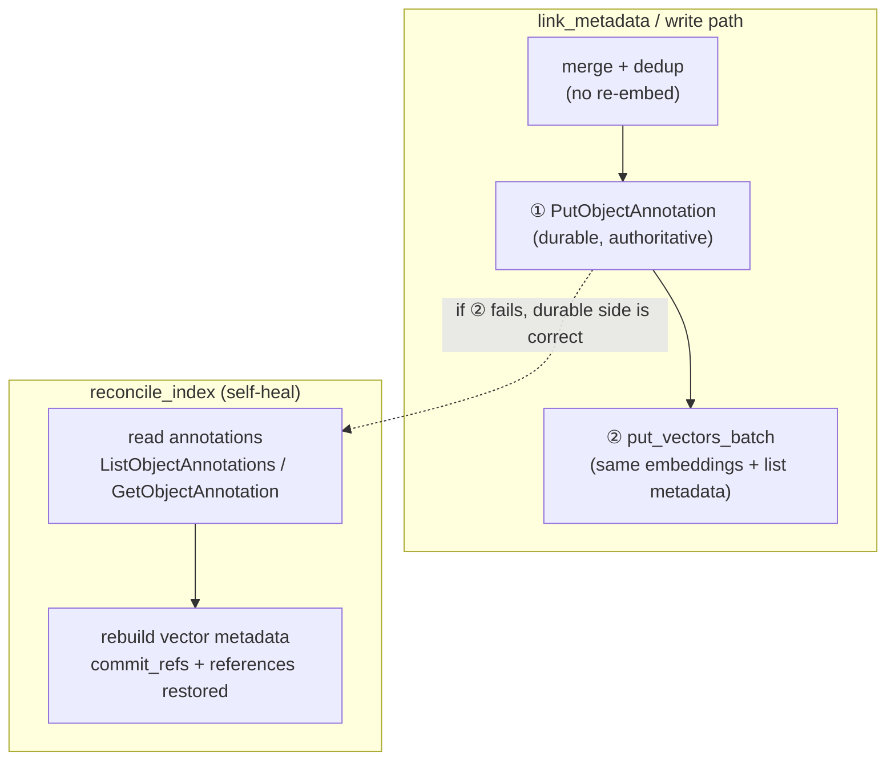

# Annotation-Backed Durable Storage for Mutable Link Fields (commit_refs + references)

## Description

cairn-mcp is growing a first-class `references` field (an artifact pointing to other artifacts by
resolved identifier) alongside the existing `commit_refs` field (an artifact pointing to the git
commits it describes). Both are *mutable, accreting link data*: appended to after the artifact is
first written, deduplicated, and never re-embedded. The 2026-06-16 ADR (ADR-009) stored
`commit_refs` in vector metadata only, which caused `reconcile_index` to silently drop all
backfilled commit links whenever an artifact was re-indexed — a documented V1 limitation.

This ADR records the coupled decisions that close that gap and generalize it to `references`:
the durable copy of both mutable link fields moves to **S3 object annotations**, dual-written with
vector metadata; `link_commit` generalizes into a single `link_metadata` primitive; `reconcile_index`
rebuilds both fields from annotations (resolving the old limitation); overwriting writes read-forward
and re-apply link data; and annotation availability is handled as a feature-level concern, not a hard
server-startup gate. These decisions were taken with the operator in the 2026-07-01 / 2026-07-02
brainstorming session (decisions D11–D15, resolution of OQ2) and correspond to PRD requirements
FR-51 through FR-58 and the revisions to FR-32, FR-17, and FR-28.

## Status

Accepted

This ADR supersedes **only** the "vector-only `commit_refs` storage (V1)" decision of ADR-009
(`adr-2026-06-16-artifact-commit-traceability.md`) and its reconcile consequence. The two other
decisions recorded in ADR-009 remain **in force and unchanged**:

- **ULID `last_edited_ulid`** as the write-time timestamp for session-scoped discovery — unaffected;
  the annotation write path is explicitly designed not to disturb `last_edited_ulid`.
- **The agent-driven AGENTS.md post-commit protocol (Path 2)** as the linking trigger — unaffected;
  it now invokes `link_metadata` instead of `link_commit`, but the trigger mechanism itself is
  unchanged.

## Context

Two forces converged to reopen the V1 storage decision:

1. **`references` needs a durable home too.** The cross-referencing work (see the
   2026-07-01 brainstorming) promotes `references: list[str]` to a first-class `Artifact` field,
   dual-stored exactly like `source_artifacts` (FR-51). It is populated at write time (migration or
   ordinary writes) and backfilled after the fact. Deciding where its durable copy lives forced a
   re-examination of where `commit_refs` lives, since both are the same *kind* of field.

2. **The V1 vector-only limitation is real and now avoidable.** ADR-009 accepted that
   `reconcile_index` drops `commit_refs`, with a future mitigation noted (also write S3 object
   metadata). Grounding during the brainstorming revealed the fix is smaller than the ADR-009
   mitigation assumed: `reconcile_index._reindex_artifact` **already** rebuilds `commit_refs` from
   the S3 side and re-adds it to vector metadata; it returns empty today only because `link_commit`
   never writes `commit_refs` to the S3 object at all. The fix therefore belongs on the **write
   side** (make a durable S3-side copy authoritative), not in reconcile — which needs zero change
   for `commit_refs` and only a small addition for `references`.

The operator then raised the storage-*type* question: S3 offers three custom-metadata mechanisms,
and the choice materially changes the design. Research against primary AWS documentation plus
boto3/moto feasibility checks (2026-07-02) established the constraints:

- **User-defined metadata** (`x-amz-meta-*`) — 2 KB total cap, **immutable after upload**; the only
  way to change it is to copy or re-PUT the whole object. This is what the server uses today for
  identity metadata.
- **Object tags** — 10 max, 256-char values. Too small for accreting link lists. Rejected.
- **Object annotations** — a named payload up to 1 MiB, up to 1,000 per object, **mutable in place
  via `PutObjectAnnotation` without re-PUT and without changing the object's ETag**, durable on the
  object. This kills both V1 risks at once (the 2 KB ceiling and the full-body re-PUT / re-embed /
  `last_edited_ulid` disturbance) and matches the feature's intended purpose (data lineage, audit
  trails).

Annotations carry real, verified caveats that shaped the coupled decisions below: moto has no native
annotation support (must be self-mocked); overwriting an object wipes its annotations; annotations
cannot be set during `PutObject` (only after upload); they are unavailable in some regions and bucket
types; and they require IAM actions beyond core storage.

The `references` reverse-lookup for the delete/archive warning (D13 / FR-56) queries **vector
metadata**, where `references` is stored as `list[str]`; it is therefore independent of the S3
storage-type decision and is recorded here only for completeness. This ADR is about durable link
storage; it does not re-open the tier-based access-control model (ADR-007) — every gate remains
own-scope only.

## Decision

The five decisions below are coupled: they only make sense together.

### 1. Annotation-backed durable storage for `commit_refs` and `references` (FR-54)

The durable copy of both mutable link fields is stored as an **S3 object annotation** — a named
payload, mutable in place via `PutObjectAnnotation`, ~1 MiB, ETag-stable, that does not disturb the
object body, its write-time timestamp, or its embeddings. The division of responsibility across the
three stores is:

| Store | Holds | Mutability |
|---|---|---|
| S3 user-defined object metadata | Immutable identity metadata (type, title, date, tier, visibility, …) | Immutable after upload |
| **S3 object annotations** | **`commit_refs`, `references` (durable copy)** | **Mutable in place** |
| S3 Vectors metadata | `commit_refs`, `references` as `list[str]` (for `$eq` list-membership filtering) + identity metadata | Rewritten on re-put |

This is a deliberate refinement of the intentional S3-vs-vector dual-encoding already documented in
AGENTS.md: immutable identity stays in user-defined metadata; mutable, accreting link data moves to
annotations; vector metadata keeps both fields as lists so filtering (FR-28, FR-51) is unchanged.

### 2. `link_metadata` generalizes `link_commit` (FR-53, supersedes FR-32)

`link_commit` becomes a single `link_metadata` primitive that backfills **both** `commit_refs` and
`references`. Its mechanism is unchanged in spirit — fetch current vectors + embeddings → merge and
deduplicate the supplied values → write back with the same embeddings, so there is **no Bedrock call,
no content mutation, and no change to `last_edited_ulid`** — but the write is now a **dual-write**:
the durable annotation copy is written **first**, vector metadata **second**. This ordering mirrors
`delete_artifact`'s recoverable-state reasoning: if the vector write fails, the durable side is
already correct and a later `reconcile_index` rebuilds vectors from it and self-heals. Merge-and-
deduplicate makes re-runs idempotent. The operation is own-scope only; foreign-scope identifiers are
skipped and counted, exactly as `link_commit` did. `propose_commit_links` (FR-31) is retained
unchanged.

### 3. `reconcile_index` rebuilds both fields from annotations (FR-17, FR-54 — resolves OQ2)

When re-indexing an artifact, `reconcile_index` restores both `commit_refs` and `references` into
rebuilt vector metadata by reading the object's **durable annotations**
(`ListObjectAnnotations` / `GetObjectAnnotation`), not standard object metadata. Because these fields
are durably present on the object, a reconcile run no longer drops them. This directly resolves the
ADR-009 "reconcile drops commit links" limitation and OQ2.

### 4. Overwrite preservation on re-writing writes (FR-55)

Overwriting an S3 object **clears its annotations**. cairn's only in-place re-PUT path is a tier-3
living-document update (tier 2 is overwritten only via the explicit opt-in replacement flag). On such
a write, the write path must **read forward** the artifact's existing `commit_refs` and `references`
and **re-apply** them to both stores after the `PutObject`. Read-forward may source from either
durable store since both hold the value — the existing vector metadata (via `get_vectors`, which the
`PutObject` does not touch) is the simpler source because the write path already touches vectors; the
annotation copy is the equally-valid alternative. Either way, the merged value is written back to
**both** stores. "Preserve" was chosen over "accept clearing" because the silent loss of an
append-only link trail is precisely what cairn exists to prevent.

### 5. Annotation availability / IAM is not a hard startup gate (FR-57)

Annotations back **only** the `commit_refs` / `references` feature — the core content, vector, and
embedding store operates fully without them. Refusing to boot the whole memory server over an
annotation problem would be disproportionate. Therefore availability and IAM are handled at two
levels instead of a startup gate:

- **One-time setup check** — the `setting-up-cairn` installation skill (FR-24) probes annotation
  availability and IAM permission alongside its existing resource-reachability checks, giving the
  operator a friendly early failure with remediation guidance.
- **Graceful runtime handling** — annotation-unavailable / `AccessDenied` errors in `link_metadata`
  and the write path are handled gracefully (structured, actionable errors, never a raw exception) to
  cover post-setup drift (an IAM edit, a bucket or region change) that a one-time check cannot catch.

The four IAM actions the deployment policy must grant (verified 2026-07-02 from the CLI operation
help) are:

- `s3:PutObjectAnnotation`
- `s3:GetObjectAnnotation`
- `s3:ListObjectAnnotations`
- `s3:DeleteObjectAnnotation`

Annotations are **unavailable** in the UAE and Bahrain regions and on **S3 Express One Zone**,
**Outposts**, and **directory** buckets. These are documented in the README, not enforced at startup.

### Dual-write and reconcile flow

## Alternatives Considered

### Durable storage type for the mutable link fields

| Option | Pros | Cons |
|--------|------|------|
| **Chosen** — S3 object annotations | Mutable in place, no full-body re-PUT, ETag-stable, does not disturb body / timestamp / embeddings; ~1 MiB (unbounded link growth); durable on the object so reconcile rebuilds from it; matches the feature's intended lineage/audit purpose | moto has no native support (must self-mock); overwrite wipes them; cannot be set during `PutObject`; region/bucket-type gaps; extra IAM actions |
| User-defined object metadata (`x-amz-meta-*`) | Already used for identity metadata; set atomically in `PutObject`; survives reconcile (reconcile already reads it) | 2 KB total cap (too small for accreting lists); **immutable** — every backfill requires a full `copy_object` / re-PUT, re-triggering re-embed concerns and disturbing `LastModified`; the exact partial-failure and race cost ADR-009 rejected |
| Object tags | Survive reconcile | 10 tags max, 256-char values — far too small for link lists. Rejected outright |
| Vector metadata only (the ADR-009 V1 choice) | Zero extra S3 op in linking; no partial-failure mode beyond the vector write; `read_artifact` already reads vector metadata | Lost on every `reconcile_index` re-index (the limitation being fixed here); no durable record of the link trail |

### Storage mechanism: dual-write vs vector-only

| Option | Pros | Cons |
|--------|------|------|
| **Chosen** — dual-write (durable annotation first, vector second) | `reconcile_index` becomes lossless (rebuilds from the durable side); a failed vector write self-heals on next reconcile; idempotent via merge-dedup; still no content mutation and no re-embed | One extra S3 operation per link; introduces a partial-failure window (mitigated by ordering + reconcile self-heal); depends on annotation availability |
| Vector-metadata-only (V1) | Simplest; no annotation dependency | Reconcile drops the fields — the exact limitation this ADR closes |

### One uniform mechanism for both fields vs a split

| Option | Pros | Cons |
|--------|------|------|
| **Chosen** — annotations for **both** `commit_refs` and `references` | One mechanism for two very similar fields; uniform reconcile, overwrite-preservation, and IAM story; less code and fewer test surfaces | Both fields inherit the annotation caveats (overwrite wipe, moto gap, availability) |
| Split — `references` → user-defined metadata, `commit_refs` → annotations | `references` is bounded and write-settable, so it could ride in identity metadata set atomically at `PutObject`, avoiding the overwrite-wipe for that field | Two divergent mechanisms for two near-identical fields (double the reconcile, overwrite, and test logic); `references` would still hit the 2 KB cap and immutability for backfill. **Operator explicitly rejected the split** ("let's not use 2 different mechanisms for 2 things very similar") |

### Extending annotations to `source_artifacts` (considered, rejected)

| Option | Pros | Cons |
|--------|------|------|
| **Chosen** — leave `source_artifacts` in user-defined object metadata | `source_artifacts` is **write-time-set** (supplied when a synthesis is written; re-supplied on every tier-3 overwrite), never backfilled post-hoc, and already survives reconcile because reconcile rebuilds it from S3 object metadata like `tags`. It has none of the mutability that motivates annotations | Two mechanisms coexist across reference-like fields (annotations for `commit_refs`/`references`; user-defined metadata for `source_artifacts`) |
| Move `source_artifacts` to annotations too, for one uniform store | Conceptual symmetry — every artifact-to-artifact reference list in one place | Adds the overwrite-wipe hazard (every synthesis re-write clears annotations → read-forward + re-apply) for **zero benefit**, since `source_artifacts` is re-supplied at write time and never appended after the fact; it is not reconcile-fragile today. Over-engineering |

The line is drawn by **mutability, not by whether a field is "a reference"**: annotations are for *post-hoc-mutable, accreting* link data (`commit_refs`, `references`); *write-time-set* lists (`source_artifacts`, `tags`) stay in user-defined metadata. This is orthogonal to the unified `referenced_by` warning (ADR-012 D13 / FR-56), which scans **vector metadata** (where `source_artifacts` and `references` are both `list[str]`) and is therefore independent of where each field's durable copy lives — the warning is uniform across reference-like fields regardless of storage.

### Availability / IAM placement

| Option | Pros | Cons |
|--------|------|------|
| **Chosen** — setup-skill probe + graceful runtime handling, **no** startup gate | Proportionate: annotations back only a feature, not the core store, so the server still boots and serves content/search when annotations are unavailable; catches both first-run misconfiguration and post-setup drift | Two places to maintain the check; a misconfigured deployment discovers the limit at feature-use time rather than boot time |
| Hard server-startup gate (a seventh startup check) | Fails fast and loudly; single enforcement point | Disproportionate — refuses to boot the entire memory server over a feature-only dependency; a region/bucket that cannot do annotations still runs the core product fine |

### Overwrite handling

| Option | Pros | Cons |
|--------|------|------|
| **Chosen** — read-forward and re-apply on overwriting writes | Preserves the append-only link trail across tier-3 living-document updates; consistent with cairn's core purpose (never silently lose recalled context) | Adds a read-forward step to the overwrite path; the merged value must be written to both stores |
| Accept clearing on overwrite | Simplest write path | Silently drops accumulated `commit_refs` / `references` on the next content update — exactly the data loss cairn exists to prevent. Rejected |

### Accepted caveats (recorded, not mitigated away)

- **moto has no native annotation support.** The project testing convention mandates moto for S3
  operations. Annotations are self-mocked via a conftest extension, following the exact precedent of
  the `query_vectors` cosine-similarity patch already in `tests/unit/conftest.py`; integration tests
  exercise the real annotation API.
- **Overwrite wipes annotations.** Handled by decision 4 (read-forward), but it is a direct
  interaction with the tier-3 "updated in place" invariant and must be tested explicitly.
- **Deployment-agnostic regional tension.** cairn is deployment-agnostic, yet annotations are
  region/bucket-type dependent. Handled by decision 5 (documented constraint + graceful handling)
  rather than by narrowing the server's supported footprint.

## Consequences

- **Reconcile is lossless for link data (OQ2 resolved).** Any `reconcile_index` run rebuilds both
  `commit_refs` and `references` into vector metadata from durable annotations. The ADR-009 "reconcile
  drops commit links" limitation is closed and the corresponding PRD Known Limitation is superseded.

- **`link_metadata` remains embedding-free and timestamp-neutral.** The dual-write adds an S3
  annotation operation but still makes zero Bedrock calls, does not mutate content, and does not shift
  `last_edited_ulid` — preserving the freshness signal `check_synthesis_freshness` depends on. This is
  verifiable by a Bedrock-client spy, as `link_commit` was.

- **No legacy re-link sweep needed (pre-launch).** In principle, `commit_refs` backfilled under the
  superseded vector-only `link_commit` would live only in vector metadata and need one-time re-linking
  through `link_metadata` so they land in annotations. In practice cairn-mcp has no live deployment
  with such data, so no sweep is planned; this would become relevant only if the annotation feature
  were adopted on a deployment that had already accumulated vector-only `commit_refs`.

- **The core store is unaffected by annotation availability.** Content (S3), search (S3 Vectors), and
  embeddings (Bedrock) all function when annotations are unavailable; only the `commit_refs` /
  `references` feature degrades, with structured errors and setup-time guidance.

- **Write path gains an overwrite-preservation obligation.** Every in-place re-PUT (tier-3 living
  documents; tier-2 explicit replacement) must read-forward and re-apply link data to both stores.
  This is a new invariant to uphold and test whenever the write path changes.

- **New IAM surface for deployments.** The deployment policy must grant the four annotation actions.
  Existing deployments that do not will see the feature degrade gracefully, not a boot failure.

- **Testing cost.** A moto annotation extension must be built and maintained alongside the existing
  `query_vectors` extension, and the overwrite-preservation and reconcile-from-annotation paths need
  dedicated coverage. This is the accepted price of the uniform-annotations choice.

- **ADR-009 is partially superseded, not retired.** Its ULID and AGENTS.md-protocol decisions stay in
  force; only the vector-only `commit_refs` storage decision and its reconcile consequence are
  replaced by this ADR.
