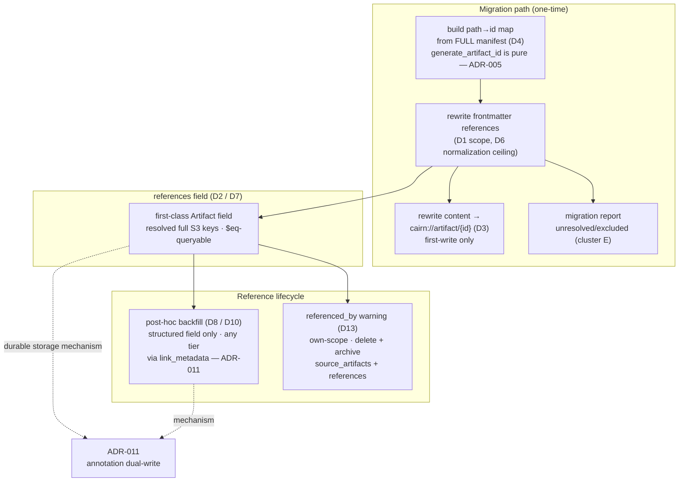

# Artifact Cross-Referencing — First-Class references Field, Migration Rewrite, and referenced_by Warning

## Description

cairn-mcp had no first-class way for one artifact to point at another. Existing project
documentation frequently cross-references sibling files by repo-relative path — in an OKF/house
frontmatter `references:` list or as in-body markdown links — but a file path and a cairn
`artifact_id` are fundamentally different addressing schemes, and nothing in the migration path or
the write path carried those links across the boundary. This ADR records the **design of the
cross-referencing capability**: promoting `references` to a first-class `Artifact` field, the scope
and normalization ceiling of the migration-time rewrite, the content-rewrite target format,
forward-reference resolution, the mutability-by-representation principle, agent guidance, a deferred
backfill skill, and a unified own-scope `referenced_by` delete/archive warning. It corresponds to
PRD requirements FR-51, FR-52, FR-56, and FR-58 (and the NFR-12 AGENTS.md-guidance clause) and to
brainstorming decisions D1–D10 and D13.

### Boundary with ADR-011

This ADR and ADR-011 (`adr-2026-07-03-annotation-backed-link-storage.md`) are companions carved
from the same 2026-07-01 / 2026-07-02 session and must be read together, but they own disjoint
concerns:

- **ADR-011 owns the durable storage mechanism** for the mutable link fields (`commit_refs` and
  `references`): the choice of S3 object annotations, the annotation-first dual-write with vector
  metadata, the `link_metadata` primitive that generalizes `link_commit`, `reconcile_index`
  rebuilding both fields from annotations, overwrite preservation on re-PUT, and annotation
  availability / IAM handling without a hard startup gate.
- **This ADR owns the cross-referencing design**: what the `references` field *is* and how it is
  used, the migration rewrite behaviour, forward-reference resolution, the mutability principle,
  the `referenced_by` warning, and failure handling.

Where a decision here depends on the durable-storage mechanism (D2's durable copy, D8's backfill
mechanism), it **defers to ADR-011** and does not re-decide it.

## Status

Accepted

## Context

Grounding during the 2026-07-01 session confirmed a genuine gap, not a hypothetical one:
`src/cairn_mcp/artifact.py` had no `references` field (the frontmatter convention lived only in
project documentation style and never reached the `Artifact` model), and the migration skill's
descriptor-building steps read file content verbatim into the stored `content` field with no
rewriting logic anywhere. Once a file becomes an artifact, a reference embedded in it — or in
another file pointing at it — may target: an artifact already migrated, one scheduled later in the
same batch, one migrated in an earlier or later session, one permanently excluded (e.g. ADRs kept
git-only per the project's `adr_strategy`), or a target that no longer exists.

Two framing moves shaped the whole design:

1. **Inversion.** Asking "what would make this actively harmful, not just incomplete?" surfaced
   **migration fragility / complexity** as the primary risk to avoid — not silent broken links or
   content mutation per se. This is why the migration rewrite is deliberately narrow (frontmatter
   only, bounded normalization, transparent fall-through) rather than an ambitious link repairer.

2. **Scope-reframing.** The problem is a **general cross-referencing gap** (cairn had no
   first-class artifact-to-artifact reference), not a migration-only concern. This is why the field
   and mechanism serve ordinary `write_artifact` calls, not just the one-time import.

Codebase archaeology established that the capability can be built almost entirely from existing,
shipped plumbing rather than new mechanisms: `source_artifacts` (used by the `synthesis` type)
already establishes the exact dual-storage pattern; `clients/filter.py`'s `$eq` operator already
does generic list-membership matching for any field name; `cairn://artifact/{id}` is already a
registered MCP resource URI in `resources.py`; `delete_artifact`'s synthesis-reference check
already proves the reverse-lookup pattern in production; and `generate_artifact_id` is a pure
function of type + title (+ date for tier 2), per ADR-005, which makes a target's future identifier
computable before that target is ever written.

A `challenging-assumptions` pass surfaced the tier-mutability tension recorded in D8 (below) and
explicitly closed the cross-team leakage question (below). This ADR does not re-open the
tier-based access-control model (ADR-007); every reverse-lookup gate here remains own-scope only.

## Decision

### D2 — `references` promoted to a first-class `Artifact` field (FR-51)

`references: list[str]` becomes a first-class field on the `Artifact` model, storing **only
resolved full S3 keys** — the operative `artifact_id` (e.g. `{write_prefix}/{id}{ext}`), not a bare id (**revised 2026-07-04, review C1**: the canonical form is the full S3 key, matching what the read gate, `referenced_by` `$eq`, and vector metadata use) — no `cairn://` prefix, no raw path text. It is **dual-stored
following the same pattern as `source_artifacts`** — a durable copy on the S3 object (location and
encoding recorded in ADR-011) and a `list[str]` in S3 Vectors metadata — and it is queryable via
the existing generic `$eq` list-membership filter with AND semantics (all supplied identifiers must
be present).
It is accepted at write time and returned in `write_artifact`, `read_artifact`, and
`list_artifacts`; an absent or empty `references` is the default and raises no error; legacy
artifacts return `[]`.

This decision reuses **100% existing plumbing** — the dual-storage pattern, the list-membership
filter, and the reverse-lookup pattern all already exist for `source_artifacts` and `tags` — which
is precisely what justified promoting a schema field over a looser convention. **Where the durable
copy of `references` physically lives (S3 object annotations, dual-written vectors-second) is
recorded in ADR-011, not here.** This ADR records only that `references` is a first-class,
resolved-identifier, `$eq`-queryable field.

### D1 / D5 / D6 — Migration rewrite scope and normalization ceiling (FR-52)

The migration frontmatter rewrite is deliberately narrow, in direct service of the
migration-fragility risk the inversion surfaced:

- **D1 — Frontmatter only.** Only the frontmatter `references:` YAML list is mechanically
  rewritten. **In-body markdown links are explicitly out of scope** for automated rewriting —
  matching them would require fragile regex over inconsistent free-form prose (the original
  Windows-backslash-path example illustrated exactly this messiness).
- **D5 — `http(s)://` entries are always left untouched**, never treated as path-resolution
  candidates.
- **D6 — Best-effort, explicitly bounded path normalization.** Convert backslashes to forward
  slashes; attempt the lookup stripping only a small set of common leading-prefix variants (`./`, a
  single leading `/`, or none). **No match → leave the entry completely untouched** and fall
  through to the general search-based fallback. Repairing genuinely broken or inconsistent source
  references beyond this ceiling is explicitly **not cairn's job**.

### D3 — Content-rewrite target format (FR-52)

Resolved references are rewritten **in the stored content** to the existing
`cairn://artifact/{id}` MCP resource URI — an already-registered scheme, not a new one. Unresolved
or excluded targets keep their **original raw path text untouched**. Mixed addressing across the
corpus (`cairn://…` next to `/docs/…`) is the **correct permanent steady state, not a defect**: the
corpus will always contain a blend of resolved cairn URIs and raw paths, and that is expected.

### D4 — Forward-reference resolution via a manifest-wide path→id map (FR-52)

Migration builds a **single authoritative path→`artifact_id` map from the FULL `CAIRN_IMPORT.yaml`
manifest — every entry, any status, across sessions — before any writes happen.** Because
`generate_artifact_id` is a **pure function** (ADR-005), each entry's identifier is computable from
its type + title (+ date) as soon as those are known, with no dependency on write order. This turns
two otherwise-hard problems into non-problems:

- **Same-batch forward references** — a file that references a sibling scheduled for import later in
  the same batch resolves, because the sibling's identifier is already in the map.
- **Multi-session retries** — building the map from the *full* manifest (not just the subset being
  retried) means a file successfully written in an earlier session never wrongly appears unresolved
  to a reference discovered during a later retry.

### D7 — General applicability (FR-51)

The same field and mechanism serve **any ordinary `write_artifact` call**, not just migration. An
ongoing agent session may populate `references` directly with known `artifact_id` values. The
capability is a general cross-referencing feature that migration happens to be the first heavy
consumer of.

### D8 — Mutability split by representation (design principle)

Mutability is split **by representation, not by a single retroactive-editing rule**:

- The **structured `references` field** may be backfilled post-hoc on **any tier**, mirroring the
  existing `link_commit`/`link_metadata` behaviour (re-fetch existing vector + embedding, merge
  metadata, re-put with no re-embedding, no content touch). The `challenging-assumptions` pass
  established that tier 2's "append-only" rule is about **content**, not all metadata:
  `link_commit` already backfills tier 2 structured metadata today, so this is precedented, not new.
- **Stored content text** is only ever rewritten to `cairn://artifact/{id}` at **first-write time**
  (migration or a new session write). It is **never retroactively patched** into an already-written
  tier 2 artifact. Tier 3 keeps its existing "updated in place" content freedom (ADR-007).

The WHY is stronger than the append-only principle alone: a content rewrite re-triggers section
parsing (`parse_sections`) and Bedrock **re-embedding**, and shifts `last_edited_ulid` — a
freshness signal `check_synthesis_freshness` depends on. Retroactively patching content would incur
real cost and corrupt a freshness signal, quite apart from the tier-2 append-only contract.

The **mechanism** by which the structured backfill is made durable (annotation dual-write) is
recorded in **ADR-011**; the tier semantics this principle leans on are recorded in **ADR-007**.
This ADR records only the *principle* — which representation may change when.

### D9 — AGENTS.md guidance (NFR-12)

The AGENTS.md usage snippet written by the installation skill gains two guidance clauses:

1. **Proactive `cairn://` referencing** — when writing an artifact that references a target already
   known to be a cairn artifact, use its `cairn://artifact/{id}` URI rather than a raw path.
2. **Reference healing** — an agent that encounters a broken or unresolved reference during normal
   work should search for the likely target and **propose a fix to the operator, never silently
   rewrite it**.

### D10 — Decoupled, optional post-hoc reference-backfill cleanup skill (FR-58)

A separate, decoupled, **skippable-by-default** cleanup skill — mirroring the existing commit-refs
backfill pattern — is the vehicle for the D8 structured-field backfill. It runs **post-hoc**
(decoupled in execution time, not inline with the write) because a reference can only be backfilled
once its target artifact exists and is resolvable: references discovered after a write, or targets
absent from the original migration batch, cannot be resolved inline and are filled in by this later
pass. The skill is **in scope for this phase** (Phase 12, T53 / FR-58) — "post-hoc" and "decoupled"
describe *when* it runs, not a deferral to a future milestone. When run, it content-scans artifacts
against the migration path→id map, presents a **dry-run batch report** of proposed `references`
backfills for operator review, and applies confirmed backfills via `link_metadata` (ADR-011). It
never rewrites stored content and never mutates metadata without operator confirmation. Only its
remaining fine detail (discovery-scan specifics, per-artifact vs batch approval UX) is non-blocking
OQ1-cleanup, left to the spec.

### D13 — Unified own-scope `referenced_by` warning on delete and archive (FR-56)

`delete_artifact`'s existing synthesis-only reference check is generalized into a **single unified
own-scope `referenced_by` check** covering **both** `source_artifacts` (synthesis provenance) and
the new `references` field, for artifacts of any type. It is **warn-but-don't-block** and applies to:

- **`delete_artifact`** — permanent, so the warning is **stronger**.
- **`archive_artifact`** — reversible, so the warning is **informational**.

Two hard constraints hold: the check is **strictly own-scope only** (the existing non-negotiable
rule — never reveal foreign-scope identifiers; else it re-opens the cross-scope leakage closed
below), and it uses **server-side `$eq` list-membership filtering** (`{"references": {"$eq":
target}}`) rather than fetch-all-then-filter-in-process. ADR-011 mentions this reverse-lookup only
"for completeness" because it queries vector metadata and is independent of the storage-type
decision; the **design decision itself is recorded here**.

### Failure handling — unresolved, excluded, never-migrated, missing targets (cluster E)

For any reference target that does not resolve — unresolved, excluded (e.g. git-only ADRs),
never-migrated, or missing — the migration **leaves the original path text untouched** (transparent:
still human-readable, still valid within the source repo) and **surfaces the case in the migration
report** for the operator. It is **never dropped silently**; silent dropping loses information
without telling anyone and was rejected outright.

### Closed as not applicable — cross-team reference leakage

The concern that a human-readable `artifact_id` in a `references` entry could leak a foreign team's
hidden artifact was raised, examined, and **explicitly closed as not applicable**. A `references`
entry can only ever hold a **resolved** `artifact_id`, which means the target is already a real
cairn artifact reachable by *some* existing path. No new cross-scope validation or restriction is
added for this case.

### Feature composition

## Alternatives Considered

### Timing — when reference resolution happens (cluster B / D)

| Option | Pros | Cons |
|--------|------|------|
| **Chosen** — migration-time rewrite of the structured field + first-write content rewrite, forward-safe via the manifest-wide map | Resolution happens once, deterministically, before any write; the pure-function id scheme makes forward references a non-problem; no per-read cost | The map must be built up front from the full manifest; content resolved at write time is fixed thereafter (structured field can still be backfilled) |
| Read-time resolution (store raw text, resolve on display) | No migration mutation at all; always reflects current state | Pushes resolution cost and logic onto every reader/client; no queryable structured field; broken links stay invisible until a read |
| Hybrid (store raw text plus a resolved side-mapping) | Keeps original text verbatim while still offering resolved data | Two parallel representations to keep consistent; the structured `references` field already gives the resolved view without duplicating raw text |
| Do nothing programmatic (leave links as dead historical record) | Zero implementation | Leaves the core gap unsolved — recalled artifacts cannot navigate to each other |

### Target format for the rewritten reference (cluster C)

| Option | Pros | Cons |
|--------|------|------|
| **Chosen** — resolved full-key `artifact_id` in the structured field + `cairn://artifact/{id*}` in content | Reuses an already-registered MCP resource URI; the field stays clean resolved ids for `$eq` filtering; content is navigable in MCP hosts | Corpus permanently mixes `cairn://` and raw paths (accepted as correct steady state, not a defect) |
| Bare `artifact_id` string dropped into the content link target | Shortest text | Not a resolvable URI in MCP hosts; ambiguous with ordinary text; no navigation affordance |
| Footnote/table appended mapping old path → new identifier | Preserves original text exactly | Adds boilerplate to every migrated body; still leaves the in-line link dead; no queryable structure |

### Overall shape — the four candidate directions (synthesised, not chosen singly)

| Option | Pros | Cons |
|--------|------|------|
| **Chosen** — synthesise all four: first-class field (D2) + reuse the `cairn://` URI (D3) + bounded normalization with search-based fall-through (D6) + a decoupled optional backfill step (D10) | Each direction covers a gap the others leave: queryable structure, navigable content, graceful failure, and post-hoc cleanup without server complexity | More moving parts than any single direction; requires the boundary discipline with ADR-011 |
| First-class schema field alone | Queryable, structured | Says nothing about content rewrite, failure handling, or backfill |
| Pure convention / search-based resolution, no new mechanism | Zero schema change; nothing to migrate | No queryable field; every consumer re-implements resolution; no durable link record |
| A general `cairn://` resolver alone | Navigable content | No structured field to filter on; no migration story; no reverse-lookup |

### Ownership — who performs the rewrite (cluster F)

| Option | Pros | Cons |
|--------|------|------|
| **Chosen** — manifest-driven rewrite in the migration skill + a decoupled optional backfill skill; `references` accepted by the ordinary server write path | Keeps the one-time operational concern out of the server core (the original migration brainstorming explicitly avoided adding server complexity for it); the server only gains a general field, not migration logic | Two skills to maintain; the skill must build and hold the path→id map |
| Server-side rewrite inside `migrate_artifacts` | Single enforcement point; agent does less | More invasive; bakes a one-time operational concern into the server; harder to evolve than a skill |
| Agent does it ad-hoc in-context per file | Fine for the small-batch path | Fragile for the large-batch path where full content is not read until the final write step; no single authoritative map |

## Consequences

- **A general cross-referencing capability, not just a migration fix.** Any artifact — migrated or
  written live — can now point at another by resolved identifier, be filtered by it (`$eq`), and be
  found by a reverse-lookup. The migration rewrite is one consumer of a general field (D7).

- **The migration rewrite is intentionally narrow.** Frontmatter-only, `http(s)://`-safe, bounded
  normalization with transparent fall-through (D1/D5/D6). This is the deliberate answer to the
  inversion finding that *migration fragility*, not broken links, is the primary risk. Genuinely
  broken source references are surfaced in the report, not repaired.

- **Mixed addressing is permanent and correct.** `cairn://…` links coexist with raw paths across
  the corpus (D3). Tooling and readers must treat this blend as the expected steady state.

- **Content is rewritten once; structure is mutable forever.** The D8 split means a reference can
  be backfilled into the structured field on any tier post-hoc (via `link_metadata` — ADR-011)
  without re-embedding or shifting `last_edited_ulid`, while content text is fixed at first write.
  This preserves both the tier-2 append-only content contract (ADR-007) and the freshness signal.

- **Delete and archive gain a unified own-scope warning.** D13 generalizes the synthesis-only check
  (FR-21) to cover `source_artifacts` + `references` on both operations, server-side filtered,
  own-scope only. Deleting or archiving a still-referenced artifact warns but never blocks, and
  never reveals foreign-scope identifiers.

- **No new cross-scope validation.** The leakage question is closed: a `references` entry can only
  name a real, resolved cairn artifact, so no target can be leaked that is not already a cairn
  artifact. The `referenced_by` check stays own-scope only per ADR-007.

- **A deferred, optional cleanup skill exists but is skippable.** D10's backfill skill is decoupled
  and dry-run-first; declining it leaves every artifact unchanged. Its detailed UX is a non-blocking
  open item for the spec.

- **Boundary discipline with ADR-011 must be maintained.** This ADR deliberately does not decide
  where the durable copy lives, how the dual-write is ordered, how reconcile rebuilds it, or how
  overwrite is preserved — all of that is ADR-011. Future revisions must keep the storage mechanism
  in ADR-011 and the cross-referencing design here, and cross-reference rather than duplicate.
