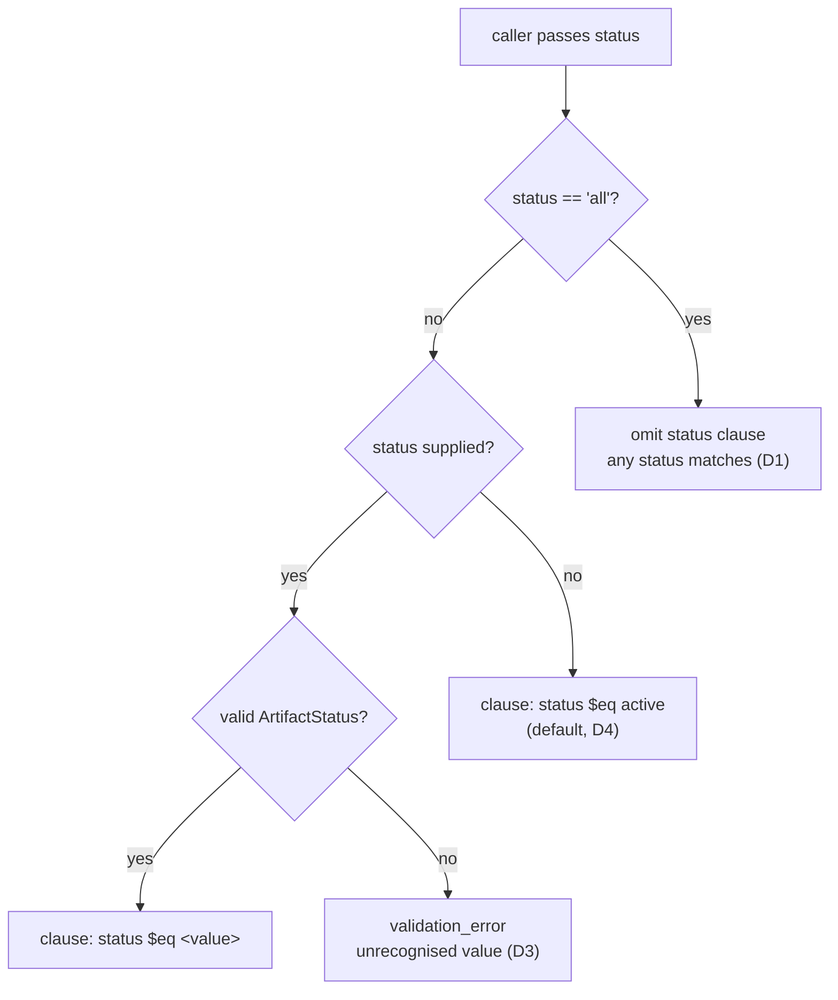

# The `status="all"` Sentinel as a Cross-Tool Convention for Query-Shaped Tools

## Description

`ArtifactStatus` enumerates the statuses actually persisted to AWS metadata: `active` and
`inactive`. `"all"` is not one of them and never will be — it is a sentinel meaning *apply no
status filter at all*, and it therefore has to be special-cased ahead of enum validation rather
than passed through it. `list_artifacts` honoured that sentinel; `search_artifacts` did not, and
rejected it as a validation error. This ADR records the fix and, more importantly, promotes the
sentinel from a property of one tool to a **convention binding every query-shaped tool that
exposes a `status` parameter**.

## Status

Accepted

## Context

Two tools accept a `status` filter argument: `list_artifacts` and `search_artifacts`. In their
signatures and in their tool descriptions the parameter reads as the same parameter. It was not.

`list_artifacts` recognised `"all"`: when the caller passes it, the status clause is dropped from
the metadata filter entirely. Any other value, *including* the `"active"` default, is validated
against `ArtifactStatus` and filtered normally. That behaviour is recorded in
`docs/specs/p3-t10-list-artifacts.md` under its `> **Revised (2026-07-05)**` note, which was
written to close a bug in the studio's browser UI.

`search_artifacts` validated `status` against `ArtifactStatus` unconditionally. `"all"` is not an
enum member, so the call returned a `validation_error`.

The root cause is not the missing branch itself but how it came to be missing: **the sentinel was
introduced as a point fix to the tool where the bug was observed, and was never propagated to its
sibling.** The 2026-07-05 revision solved a reported symptom on the listing path. Nothing at the
time asked whether the other tool taking the same argument needed the same treatment, and nothing
in the specs said it did. A convention was created without being written down as one, which is
indistinguishable from no convention at all.

The record is in fact less forgiving than "nobody noticed". A later remediation pass that added
enum validation for the `type`, `tier`, and `status` filter values edited **both** tools in the
same change, and its own completion note states that it preserved the `status="all"` sentinel in
`list_artifacts`. The sentinel was therefore in view, named, and handled on one path while the
other path had validation tightened around it. The divergence survived the one moment most likely to catch it, because the
work was framed as "validate filter values in each tool" rather than "make this parameter behave
the same way everywhere it appears". That framing is what this ADR replaces.

The divergence surfaced through the studio, where the status facet defaults to `"all"`. That left
the browser UI with two options, both wrong:

- Forward the facet's value to `search_artifacts` — searching errors out on the facet's own
  default state, so search is broken until the operator changes a filter they never set.
- Omit the argument when the facet reads "All" — search silently falls through to the server's
  active-only default while the UI continues to display "All". The interface then lies about what
  it searched, and archived artifacts are missing with no indication that a filter was applied.

The second is the more damaging failure: a wrong answer presented as a complete one. It is also
the failure the 2026-07-05 note already describes for the listing path — the same bug, one tool
over, because the same reasoning error was available to make twice.

Three forces bound the answer:

1. **`"all"` cannot become an `ArtifactStatus` member.** Enum values are the exact strings
   persisted to AWS metadata. Adding `"all"` would make it a writable status, corrupting stored
   data to solve a query-filter problem.
2. **Filtering on the literal string is silently wrong, not loudly wrong.** `{"status": {"$eq":
   "all"}}` is a structurally valid filter that no stored artifact can ever match. It returns zero
   results and no error, on every call, forever. Omitting the clause is the only expression of
   "no status constraint" the filter language offers.
3. **Unrecognised values must still fail.** If the sentinel were implemented by falling back to
   "omit the clause" for anything that fails enum validation, a typo like `status="activ"` would
   quietly widen the result set instead of reporting the typo. The sentinel must be a single
   recognised literal, checked before validation — not a catch-all after it.

## Decision

### D1 — `"all"` is a sentinel meaning "omit the status clause", checked before enum validation

A tool exposing `status` compares against the literal `"all"` **first**. On a match, no status
clause is added to the metadata filter at all. The value is never forwarded to `ArtifactStatus`,
never written to metadata, and never compared against a stored status.

The clause is omitted rather than widened into an explicit disjunction over the enum members. An
`$in` over `["active", "inactive"]` would produce the same result set today and become wrong the
moment a third status is added — it encodes "every status I knew about when this was written"
where the intent is "any status".

### D2 — Every query-shaped tool exposing `status` honours the sentinel identically

This is the operative decision. `status="all"` is a property of the `status` parameter, not of any
one tool that happens to take it. Any tool that exposes `status` as a caller-facing filter —
`list_artifacts` and `search_artifacts` today, any tool added later — accepts `"all"` with exactly
the semantics in D1.

A tool that takes a `status` filter and rejects `"all"`, or accepts it and interprets it as
anything other than "no status constraint", is out of compliance with this ADR. This holds even
where no caller is known to pass it: the cost of the branch is three lines, and the cost of the
divergence is an interface that lies.

The converse is also bounded: a tool that does **not** expose a caller-facing `status` parameter
is not covered and owes nothing. The convention attaches to the parameter, not to the fact of
querying the index.

### D3 — Strict widening: nothing previously valid changes behaviour

Extending the sentinel to `search_artifacts` changes the outcome of exactly one input that
previously produced a `validation_error`. Specifically:

- `status` omitted — unchanged. Still defaults to active-only.
- `status="active"` — unchanged. Validated, filtered normally.
- `status="inactive"` — unchanged. Validated, filtered normally; this is the documented way to
  retrieve archived artifacts.
- Any unrecognised value — unchanged. Still `validation_error`. `"all"` is the only recognised
  sentinel; there is no second spelling, no case-insensitive match, and no wildcard.
- `status="all"` — previously `validation_error`, now returns matches regardless of status.

No stored data, no index content, and no default is touched. A caller that never passes `"all"`
cannot observe that this decision was made.

### D4 — The default stays active-only; the sentinel is the documented override

Both tools continue to default to active-only when `status` is not supplied. Archiving still means
"excluded from results unless asked for", which is what FR-05 requires by default and what its
"by default" wording already permits to be overridden. `"all"` is one of the two explicit
overrides — alongside `status="inactive"` — not a change to the default.

### What this decision does not touch

The status **gate** itself is unchanged: the filter clause, its placement in the combined `$and`,
and the cross-scope gate that ANDs with it are all as previously specified. This decision governs
only whether the status clause is emitted, never what it contains when it is, and never any other
clause in the filter.

## Alternatives Considered

| Option | Pros | Cons |
|--------|------|------|
| **Chosen** — `"all"` is a pre-validation sentinel that omits the status clause, binding on every tool exposing `status` | Correct for any future status without revision; strict widening, so nothing previously valid changes; typos still rejected; one rule to state and to check when adding a tool | The branch must be written in each tool that takes `status`; the convention is enforced by this ADR and by review, not by the type system |
| Add `ALL` to the `ArtifactStatus` enum | No special-casing; enum validation accepts it uniformly | Enum values are the exact strings persisted to AWS metadata — `"all"` would become a writable status and could be stored on an artifact, corrupting data to solve a query-filter problem |
| Filter on the literal string `"all"` | No branch at all; the value flows through the existing path untouched | Matches no stored status, so every such call returns zero results with no error — the silently-wrong outcome this ADR exists to prevent |
| Widen to `$in ["active", "inactive"]` when `"all"` is passed | Explicit; the emitted filter states exactly what it matches | Enumerates the statuses known at the time of writing; silently excludes any status added later, at which point "all" no longer means all |
| Treat any value failing enum validation as "no filter" | Sentinel needs no special-casing; tolerant of caller spelling | A typo (`"activ"`) silently widens the result set instead of reporting the error; loses the validation boundary D3 preserves |
| Leave `search_artifacts` rejecting `"all"`; have each caller special-case it | No server change | Pushes a server-side data-model detail into every client; the studio would have to choose between erroring on its own default and lying about what it searched — the exact bug being fixed |
| Extract the branch into a shared helper both tools call | Single implementation; convention enforced mechanically | The two tools build their status clause into differently shaped filters — a list of `$and` clauses in one, a single optional clause passed to the shared re-fetch loop in the other — so a shared helper would abstract three lines into a parameterised indirection; recorded as a reasonable future move if a third tool appears |

## Consequences

- **The studio's status facet is honest on both read paths.** The facet's `"all"` default is
  forwarded to whichever tool serves the current view, and both interpret it the same way. The UI
  no longer has to choose between erroring on its own default state and displaying a filter it did
  not apply.

- **The shared re-fetch loop now accepts an absent status filter.** `run_search_loop` in
  `_search_helper.py` takes an optional status clause and appends it only when present, rather
  than requiring one. This keeps the loop the single source of truth for filter assembly — the
  alternative was for the tool to hand the loop a clause meaning "match everything", which the
  filter language cannot express.

- **`synthesise_artifacts` is unaffected, and this was verified rather than assumed.** It exposes
  no caller-facing `status` parameter at all — its signature takes `query`, `top_k`, `type`,
  `tags`, `team`, and `project`, and it hardcodes an active-only status filter internally. There is
  therefore no sentinel to honour and no divergence to fix. D2 does not bind it today. It *would*
  bind it the moment a `status` parameter were added to it, which is the point of stating the
  convention in terms of the parameter rather than in terms of the tools that exist now.

- **New query tools carry a checklist item.** Any tool added with a `status` filter must implement
  D1. This is a review obligation, not a compile-time one — the convention is stated here and in
  both tool specs, and nothing in the type system will catch its absence.

- **The failure mode is recorded, not just the fix.** The divergence existed because a point fix
  was applied where a symptom appeared without asking which siblings shared the parameter. That
  question — *which other tools take this argument, and do they now disagree?* — is the durable
  output of this ADR. The `"all"` sentinel is one instance of a class: any caller-facing parameter
  shared by more than one tool can drift the same way.

- **Archived artifacts are now reachable through semantic search.** Previously the only way to
  search across archived and active artifacts was two calls with two different `status` values,
  merged by the caller. This is a capability gain, and it means archived content can surface in
  search results where it could not before — but only when explicitly asked for, since D4 leaves
  the active-only default in place.

- **No security or access-control consequence.** The status clause is orthogonal to the scope
  gate. Passing `status="all"` removes only the status constraint; the cross-scope filter — own
  scope unrestricted, foreign scope limited to tier 3 with `visibility="shared"` — is ANDed in
  separately and is untouched. An archived foreign-scope tier 2 artifact remains as invisible as
  an active one.

- **Observability is unchanged and adequate.** Both tools already log their result counts, and a
  rejected status value returns a structured `validation_error` naming the offending value. The
  omitted-clause path needs no additional signal: it is not an error condition, and the emitted
  filter is reconstructible from the request arguments.

## Proposed Revision — 2026-09-25

> **Pending.** Proposed by ADR-016 (draft, awaiting review); takes effect when ADR-016 is
> accepted. Until then this ADR's Decision stands as written above.

[The OKF v0.2 adoption ADR](adr-2026-09-25-okf-v02-adoption.md) proposes renaming the archive marker
this ADR filters on: `status` (`active` / `inactive`, `ArtifactStatus`) becomes `archived: bool`, and
`ArtifactStatus` is deleted, because `status` now carries the OKF document lifecycle
(`draft | stable | deprecated`).

- **The convention carries over to the boolean**: `archived=false` is the default, `archived=true`
  replaces `status="inactive"`, and "all" is expressed by omitting the clause, exactly as D1
  requires — never by matching a sentinel against stored data. The parameter shape by which a
  caller asks for "all" is left to the spec.
- **D2 still attaches to the parameter.** A caller-facing `status` parameter now means a lifecycle
  filter; if a tool exposes one, it honours `"all"` identically.
- **D4's default widens from active-only to in-force** — `status != deprecated AND archived == false`
  — on search, listing and synthesis preparation. `synthesise_artifacts` may therefore gain a
  caller option for full lineage, at which point D2 binds it, as the Consequences anticipated.
