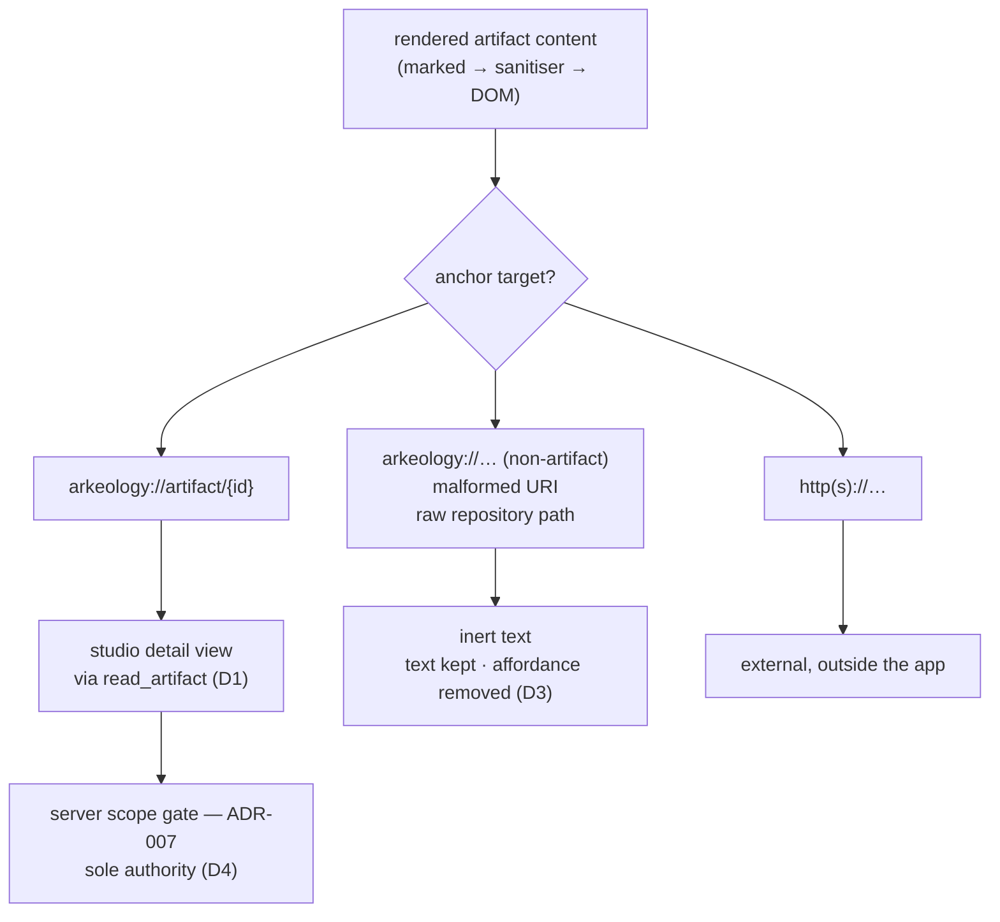

# Studio-Side Resolution of arkeology:// Links on the Human Read Surface

## Description

ADR-012 decided that migration rewrites resolved cross-references in stored artifact content to the
`arkeology://artifact/{id}` MCP resource URI, and accepted mixed addressing — resolved
`arkeology://…` URIs coexisting with untouched raw repository paths — as the correct permanent
steady state. What no decision covered is **what a read surface does when it renders one of those
URIs**. This ADR records that Arkeology Studio resolves `arkeology://artifact/{id}` itself, in-app,
and that everything it cannot resolve renders as inert text. It records a read-surface contract
only; it does not re-open ADR-012's rewrite format, its discovery boundary, or its mixed-addressing
consequence.

## Status

Accepted

## Context

`arkeology://` is a scheme the MCP host and the Arkeology server understand — it is registered in
`resources.py` as the `arkeology://artifact/{id*}` resource template — but it is not a scheme a
browser understands. Arkeology Studio renders artifact markdown in a sandboxed iframe, so every
cross-reference ADR-012 resolved arrives at the one surface built for humans as an anchor whose
target the browser cannot follow. The cross-referencing feature therefore made the corpus navigable
for agents and, on the human surface, simultaneously less navigable than the raw paths it replaced:
before the rewrite a reader at least saw a path they could open in their editor.

Three forces bound the answer:

1. **Only one human surface exists.** `arkeology_studio` is the human reading entry point. There is
   no second renderer to defer the problem to, and no browser-resolvable form of the scheme to
   delegate to.
2. **The addressing scheme must stay singular.** ADR-012 chose `arkeology://artifact/{id}` precisely
   because it was an *already-registered* scheme rather than a new one. Any fix that introduces a
   parallel, browser-facing address form would spend that decision's entire rationale.
3. **The access-control gate must stay singular.** ADR-010 accepted MCP Apps partly because the
   iframe makes ordinary tool calls, leaving the ADR-007 scope gate untouched and un-duplicated. A
   link resolver that pre-judged reachability client-side would be a second enforcement point,
   drifting from the server's `startswith(scope + "/")` rule.

The corpus also contains links ADR-012 deliberately left alone — unresolved, excluded, or
never-migrated targets keep their original raw path text, and in-body links never declared in
frontmatter were never discovered at all. Those anchors survive markdown rendering as relative URLs,
which *are* browser-followable, and following one either navigates the iframe away from the
application or is blocked by the sandbox. A raw path is therefore not the benign fall-through on the
read surface that it is in the source repository.

## Decision

### D1 — Studio resolves `arkeology://artifact/{id}` in-app

Activating an `arkeology://artifact/{id}` link in rendered artifact content loads that artifact in
the studio's own detail view, by way of the same `read_artifact` tool call the studio already makes
when a row in the artifact list is selected. Resolution is entirely client-side: no navigation
leaves the application, no new MCP tool is introduced, and no existing tool's request or response
shape changes.

The `{id}` in the URI is the **full S3 key** form of the identifier — the operative `artifact_id`
per ADR-012's D2 revision — and is passed to `read_artifact` verbatim. The studio derives nothing
from it and parses nothing out of it.

### D2 — This is a read-surface convenience, not a second addressing mechanism

There remains exactly one way to address an artifact from content: the
`arkeology://artifact/{id}` URI whose authority is the resource template registered in
`resources.py`. The studio does not mint a URI form, register a scheme, translate one address space
into another, or hold a mapping of its own. It recognises the one existing form and answers it with
a tool call it was already making.

The distinction matters for future readers: **a second reader that does not implement D1 is not
broken and is not out of compliance.** D1 describes what one client chooses to do with an address
it can already read, not a property the address acquires. Nothing here obliges any other consumer —
an agent, a host, a future surface — to behave the same way; an agent resolving the same URI through
the MCP resource remains the primary, unchanged path.

### D3 — Everything not resolvable renders as inert text

Three categories of anchor exist in rendered content beyond the resolvable one, and all three are
treated identically: the anchor's **text is preserved, its navigation affordance is removed**, and it
is presented as plain text rather than as a link that fails when activated.

- **Non-`artifact` `arkeology://` URIs** (for example the `arkeology://artifacts` listing or an
  `arkeology://schema/…` resource) — real registered resources, but not artifacts, and the detail
  view renders artifacts only.
- **Malformed `arkeology://` URIs** — an empty identifier, an unrecognised path segment, or an
  identifier that cannot be decoded.
- **Raw repository paths** ADR-012 left untouched — these must be inert *because* they would
  otherwise be followable: a relative URL survives HTML sanitisation and, if activated, navigates
  the iframe away from the application or is blocked by its sandbox. Neither outcome is a link.

The security boundary is unchanged by this decision. Artifact content is untrusted — cross-scope
tier-3 shared artifacts are authored by other teams — and the sanitiser standing between rendered
markdown and the DOM is what makes rendering safe. **Its URI allow-list is not widened to admit the
`arkeology:` scheme**, and no `arkeology:` href reaches the DOM; a resolved link is represented by
inert data the click handler reads. Widening the allow-list to make the scheme "work" would relax a
security control to solve a display problem.

### D4 — No client-side access control; the server gate stays the sole authority

The studio performs no scope, tier, visibility, or existence check on a link target before resolving
it. Every resolution is an ordinary `read_artifact` call subject to the ADR-007 gate, exactly as a
list selection is. When the gate denies the read, or the target no longer exists, the server's own
error is what the reader sees.

This keeps the consequence ADR-010 bought — one enforcement point, in the server — and bounds the
worst case of a hostile link: a crafted target in a foreign-scope artifact can, at most, cause a
reader-initiated read of something that reader was already permitted to read.

### What this decision does not touch

ADR-012's D3 stands unchanged: the content-rewrite target format is still `arkeology://artifact/{id}`,
and **mixed addressing across the corpus remains the correct permanent steady state**. D1 does not
make raw paths a defect to be repaired, does not extend rewriting to any new class of link, and does
not create a reason to re-run or broaden the migration rewrite. It changes how one client *renders*
the blend ADR-012 already declared correct — nothing about the blend itself.

## Alternatives Considered

| Option | Pros | Cons |
|--------|------|------|
| **Chosen** — the studio resolves `arkeology://artifact/{id}` itself into its own detail view; everything else inert | No new scheme, no new tool, no server change; reuses the `read_artifact` call the studio already makes; the ADR-007 gate stays the single enforcement point; ADR-012 untouched | Only the studio benefits — the capability is a client property, not an address property; its practical value is bounded by the iframe usability constraint ADR-010 recorded |
| Rewrite `arkeology://` back to a browser-followable address at render time | Links become ordinary anchors the browser can follow | There is nowhere to point them: the studio is an iframe inside a host, not an addressable site; and it reintroduces path addressing on the read surface, which is what ADR-012 rewrote away from |
| Register a second, browser-resolvable address form for artifacts | Any renderer, present or future, would resolve links with no client work | A second addressing mechanism — exactly what ADR-012 D3 avoided by reusing an already-registered scheme; would also require hosting and an auth story the server deliberately does not have |
| A new server tool or response field enumerating an artifact's outbound links pre-resolved for display | Server-side, testable, uniform across clients | New server surface for a purely presentational concern; the identifier is already present verbatim in the URI, so the tool would return what the client already holds |
| Leave the links as they render today | Zero work | The one human surface renders every resolved cross-reference as non-navigable text — the cross-referencing feature actively removes navigability for humans relative to the raw paths it replaced |

## Consequences

- **Cross-references become navigable for humans, on one surface.** A reader in the studio can
  follow a resolved reference and return, without leaving the app or asking an agent to fetch the
  target. This is a client capability; no other consumer gains or owes anything (D2).

- **The corpus is unchanged and stays mixed.** No stored content is rewritten, re-embedded, or
  re-migrated by this decision. ADR-012's mixed-addressing steady state remains correct, and raw
  paths remain a legitimate permanent state rather than a backlog of broken links.

- **A link that cannot be followed is never presented as one.** Inert rendering is a deliberate
  downgrade in affordance: an unresolvable reference now reads as plain text rather than inviting a
  click that fails. Readers lose the (previously misleading) cue that something was clickable, and a
  raw path is no longer even accidentally openable from the studio — it must be opened in the
  reader's editor, as it always effectively had to be.

- **The security posture is unchanged, deliberately.** No sanitiser allow-list is widened, no
  untrusted scheme reaches the DOM, and no scope decision moves client-side. The cost is that
  resolution cannot be a plain anchor and must be carried by inert data plus a handler.

- **The gate is exercised on a new path, and its error messages become reader-facing.** Denied and
  missing targets are now surfaced to a human rather than to an agent, so `read_artifact`'s error
  wording is part of the read surface. Existing wording is used as-is; the studio does not
  paraphrase or re-classify it (D4).

- **Value is gated on the iframe being usable in a host.** ADR-010's post-implementation note
  records that the iframe rendering environment in the supporting hosts tested was too small for the
  interface to be practical, and that the team's day-to-day value comes from the non-supporting-host
  listing path. Link resolution is a property of the iframe app only; a reader on the fallback path
  gets no navigation from it. That path returns listings rather than content, so no link ever
  renders there — this is a bound on who benefits, not a gap to be filled with a second mechanism.

- **A future second renderer inherits nothing.** Because D2 keeps this a client behaviour, any later
  human surface would have to implement its own resolution. That is accepted: the alternative —
  making resolvability a property of the address — is the second addressing mechanism this ADR
  exists to prevent.

## Proposed Revision — 2026-09-25

> **Pending.** Proposed by ADR-016 (draft, awaiting review); takes effect when ADR-016 is
> accepted. Until then this ADR's Decision stands as written above.

[The OKF v0.2 adoption ADR](adr-2026-09-25-okf-v02-adoption.md) proposes changing what the `{id}` in
an `arkeology://artifact/{id}` link can look like, and adding one thing Studio must render.

- **An `{id}` may now carry a producer-supplied id verbatim.** It is case-sensitive, has no hash
  suffix, and may contain dots (`[A-Za-z0-9._-]`, alphanumeric ends, no `/`, no `..`, at most 128
  characters). D1's rule that Studio derives nothing from the `{id}` and passes it through
  unchanged is what keeps this working: no lowercasing, no slug normalisation and no suffix
  handling may be introduced on the client. D3's "malformed" category is unchanged: Studio does not
  validate an id against that form, so a decodable URI is resolved and any rejection is the
  server's own `read_artifact` error (D4). Whether a stored link carries
  the full S3 key, as D1 assumes, or a bare id that the server resolves to one, is left to the
  Phase 15 specs; if it becomes a bare id, D1's "full S3 key" wording must be revisited.
- **Studio must render the `{withheld: n}` marker.** When Studio shows a foreign-scope artifact's
  `sources` or `relationships`, the server has already removed the entries the reader cannot read
  and appended one `{withheld: n}` entry per list; Studio displays it (for example "and n more
  withheld") rather than dropping it or rendering it as a link. The same marker appears in the
  returned content's frontmatter blocks, which Studio renders as ordinary content. This adds
  nothing to D4: the server remains the sole authority, and Studio neither computes nor can reveal
  what was withheld.
