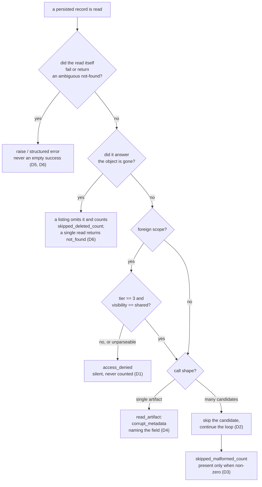

# How Arkeology Treats Malformed and Ambiguous Persisted Data

## Description

Arkeology reads persisted records it did not necessarily write. Own-scope metadata comes from a
validated `Artifact`; foreign-scope metadata comes from another team's deployment, possibly a
different version, a partially-completed migration, or a hand-edited record. Until now the server
had no stated policy for what to do when such a record is malformed, and each site invented its
own answer: some raise and abort the whole call, one returns an empty list that is
indistinguishable from a real absence, and one substitutes a default for a field the access gate
keys on. This ADR replaces those three per-site answers with one policy, stated in terms of the
*shape of the call* — iterating, single-artifact, or a read of the sole durable store — rather than
in terms of the tool that happens to be executing.

## Status

Accepted

## Context

Two observed defects converge on the same missing decision.

**One malformed record fails an entire tool.** The shared re-fetch loop `run_search_loop` in
`_search_helper.py` indexes `item["metadata"]["artifact_id"]`; the shared summary builder
`build_artifact_summary` in the same module computes `int(meta.get("tier", 0))`;
`check_synthesis_freshness` indexes `synth_meta["artifact_id"]` in its deduplication pass; and
`read_artifact` computes `int(meta["tier"])` when it assembles its response. Each is unguarded.
A missing key raises `KeyError`, a non-numeric value raises `ValueError`, and a non-scalar value
raises `TypeError`. Every one of those escapes to the tool's mandatory catch-all and returns
`internal_error` with no results at all — so one bad record in a scope withholds every good record
alongside it.

The same coercion sits inside the access gate itself. `is_cross_scope_readable` in `_scope.py`
computes `int(meta.get("tier", 0))`, and that coercion is *required*: `read_artifact` hands the gate
S3 object metadata, where `tier` is a stringified integer, while `list_artifacts`,
`search_artifacts`, and `check_synthesis_freshness` hand it vector metadata, where `tier` is an
`int` (see `s3.artifact` and `s3vectors.artifact` — the two encodings are deliberate and must not be
unified). What is missing is not the coercion but a guard on it. Two fixes were candidates —
guarding inside the gate, or at each call site — and the choice was deferred until this ADR; D1
makes it.

Confidentiality is not at stake — the exception is caught and nothing leaks. **Availability is.**
A data-quality problem in another team's scope becomes an outage in yours, and the loops most
exposed are exactly the ones that read across the scope boundary.

**A deleted object reads as "no links".** `get_object_annotation` in `clients/s3.py` maps three
distinct S3 error codes — `NoSuchKey` (the object is gone), `NoSuchAnnotation` (the object exists,
that annotation does not), and a bare `404` (either, unclassified) — to one bare `KeyError`.
`annotations._read_one` catches `KeyError` and returns `[]`. So an object that has been deleted,
and a transient response botocore could not classify, both report as an artifact that genuinely has
no links.

That inversion is the one AGENTS.md already names load-bearing, and is why `annotations.py` sits in
the mutation-testing scope: *a failed annotation read must raise while a genuinely absent annotation
returns empty*. Since S3 object annotations became the sole authoritative copy of `commit_refs` and
`references` (recorded in the annotation-backed link storage ADR), every read-modify-write cycle on
those fields — an overwriting `write_artifact`, `archive_artifact`'s status re-PUT,
`reconcile_index` rebuilding vector metadata — writes back what it read. An empty result caused by a
failure is therefore written over good data, and there is no second store to recover it from.

Three forces bound the answer:

1. **The two directions of error are not symmetric.** Withholding a good record is recoverable — the
   caller can ask again, and an operator can repair the source. Writing `[]` over a real link set is
   not. Where a rule must guess, it guesses in whichever direction is recoverable, and that
   direction is not the same one on both sides of this ADR.
2. **The caller is an agent, and a log line is invisible to it.** A silent skip produces a partial
   result that is shaped exactly like a complete one. That is the defect being fixed, not an
   acceptable cost of fixing it.
3. **Three existing callers use `get_object_annotation` as a reachability probe.** `health_check`'s
   annotation probe and startup check 3's per-read-prefix probe both ask only *was the call
   permitted?* and deliberately treat not-found as proof that it was — the probe key need not exist.
   Startup check 8 round-trips its own freshly-written annotation, so any not-found there is a real
   failure of the round trip. Any new distinction has to leave all three answering the same
   questions they answer today.

## Decision

Six clauses, applied by the shape of the call rather than by the tool that happens to be running.
D1 covers the access gate, D2 and D3 the iterating tools, D4 the single-artifact read, D5 the
durable link store, and D6 the boundary between them.

### D1 — The cross-scope gate is total: an unparseable `tier` or `visibility` denies

`is_cross_scope_readable` never raises for any metadata value it is handed. A `tier` that is
absent, non-numeric, or non-scalar, and a `visibility` that is absent or not a string, deny the
candidate. Coerce defensively inside the gate, in `_scope.py`, rather than
guarding the gate's evaluation at each of its call sites — the duplication `_scope.py` exists to
prevent, and which would put new gate logic outside the declared mutation-testing scope.

Denial is the only admissible direction, and the in-process predicate is what delivers it. The two
forms of the gate are **not peers**: `is_cross_scope_readable` is the authority and every read path
runs it against the candidate's own metadata, while `build_scope_filter` is a *prefetch
optimisation* that narrows what is fetched. `{"tier": {"$eq": 3}}` ANDed with
`{"visibility": {"$eq": "shared"}}` rejects an absent, `"abc"` or `null` value, but it does **not**
reject `[3]`: `$eq` means value-in-list for a list-valued field, the semantics `tags` depends on, so
a non-scalar `tier` or `visibility` matches the clause and the candidate is fetched. The filter is
not narrowed to close that, because narrowing it would break tag matching.

That is harmless precisely because of the asymmetry. A filter that admits more than the predicate
costs one wasted fetch; a filter that admits *less* would be a bug, because the candidate is never
fetched and the predicate never sees it, so a readable artifact silently vanishes from every search,
listing, and synthesis. Only that second direction is a defect, and it is what
`test_never_rejects_a_candidate_the_predicate_would_admit` in `tests/unit/test_tools__scope.py`
pins. Both forms stay in the mutation-testing scope, and `run_search_loop` runs the predicate over
every candidate it collects so `search_artifacts` and `synthesise_artifacts` cannot return one the
filter merely happened to admit.

Denial is silent, as every other gate denial is. A denied foreign candidate is never counted under
D3 and never named in a response: the counting itself would disclose that a foreign artifact exists,
which the tier-based access control ADR forbids.

### D2 — A tool iterating over candidates skips a malformed one and continues

Where a tool processes many candidates, a candidate whose persisted metadata cannot be read into
the tool's own result shape is skipped, and the loop continues. It never aborts the call. This binds
`search_artifacts`, `synthesise_artifacts`, `list_artifacts`, and `check_synthesis_freshness`, and
it binds the two shared helpers they run through — `run_search_loop` and `build_artifact_summary` —
which is where the fix belongs rather than in each tool.

A candidate with no usable `artifact_id` is malformed for this purpose: it cannot be identified,
deduplicated, or fetched. The sites that already coerce that field defensively — `list_artifacts`
and `_reference_filter` — are the ones that happen to survive today by accident rather than by
rule, and D2 is what makes their behaviour the rule.

### D3 — The skip is reported as `skipped_malformed_count`, present only when non-zero

Every tool bound by D2 reports its skips in a `skipped_malformed_count` field, present in the
response **only when non-zero**, so its presence is itself the signal — the convention
`reconcile_index` already establishes for `skipped_non_artifacts` and `stuck_failures`, and
`synthesise_artifacts` for `skipped_count`. One name across every tool, for the same reason the
`status="all"` sentinel convention ADR gives: a per-tool spelling of one condition is a spelling
that drifts per tool.

It is a **count, not a list of identifiers**, for two reasons. The identifier is frequently the very
field that is missing, so an id list cannot describe the skips it most needs to. And an id list
would be the one place a foreign-scope artifact could be named outside the gate's verdict; a count
cannot name anything. Reconcile's list-valued `skipped_non_artifacts` is not the precedent to copy
here — it enumerates own-scope S3 keys, which are never gated.

A skipped candidate does not count towards any total describing work done: not `total_checked` in
`check_synthesis_freshness`, and not the returned artifact count anywhere. This mirrors the rule
that a key in `skipped_non_artifacts` does not count towards `orphans_found`. Where a tool also
returns a summary verdict, a non-zero count denies it: `check_synthesis_freshness` reports
`all_fresh: False`, because a run that could not audit part of its input has not established that
everything is fresh. And where a tool can return an empty result set, the count accompanies it —
zero results reached because every candidate was unreadable is the single case a caller most needs
to tell apart from "nothing matched".

**One counter per cause, not one counter per skip.** `skipped_malformed_count` is disjoint from
`synthesise_artifacts`' existing `skipped_count` (a candidate whose S3 **content** read failed), and
from `skipped_deleted_count`, which D6 adds to `list_artifacts` for a candidate whose object was
found to be gone. Three counters across four tools, because the operator's next action differs in
each case: a transient or permissions failure against S3, corrupt index metadata needing
investigation and a `reconcile_index` re-index, and ordinary churn that `reconcile_index` prunes as
a dangling vector without anyone looking at it.

Merging them would not simplify the surface, it would destroy the signal. A count whose whole value
is that it should be zero cannot share a field with a count that is routinely non-zero for a benign
reason: the benign cause holds the number at a floor, and an operator watching it can never see the
serious cause arrive. `reconcile_index` already learned this — `skipped_non_artifacts` exists
precisely so a permanent stray object does not hold `orphans_found` at a non-zero floor forever —
and the same reasoning decides it here. Each counter is still a count and still names nothing, so
splitting them costs nothing against the disclosure rule above.

### D4 — A single-artifact read fails loudly and specifically: `corrupt_metadata`

`read_artifact` returns one artifact and has nothing to skip. When its stored metadata cannot be
read into the response — today, only `tier`, the one field it coerces — it returns a structured
error with the code `corrupt_metadata`, whose message names the field and the offending value. It
never returns `internal_error` for this, and it never invents a default.

Inventing a default is rejected outright: `tier` is one of the two fields the cross-scope gate keys
on, and a read that reports a defaulted `tier` teaches its caller a value that the gate did not
agree to.

D1 runs first and its verdict stands. A **foreign-scope** artifact with an unparseable `tier` is
denied by the gate and returns `access_denied` — never `corrupt_metadata`, which would report the
stored state of an artifact the gate just withheld. `corrupt_metadata` is therefore reachable for an
own-scope read, or for a foreign artifact the gate has already admitted whose other fields are
corrupt.

### D5 — Ambiguity about the durable link store raises; only a genuinely absent annotation is empty

`get_object_annotation` distinguishes the three cases it currently collapses:

| S3 error code | Raised | Means |
|---|---|---|
| `NoSuchAnnotation` | `AnnotationNotFoundError` | The object exists; this annotation does not. The **only** case that may become `[]`. |
| `NoSuchKey` | `ObjectNotFoundError` | The object itself is gone. Not an absent annotation. |
| bare `404` | `KeyError` | Not found, cause unclassified. Ambiguous, and therefore a failure. |

Both new types **subclass `KeyError`**, which is what keeps the three probe callers correct without
touching them: `health_check` and startup check 3 catch `KeyError` to mean "not found, so the call
was permitted", and all three cases still satisfy that. Startup check 8 treats any exception from
its own round trip as a failed check, which all three still are. The base `KeyError` is retained,
rather than a third named type, precisely because the bare `404` case *is* the unclassified one —
the exception type says exactly as much as the response did.

`annotations._read_one` narrows its catch from `KeyError` to `AnnotationNotFoundError`. Every other
not-found propagates, and `read_link_annotations` keeps its existing contract: an empty return means
the annotations really are absent.

### D6 — Malformed data is skipped, a definitively absent object is skipped, a failed or ambiguous read is not

Three outcomes, separated by what the read established rather than by which tool is running:

| The read… | Outcome |
|---|---|
| succeeded, and the record cannot be interpreted | skip and count (D2, D3) |
| succeeded, and the answer is **the object is gone** (`ObjectNotFoundError`) | skip and count separately |
| failed, or returned a not-found it could not classify | fail the call |

An `ObjectNotFoundError` is not a read that failed. It is a read that succeeded and returned a
definitive answer: the artifact no longer exists. Omitting a deleted artifact from a listing is
therefore the correct result rather than a lossy one, and failing a read-only listing over a benign
concurrent delete is disproportionate — the more so because a retry can meet the same race. Nothing
can be written over empty on this path: `list_artifacts` only reads.

The third row is where the unrecoverable direction lives, and it is unchanged. A transient failure,
a permission denial, and the ambiguous bare `404` all fail the whole call. None of them establishes
that anything is absent, and a listing that reported empty link fields on the strength of one would
be indistinguishable from a listing of artifacts that genuinely have none — with no second copy of
those fields to recover from.

Two *iterating* tools meet the middle row today — the two that read a per-candidate durable store
inside their loop. `list_artifacts` omits the artifact from the page and counts it under
`skipped_deleted_count`. `propose_commit_links` drops the candidate silently and counts nothing: it
is read-only discovery rather than a page a caller paginates, and a deleted artifact cannot be
linked to a commit, so the number would name no action its caller could take. The rest do not meet
it at all. `synthesise_artifacts` fetches content per candidate, where an absent object is already
covered by its existing `skipped_count`;
`search_artifacts` reads no S3 object at all; and `check_synthesis_freshness` resolves its sources
from vector metadata. `read_artifact` meets it as a single-artifact read and answers in its own
register: `not_found`, which is the same principle — a definitive absence is reported as absence,
never as a failure and never as an artifact with empty link fields.

### What this decision does not touch

The gate's *rule* is unchanged: own scope unrestricted, foreign scope tier 3 and `shared` only. D1
states what an unparseable value means under that rule; it does not widen or narrow what a
well-formed value means. Nor does this ADR change any tool's behaviour on a well-formed record, or
alter either metadata encoding: `tier` stays a stringified integer in S3 object metadata and an
`int` in vector metadata.

## Alternatives Considered

| Option | Pros | Cons |
|--------|------|------|
| **Chosen** — skip and count in iterating tools; deny in the gate; a typed, field-naming error on the single-artifact read; raise on any ambiguity about the durable link store | Each rule guesses in the recoverable direction for its own call shape; one stated policy instead of four site-local accidents; the caller can always tell a partial answer from a complete one | Four rules rather than one; the skip path tolerates corruption that previously surfaced loudly, which is why D3 makes it visible in the response rather than only in a log |
| Fail the whole tool on any malformed record (today's behaviour) | The loudest possible signal; no partial result can ever be mistaken for a complete one; no new response field | One foreign record's data-quality problem is an outage for every good record beside it, and the caller gets `internal_error` with no way to tell corruption from a bug; unbounded blast radius for a bounded fault |
| Skip malformed records silently, logging only | Smallest change; loops keep running; no response-shape change anywhere | The caller is an agent and never sees the log. A short result set is shaped exactly like a complete one, so the tool reports a subset of memory as if it were all of it — the failure this ADR exists to prevent |
| Default a missing or unparseable value (`tier` → 2, `visibility` → `hidden`) and carry on | Uniform: every record produces a result; no new error code | `tier` and `visibility` are the two fields the gate keys on, so this substitutes an answer for the access decision itself and hands the caller a value no writer ever stored. Denial (D1) is a *gate verdict*, not a default value, and is never reported as the artifact's tier |
| Guard the gate's evaluation at each call site rather than inside the gate | Keeps the gate's own contract strict — an unparseable value stays an error there | Repeats the guard at four-plus sites, which is the duplication `_scope.py` exists to prevent, and each new guard is gate logic living outside the file the mutation-testing scope covers |
| Report skips as a list of artifact ids, mirroring `skipped_non_artifacts` | Actionable: an operator could repair the named records directly | The id is frequently the missing field, so the list cannot describe its own worst cases; and it is the one place a gated-out foreign artifact could be named, disclosing the existence the gate withheld |
| Reuse `synthesise_artifacts`' existing `skipped_count` for malformed skips too | One key instead of two; no new name to propagate | Collapses a transient S3 content-read failure and corrupt index metadata into one number, which points the operator at two different repairs; and it contradicts the existing contract sentence defining that key |
| Fail the whole listing when a candidate's object is found to be gone | One rule for everything a link-field read can return; no second counter | Fails a read-only call over a benign concurrent delete, where a retry can meet the same race. The read did not fail — it answered definitively, and omitting a deleted artifact from a listing is the correct result, not a lossy one |
| Count a gone-object skip in `skipped_malformed_count` rather than its own field | One conditional key instead of two; one rule to state | A count that should be zero cannot share a field with one that is routinely non-zero for a benign reason — the churn holds the number at a floor and the corruption signal never surfaces. It is also the narrower key that would have to widen: only `list_artifacts` can meet this condition at all, so the cost is one extra conditional key in one contract |
| Keep one bare `KeyError` for all three annotation not-found codes and have `_read_one` re-inspect the cause | No new exception types; probe callers untouched by construction | The cause is not recoverable from a `KeyError`; re-deriving it means re-parsing a `ClientError` the client layer already classified, in the module furthest from it |
| Make `ObjectNotFoundError` / `AnnotationNotFoundError` subclass `ArkeologyError`, as every other typed exception does | Consistent with `errors.py`'s existing hierarchy | Breaks all three reachability probes at once: they catch `KeyError` to mean "not found, call permitted", and a health check that reports a drifted annotation store on a probe key that simply does not exist is a false alarm on every run |

## Consequences

- **A new error code, `corrupt_metadata`, joins `ErrorCode`.** It is caller-visible and appears in
  the `read_artifact` contract's error list. Adding it to `constants.py` is not itself a contract
  change — that module deliberately has none — but the code's meaning is normative in the tool
  contract that lists it, exactly as `annotation_unavailable` is.

- **A new response field, `skipped_malformed_count`, joins four tools, and `skipped_deleted_count`
  joins one.** Both are conditional, like every other transparency flag on those tools.
  `check_synthesis_freshness` is the one place this needs care: its contract promises eight keys
  present on every successful call so a caller may read any of them without a membership test.
  `skipped_malformed_count` is a ninth, conditional key and does not join that set — the eight-key
  promise is unchanged.

- **A non-zero `skipped_deleted_count` is a sighting of a condition `reconcile_index` already
  names.** An S3 object gone while its vectors remain is a dangling artifact, which reconcile finds
  and prunes. The count therefore needs no operator action on a single occurrence and warrants a look
  only if it persists across runs — which is exactly the read that a shared counter with malformed
  skips would have made impossible.

- **Two new exception types subclass `KeyError` rather than `ArkeologyError`.** That is a deliberate
  departure from the house hierarchy, made to keep the three reachability probes correct without
  editing them, and it is the reason the departure is recorded here rather than left to be
  rediscovered as an inconsistency.

- **The mutation-testing scope gains no new file, and its two invariants are both touched.** D1
  changes the gate in `_scope.py`; D5 changes the distinction `annotations.py` is in scope for. Both
  edits insert mutatable expressions *within* existing functions, which renumbers every mutant after
  them — the case the no-remembered-counts rule exists for. Re-read survivors with `mutmut show`
  against the triaged equivalence classes; do not compare totals.

- **Corruption becomes quieter, and that is the accepted cost.** A record that previously took down a
  call now contributes a number to a response field. The mitigation is that the number is in the
  response rather than only in a log, so an agent can say "this listing is incomplete" and an
  operator watching `skipped_malformed_count` has a signal that does not decay. `reconcile_index`
  remains the repair path: it rebuilds vector metadata from S3 plus annotations, which is what
  actually fixes a malformed index record.

- **No confidentiality change.** D1 only ever denies where the previous code raised, so nothing
  becomes readable that was not readable before; D3's count never names a gated-out candidate; and
  D4 is pre-empted by the gate on every foreign-scope path. The `access_denied`-versus-`not_found`
  distinction `read_artifact` already draws is untouched.

- **The durable link store's guarantee gets sharper, not weaker.** D5 narrows the one catch that
  could turn a failure into `[]` down to the single error code that genuinely means "absent". Every
  other outcome now propagates, which is what the read-modify-write paths were always documented to
  rely on.

- **The next tool that iterates over persisted records carries a checklist item.** D2 and D3 attach
  to the call's shape, not to the tools that exist today. A tool added later that loops over
  candidates owes the same skip-and-count behaviour under the same key name. Like the `status="all"`
  convention, this is a review obligation; nothing in the type system will catch its absence.

## Proposed Revision — 2026-09-25

> **Pending.** Proposed by ADR-016 (draft, awaiting review); takes effect when ADR-016 is
> accepted. Until then this ADR's Decision stands as written above.

[The OKF v0.2 adoption ADR](adr-2026-09-25-okf-v02-adoption.md) proposes persisted fields this
policy did not name: the required `generated` block and optional `revised` block in both metadata stores,
the boolean `archived`, and three annotation payloads — the structured link annotation (`sources`,
`relationships`), `verified`, and revision history. The policy applies to them unchanged, by the
shape of the call.

**What the existing clauses decide:**

- **A missing or unparseable required `generated`**, a non-boolean `archived`, or an unparseable
  `revised` is a record that was read successfully and cannot be interpreted. `read_artifact`
  returns `corrupt_metadata` naming the field (D4) and never invents a default — which rules out
  treating an absent `generated` as "now" or a non-boolean `archived` as `false`. An iterating tool
  whose result shape carries the field skips the candidate and counts it under
  `skipped_malformed_count` (D2, D3). None of these fields is a gate input, so D1 is unaffected and
  the gate runs first as before.
- **An annotation payload that is present but cannot be decoded** — not valid structured data, or
  entries missing their required keys — is likewise a successful read of an uninterpretable record:
  `corrupt_metadata` on a single read, skip and count in a listing. It is **never** an empty list.
  D5's rule, that only a genuinely absent annotation (`NoSuchAnnotation`) is empty, extends to all
  three new annotations, and D6's third row still fails the call on a failed or ambiguous read.
- **`check_synthesis_freshness` now meets D6's middle row.** It reads each synthesis's `sources`
  from its annotation rather than from vector metadata, so a synthesis whose object is found gone
  is skipped and counted separately from `skipped_malformed_count`, as D6 prescribes; the field
  name is for the spec. A *source* that is gone is not a skip — freshness reports it `missing`.

**What the existing clauses did not decide, and the operator's decisions** (brainstorm D50):

1. **A write that must carry forward or merge a value it cannot read fails** with
   `corrupt_metadata` and writes nothing. This binds `add_artifact_links`,
   `add_artifact_verification`, the revision-history append, and an overwrite carrying `generated`
   and the annotations forward. The policy's reads-only clauses are extended to writes in the
   direction D5 already takes: writing over data the server cannot read is how good data is lost,
   and there is no second copy to recover it from.
2. **The synthesis delete/archive warning never blocks and never under-warns silently.** A
   synthesis whose `sources` cannot be read is listed under "could not check" beside the warning,
   rather than skipped as D2 would skip it in a listing. Only own-scope ids appear there, so
   nothing leaks.
3. **A missing or non-boolean vector `archived` is detected and repaired, not silently
   filtered.** The in-force filter runs inside the vector index and drops such a vector before any
   code can count it, so D3's count cannot see it; the realistic cause is an interrupted store
   migration. `reconcile_index` reports every such vector and rebuilds `archived` from S3 object
   metadata, the durable copy, and the store-migration skill verifies at the end of its run that
   every vector carries a boolean `archived` and reports any it missed.
4. **An unreadable timestamp marks only its own source.** A `sources[].last_modified` or a
   source's `revised.at` that does not parse is reported as "unchecked: unreadable timestamp";
   the synthesis's other sources are still checked.
5. **Redaction wins over error detail.** A `corrupt_metadata` error returned to a foreign-scope
   reader names the field but never echoes its raw value. D4's "names the offending value" holds
   for own-scope reads only.
