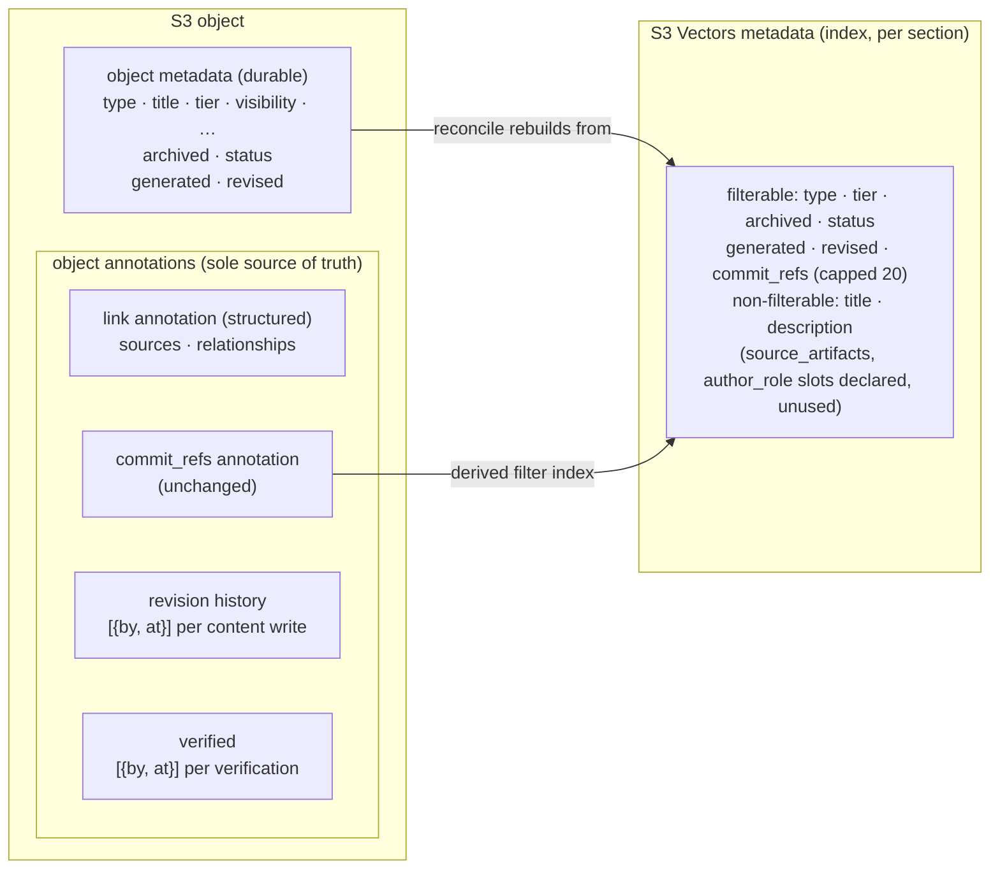

# OKF v0.2 Adoption

## Description

Open Knowledge Format v0.2 adds a provenance, trust and lifecycle layer to the format, and the
documents Arkeology ingests change shape with it: the untyped `references` list splits into
`sources` (what a document was built from) and typed `relationships` (what it asserts about other
documents), `authored` becomes `generated` with a different meaning, a three-value document
`status` appears, and every producer document gains a frozen `id`. This ADR records how Arkeology
adopts all of it — as a store and as a consumer — in one breaking release, and why each field
lands where it does.

The version is in the title on purpose. A later OKF version gets its own ADR; this one records the
v0.2 decisions and the fallbacks already scoped for the upstream rulings still pending.

## Status

Draft (2026-09-25) — awaiting operator review. The decisions were taken with the operator in the
OKF v0.2 adoption brainstorming session (2026-09-17 to 2026-09-25) and are locked there under
`## Decisions`; this ADR consolidates them and cites their D-numbers as provenance. On acceptance it
amends the deterministic artifact ids, tier-based access control, annotation-backed link storage,
artifact cross-referencing, `status="all"` sentinel, Studio link resolution and malformed persisted
data policy ADRs, and builds on the vector-metadata budget ADR — each carries a proposed revision
note pointing here, which takes effect only when this ADR is accepted. Implementation is Phase 15
of `plan.md`.

## Context

### What the producer will send

The `amanox-ai-agents` plugin writes the documents Arkeology imports. Its brief of 2026-09-22 (see
the brainstorm's `## The Producer Contract (inbound)`) commits it to emitting:

- **`id:`** — seeded from the filename stem at creation and frozen thereafter; dots are legal;
  uniqueness is the producer's guarantee.
- **`sources:`** — OKF §5.1 entries: `resource` (a bundle-relative path or a URL), optional `id`
  and `title`.
- **`relationships:`** — a house key shaped after the open OKF proposal #16, constrained to
  `{to, type}`, outbound only, where `to` is an id and never a path.
- **`generated` / `revised` / `verified`** — first authorship written once, latest revision only,
  and a list of confirmation events.
- **`status`** — `draft | stable | deprecated`. **`type`** — free-form and capitalised
  (`Code Review`, `Attested Computation`).

### Forces

- **One word, two meanings.** Arkeology's own `status` key is its archive marker (`active` /
  `inactive`). Once producer documents carry OKF `status`, a single `read_artifact` payload would
  hold the content's `status: stable` next to the metadata's `status: active`. The code can tell
  them apart; an agent reading the payload cannot.
- **The link annotation cannot hold the new shapes.** Today's durable copy of `references` is a
  comma-joined string with no escaping. `sources` and `relationships` entries are objects.
- **The vector index is expensive to change.** Filterable vector metadata is capped at 2 KB per
  vector; the non-filterable keys are fixed at index creation (`description`, `source_artifacts`,
  `title`, `author_role` are declared), so reclassifying a key means a full re-index.
- **Annotations are roomy but fragile across overwrites.** An annotation holds up to 1 MiB, is
  mutable in place and leaves the object's ETag alone — but any re-PUT of the object wipes it, so
  every overwriting path must read annotations forward.
- **A store is not a bundle.** Issue #22's strongest trust rung for `supersedes` lives in a
  bundle-root `log.md`. Arkeology has no bundle root, so any equivalent must live on the artifact.
- **Upstream is converging, not ruling.** #16 (typed relationships), #22 (supersedes semantics),
  #28 (`generated` semantics) and #32 (partial visibility of `sources`) have community
  implementations converging in public and no maintainer ruling.
- **Nothing parses artifact-id structure.** The only split in `src/` is a `/`-prefix split for the
  reconcile probe key, so changing who mints ids reaches a rule rather than a parser.
- **Standing rules apply unchanged.** No fallback paths or dual-store reads; the cross-scope gate
  is never bypassed; keys are never random.

### The distinction that organises the design

Working through the brief surfaced a distinction the rest of the design hangs on: **derivation
edges and association edges are different kinds** (D17). OKF §5.1 defines `sources` as the
materials a concept derives from; #16's `relationships` are assertions about other concepts. Only
derivation creates decay — if a source changes, the derived document may now be *wrong* — whereas
an association whose target changed is merely pointing at something that moved. Derivation edges
therefore need trust machinery (a per-edge baseline, a freshness check); association edges need
only to be carried faithfully. This is also why Arkeology's old `source_artifacts` maps to
`sources`, not to `relationships` (D18).

## Decision

### 1. Adoption posture — full adoption, decided now, adapted later

We chose **full OKF v0.2 adoption** (D1), superseding the adapter-only v0.1 posture of the
2026-06-15 OKF alignment session. Nothing forced it — a v0.1 bundle stays consumable by a v0.2
consumer under the spec's fallbacks — so this is a deliberate choice: Arkeology stores what the
format says in the format's own terms rather than translating at the boundary.

We also chose **not to wait for upstream rulings** (D39). Where v0.2 is silent or a proposal is
unruled, Arkeology takes a position now and records the fallback, so a contrary ruling moves a
field's *name or spec standing* but never its storage shape:

| Position taken now | If a ruling goes the other way |
|---|---|
| `sources[].last_modified` read as a write-time snapshot (§3 below) | a house custom key carrying the same snapshot value |
| `relationships` carried with optional per-edge `generated` / `verified`, as #16 proposes | the per-edge blocks become a house extension, still tolerated because consumers must accept unknown keys |
| One in-list `{withheld: n}` redaction marker (§7 below), as #32 proposes | only the marker's key or position changes |
| "Unverified since revised" is advisory (§3 below) | if §5.3 grows a tier for it, the flag maps onto that tier |

Such adaptations run as a later migration keyed on `okf_version`, which stays a per-document key
(D4). The one ruling that would reach further is #16's authority question — whether body links or
the frontmatter list is authoritative — because it would reopen the cross-referencing ADR's
frontmatter-only migration rule. `stale_after` and `usage_window` are not adopted: validity here
is event-driven, so no expiry date can be written in advance (D7).

### 2. Lifecycle — three things that were all called `status`, kept apart

| Concern | Key | Values | Owner | Stored where |
|---|---|---|---|---|
| Archived or not | **`archived`** (was Arkeology `status`) | `true` / `false` | Arkeology — `archive_artifact` | S3 object metadata + filterable vector metadata |
| Document lifecycle | **`status`** (OKF §5.4) | `draft` / `stable` / `deprecated` | the writer of that document | S3 object metadata + filterable vector metadata |
| Succession lineage | `relationships[].type: supersedes` | an edge on the successor | the writer of the successor | the structured link annotation |

**The archive marker becomes `archived: bool`** (D21). It names the thing rather than the
category, it *is* a boolean, and it frees `status` for the OKF lifecycle. `ArtifactStatus` is
deleted rather than renamed; a boolean needs no enum. **OKF `status` is ingested** as ordinary
per-artifact metadata in exactly the two stores `archived` uses (D22): S3 object metadata as the
durable copy `reconcile_index` rebuilds from, filterable vector metadata as the index. Neither
lifecycle key is an annotation — annotations hold only link fields, verifications and revision
history.

**In force means `status != deprecated AND archived == false`, and it is the default view** of
search, listing and synthesis preparation (D23; FR-04, FR-67). An artifact with no lifecycle
status, or in `draft`, is in force; a caller may exclude drafts (D24) — agents want in-progress
specs, so the default follows them and the option covers the stricter reading. A caller may also
ask for full lineage. Nothing is ever *hidden*: every artifact stays readable by id and listable on
request, as a deleted file stays readable in Git history. In force is a view, not a visibility
policy.

**The `supersedes` edge never decides what is in force** (D25). The in-force decision keys on the
retired artifact's own `status`. The reason is trust. A `supersedes` edge is cheap,
machine-derivable and written on a *different* document from the one it retires; if it could
exclude, one automated writer asserting "B supersedes A" would drop a real A out of every in-force
answer while B stood in for it — the threat #22 exists to guard against. `status: deprecated` on
A has none of those properties: it is a write *to A*, under the own-scope write authority that can
already archive or delete A, and it is attributed through A's `revised.by`. That reaches #22's
strongest rung without a `log.md`:

| #22 rung | Their evidence | Arkeology equivalent | Effect on in-force |
|---|---|---|---|
| 1 — edge provenance | `generated` / `verified` on the edge | the edge exists on B | none — lineage only |
| 2 — source eligibility | B is itself in force | B `stable` and not archived | none — at most, A's read shows B as a proposed successor |
| 3 — attributed resolution | an entry in the bundle-root `log.md` | `status: deprecated` on A, attributed via A's `revised.by` | A excluded |

Cross-scope falls out for free: another team's B may declare it supersedes our A, but it cannot
write our A, so A stays in force in our results and the claim is visible as lineage. The producer
already writes both ends of a supersession, so nothing is lost. `supersedes` remains a fact used
for navigation ("what replaced this?") and for consistency audits, never a switch.

**A lifecycle change on an existing artifact reuses `archive_artifact`'s path** (What Changes —
Artifact model; FR-68): an in-place object re-PUT carrying current metadata and annotations
forward, then a vector-metadata update, with no embedding. `link_metadata` cannot do it — it writes
annotations only, and both lifecycle keys live in object metadata. Being a metadata-only write, a
lifecycle change never moves `revised`. **The rename lands first**: `status` → `archived` ships
before lifecycle `status` is introduced, so one key never means two things for a release.

The `status="all"` sentinel convention moves to the boolean: `archived` has three caller states —
`false` (the default), `true`, and the clause omitted for "all". Its principle is unchanged: "all"
is expressed by omitting the clause, never by matching a sentinel against stored data, and an
unrecognised value still fails validation. That convention binds any caller-facing `status`
parameter, so it also binds a lifecycle `status` filter if the spec gives one.

### 3. Provenance — `generated`, `revised`, `verified`, and a revision log

| Key | Meaning | Mutation | Stored where |
|---|---|---|---|
| `generated: {by, at}` | first authored, by whom | **required**, written once, never rewritten | S3 object metadata + vector metadata |
| `revised: {by, at}` | latest content revision only | absent until the first revision, then replaced in place; never a list | S3 object metadata + vector metadata |
| `verified: [{by, at}]` | confirmation events | appended | its own annotation |
| revision history `[{by, at}]` | one entry per content write | appended | its own annotation |

**`generated` means first authorship** (D9 as amended). The session first recorded `generated` as
a copy of the latest revision; that was withdrawn once §5.1's reading — `generated.at` is when the
concept was first written — was adopted, matching the shape the #28 thread converged on. **House
`authored`, `date`, `author_role` and `timestamp` are removed** (D9, D32, D35): `generated.at` and
`revised.at` carry both meanings `date` had, and `author_role`, once it held an OKF §7 actor
string, merely duplicated `revised.by`. Neither `by` nor `author` was adopted as a rename —
`author` is already `sources[].author` in OKF.

Both blocks are **first-class metadata set by the writer**, not derived from the revision log
(D35); the log's first and last entries coincide with them. Actor strings follow OKF §7 verbatim,
unsplit — `<producer>/<version>`, `human:<id>`, `process:<id>`. Every `at` is ISO 8601; Arkeology
writes UTC with a `Z` suffix at fixed precision, parses whatever a producer supplies, and
**compares timestamps as parsed datetimes, never as strings** — `…10:00:00+02:00` sorts after
`…09:00:00Z` as text but is earlier (D19).

Two invariants make the freshness check in §4 sound:

- **`revised` moves only on content writes** — never on a link backfill, an archive or lifecycle
  change, a verification or a reconciliation (D19; FR-69). Otherwise every document citing the
  artifact would falsely report stale.
- **Every overwrite carries `generated` forward.** An overwriting `PUT` replaces all object
  metadata, the same trap the annotation read-forward already handles (D35).

`last_edited_ulid` **stays**, as an internal token: archive's compare-and-swap, reconcile's
ordering and the failure-log supersession check depend on it. It never appears in an OKF field
(D19).

**Revision history lives in its own annotation** (D26, D31), one `{by, at}` entry per content
write (D30) — `at` is the same value set as `revised.at`. It is separate from the link annotation
because the two mutate differently: links are replaced whole whenever they change, history is
appended on every content write, and sharing a payload would make each rewrite data it has no
business touching. The object-ETag compare-and-swap covers both, since it guards the object rather
than the annotation. History is **uncapped** (D34): measured against real AWS on 2026-09-23, the
annotation limit is exactly 1 MiB of payload, about 14,500 entries, so a cap would guard against
something years away. `read_artifact` returns it; `list_artifacts` omits it unless asked, because
the real cost is the extra annotation round trip per artifact per page, not the payload size.

**`verified` lives in its own annotation too** (D44; FR-54, C-08), not in object or vector metadata: object
metadata is capped at 2 KB per object, and a new vector-metadata key is filterable by default and
would count against the 2 KB filterable budget on every section vector. A list that grows with
every review would eventually trip the write-path budget check and block ordinary content writes.
It gets an annotation apart from both others for the same reason history does — reviewers append
on their own schedule. Recording a verification after the write is annotation-only: no re-PUT, no
re-embedding, no change to `revised`. Nothing filters on it.

**"Unverified since revised" is an advisory signal, never a trust-tier change** (D41). When the
newest `verified.at` is older than `revised.at`, `read_artifact` reports the flag beside the tier.
§5.3 derives the tier from verifiers alone, and keeping the signal advisory keeps the failure
direction safe: a consumer that ignores it misses a warning rather than reading a stale
confirmation as current. It is surfaced **on read only** for now (D45; FR-71); listings and search
are backlog item B-14.

### 4. Link fields — `sources` and `relationships` in one structured annotation

| Kind | OKF field | Entry shape | Stored where | When the target changes |
|---|---|---|---|---|
| **Derivation** — what this was built from | `sources` (§5.1) — replaces `source_artifacts` | `{resource, last_modified}` + optional `id`, `title` | structured link annotation only | the document may now be wrong: freshness check, per-source baselines |
| **Association** — what this relates to | `relationships` (#16) — replaces `references` | `{to, type}` + optional `generated`, `verified` | structured link annotation only | a dangling or moved link; the document is still correct |
| **External** — git commits | out of OKF scope | comma-joined `list[str]` | **unchanged**: annotation (authoritative) + vector metadata (capped at 20, derived filter index) | — |

```yaml
# one annotation, structured payload — replaces the comma-joined `references` annotation
sources:
  - resource: <arkeology://artifact/{id} | URL | unresolved path>
    last_modified: <ISO 8601>     # the source's revision time as observed at write time
    id: <optional footnote label joining body citations to this entry>
    title: <optional>
relationships:
  - to: <artifact id>
    type: <supersedes | builds_on | amends | …>
    generated: {by, at}           # optional — only on edges Arkeology mints
    verified: [{by, at}]          # optional
```

**Both fields share one structured annotation and nothing else** (D29; FR-51, FR-54). The existing
`source_artifacts` vector-metadata projection is **deleted, not carried over**. Keeping it would
have bought exactly one thing — the synthesis delete/archive warning at zero annotation reads —
while freshness gains nothing from it, because the per-source baseline lives only in the
annotation and freshness pays the read regardless. One convenience warning is not worth a second
representation to keep honest. The result is one home for every artifact-to-artifact edge, with
`commit_refs` the sole projected link field — and it is not a graph edge. The comma-joined encoding
and its no-comma validators no longer apply to these fields.

**Write semantics carry over from `references`** (FR-53, FR-55). On an overwriting write, `sources`
and `relationships` are claims about the artifact's *current* links: each is set to exactly the
(resolved) list supplied with the call, and a call that supplies none clears it. `commit_refs`
stays accretive, read forward and merged. The backfill tool merges and deduplicates all three.

**`sources[].last_modified` is a write-time snapshot and the per-edge freshness baseline** (D19).
It records what the producer observed when the citing document was written, not a live mirror of
the source. The live-mirror reading would require rewriting every citing document on every source
change *and* make the field useless as a staleness signal, since stored and current could never
disagree; and the sibling `usage_window` already frames the same signal block as observation. A
source is **stale** when its current revision time is later than the captured `last_modified`. A
missing `last_modified` on a source that resolves into Arkeology is **filled in at import** from the
source's current `revised.at` (its `generated.at` if never revised), as an ordinary value with no
marker (D40): resolving the source during import confirms it exists at that version, which is
itself a verification. External sources are left without it.

This replaces the one synthesis-wide `last_edited_ulid` baseline and fixes a false negative in the
current check: a cosmetic edit to a synthesis used to advance its baseline and hide a real source
change (FR-20).

**Freshness is the reader's check; the source never notifies** (D20). OKF puts the duty on the
reader: follow each source edge forward and compare. For each `sources` entry whose resource is
`arkeology://artifact/{id}`, the check passes it through the cross-scope gate, fetches the source's
current metadata, and reports it **missing** (deleted or unreadable), **archived**, or **stale**;
URLs and unresolved paths are not checked. It applies to every document with Arkeology sources,
not only syntheses — a spec citing its brainstorming session gets the same check —
though `check_synthesis_freshness` stays the scheduled audit for syntheses. Deleting or archiving a
source changes nothing on the documents that cite it: no update, no cascade, no obligation to warn.

**Reverse lookup stays outbound-only and becomes synthesis-only** (D13, D20; FR-56). No inbound
edge is ever stored — the producer never emits one, and #22 forbids inverse spellings. The one
remaining consumer of a computed inverse is the pre-delete/archive `referenced_by` warning, a
convenience beyond OKF, kept **for syntheses only** because the `type` filter bounds the
candidates: list own-scope syntheses, read each one's `sources` annotation, warn if the target is
cited. It does not reach a spec citing a brainstorming document, nor relationship targets —
deliberately, since neither is the source's obligation. `REFERENCE_FIELDS`, a filterability-driven
query builder, loses its purpose. Because this warning and the freshness check's malformed-synthesis
delete now read the annotation to *decide*, the raise-never-degrade rule of the annotations
contract applies to them with full force: a failed read must never present as "no sources".

**A dangling relationship target is not an error** (FR-51). #22, revised 2026-09-14, rules that an
absent target leaves the carrying concept current. Arkeology populates the optional per-edge
`generated` / `verified` blocks only on edges **it** mints; ingested edges are stored byte-identical
to what the producer wrote.

### 5. Identity — a supplied `id` is the artifact id

**A producer-supplied `id:` becomes the bare artifact id** (D28; FR-08, FR-73). The operative key
stays `{write_prefix}/{id}{ext}`, so cross-project uniqueness still comes from the prefix; when no
`id` is supplied, `generate_artifact_id` runs as before, so ordinary `write_artifact` callers see no
change. The question that decided it was *does the id need to be the key, or merely resolvable?*
It needs to be the key: `arkeology://artifact/{id}` and the producer's `relationships[].to` then
share one namespace, and an agent moves between the Git corpus and Arkeology with the same names
and no translation step. Retitle churn disappears for supplied ids (the producer measured ten
retitles against four renames).

This **amends the deterministic-keys rule; it does not violate it**. A frozen filename stem is
deterministic, and once supplied it is an attribute like any other; the rule's real target —
randomness and UUIDs — is untouched. The 8-hex hash suffix is **not** appended to a supplied id:
the suffix disambiguates collision classes of Arkeology's own slug formula, and the producer's
uniqueness guarantee replaces it. Uniqueness follows the brief's division — the producer
guarantees, Arkeology verifies: the migration skill checks the whole manifest for duplicate ids
before writing anything (AC-81), and `write_artifact` keeps rejecting an existing key without
`overwrite`.

**A supplied id is validated and never repaired, and it is case-preserving** (D33). Permitted:
`[A-Za-z0-9._-]`, alphanumeric first and last character, no `/`, no `..`, at most 128 characters;
anything else is a `validation_error`. `/` is excluded because the `arkeology://artifact/{id*}` URI
template expands across slashes — an id containing one would silently nest the key and turn ids
back into paths. Neither slugification nor lowercasing ever runs on a supplied id: either would
break byte-identity with `relationships[].to`, and `_slugify` would collapse the dots producer
stems legitimately carry. Matching is exact and case-sensitive, as S3 keys already are. Supplied
and generated ids coexisting is two *sources* of ids, not two conventions to keep aligned.

**Generated ids keep their formula unchanged; tier-2 generated ids anchor on the UTC calendar day
of `generated.at`** (D32, as amended 2026-09-24; FR-08), since the `date` field they used to
anchor on is removed. UTC, not the producer's stated offset, so the same instant always yields the
same key whoever wrote it. Supplied ids carry no date-anchoring guarantee — date-anchoring was a property of the
formula, where it kept a recurring title unique across days, and nothing parses a date out of a
key.

**Migration resolves `sources[].resource` through the target file's own `id:`** (D43; FR-52).
Every producer file carries a frozen `id:`, so a path resolves by opening the file it names and
reading that key — correct across file renames, with no path→id map to build. The result is stored
as `arkeology://artifact/{id}`; URLs pass through untouched. `sources[].id` is **never** used for
resolution: §5.1 defines it as a per-document footnote label joining body citations to entries,
unrelated to the target's identity, and reading it as a target would silently resolve a
coincidental label to the wrong artifact. `relationships[].to` is already an id and needs lookup,
not normalisation. The `backfilling-references` skill stays, retargeted to `sources` only — a
source whose target was not yet in Arkeology at import still needs it — and records the resolved
source's current revision time as `last_modified` (FR-58).

### 6. The type list opens

**OKF `type` is stored verbatim and matched exactly, including case; types outside the known list
are accepted** (D37; FR-09, AC-77). OKF's `type` is a free-form display string and consumers must
tolerate unknown values, so rejecting them would make Arkeology a non-conforming consumer. No
normalisation touches the stored value — folding case or replacing spaces would rewrite what the
producer wrote. `ARTIFACT_TYPES` becomes a *recommended* list published in the schema resource
(FR-18), and Studio gains a default style for unknown types.

Transformation happens in exactly one place, never to the stored value: a **generated** id
slugifies the type into the key. `Code Review` slugifies to the same `code-review` that today's
`code_review` does, so existing ids are unchanged. Exact matching would split every type filter
between the corpus's legacy snake_case values and migrated documents' display names, so the legacy
values are rewritten once to their OKF display names by the store migration (§9), and code
comparisons such as the synthesis-type check in `find_referrers` and freshness follow.

### 7. Cross-scope gate — `sources` gated, unreadable entries redacted with one counted marker

**`sources` entries that point into Arkeology now pass through the cross-scope gate** (D38; FR-10).
The old asymmetry — `references` gated, `source_artifacts` not — was a gap rather than a choice:
sources used to be external only. Entries with the `arkeology://artifact/` scheme pass through the
existing `resolve_readable_targets` unchanged — own scope by prefix, foreign scope only if tier 3
and `shared`. URLs and unresolved paths pass untouched. `relationships[].to` stays a bare id
because #16 types it as an id, while `sources[].resource` is typed as a URI; each follows its
field. Reusing the one gate function adds nothing new to the mutation-testing scope.

**Unreadable entries are redacted, not dropped** (D47, amending D38). Silent dropping breaks OKF's
trust framework: a foreign reader sees a list that looks complete, and judges the document on
provenance it does not actually rest on. Returning the hidden id is not acceptable either — a
tier-2 id can itself be sensitive. So the entries the reader cannot read are removed and **one**
marker per list is appended, carrying only their count: no id, resource, title or timestamp
(AC-78). One marker per hidden entry was rejected — list positions carry no meaning once the
entries are gone, and the count is all the reader needs. Own-scope readers see both lists in full;
the stored annotation is never touched.

**The marker is `{withheld: <n>}`, sits inside the list, and is emitted unconditionally** (D48).
In-list rather than a sibling key, so one shape covers both lists without inventing a
`<field>_withheld` key per list, and "and n more" reads naturally. Every response that returns
`sources` or `relationships` to a foreign-scope reader carries the marker whenever at least one
entry was withheld — no path, option or output format may omit it. The reason is the one the #32
reply gave: an ignored `revised` only understates recency, but a missing marker errs in no safe
direction, because the hidden entries could have strengthened or weakened the concept. Display
remains the reading end's concern; Studio can show foreign-scope artifacts and must render the
marker. The freshness check and the delete/archive warning are own-scope only and never see one.
Arkeology ships this shape now and raised it upstream as OKF issue #32.

**The same redaction applies to the returned content's frontmatter** (D49, extending D47; FR-10,
AC-78). In an OKF document the frontmatter *is* the metadata, and migration writes resolved sources
into it as `arkeology://artifact/{id}` (FR-52). Redacting only the structured field would leave
every withheld id in the returned content beside it, making the redaction decorative. So for a
foreign-scope reader the server rewrites the `sources:` and `relationships:` blocks of the
**returned** content with the same entries removed and the same `{withheld: n}` marker; the stored
object is never modified, and an own-scope reader receives the content byte-for-byte as stored.

The redaction surfaces are therefore every capability that returns a foreign artifact's link
fields or its content: **reading, listing** (the field), **synthesis preparation, and the data
resources**. Search returns neither link fields nor content, so it is not a redaction surface.

### 8. Tool surface

- **`link_metadata` is renamed `add_artifact_links`** (D46; FR-53). The old name read as "link the
  metadata" and did not say what the tool changes: it *adds* commit references, sources and
  relationships — merge and dedupe, never remove. Storage location is kept out of the name.
- **`add_artifact_verification` is new** (D46; FR-70). A verification is an event appended to the
  `verified` annotation, not a set merge, so it is a separate tool rather than a parameter on the
  links tool. Both build on one shared compare-and-swap annotation-append helper, which revision
  history needs anyway.
- **"Revised after verification" is not a tool**: `read_artifact` computes it (FR-71).
- **Lifecycle change** reuses archive's re-PUT path (§2). Whether it is a small tool of its own or
  a generalised `archive_artifact` is left to the spec.
- **The schema resource is rewritten** so an agent interprets every field — `archived`, `status`,
  the in-force view, `generated`, `revised`, `verified`, `sources` including `last_modified`, the
  footnote-label `id` and the `withheld` marker, `relationships`, and the open type list — the way
  OKF defines it rather than by guesswork (FR-18).

### 9. A breaking change, with store migration by a dedicated skill

**This release is breaking and carries no compatibility aliases** (D42). The no-fallback-paths rule
applies to parameter names as much as to stores. The former archive `status`, `references`,
`source_artifacts`, `author_role`, `date`, `timestamp` and `link_metadata` are rejected once the
change lands, with a validation error naming the replacement (AC-80).

**Existing deployments are migrated by a new skill plus scripts**, not by `reconcile_index`
(D42; FR-74). `reconcile_index` repairs index drift from S3; it is not a metadata-key migration
tool and gains no migration code. The skill brings S3 objects, object metadata, vector metadata and
annotations to the new shape — `status` → `archived`, legacy types → OKF display names,
`authored` / `date` / `author_role` / `timestamp` → `generated` / `revised`, comma-joined
`references` / `source_artifacts` → the structured annotation, and the `source_artifacts`
vector-metadata key dropped. For each existing artifact it writes a `generated.at` that falls on
the UTC day of the artifact's old `date`, so that a later overwrite of a tier-2 artifact
regenerates exactly the key already stored rather than minting a second one. It reports what it will change, waits for the operator's confirmation,
never re-embeds, and changes nothing when re-run.

Document migration of the repository's own files is the plugin's job; Arkeology's is to make the
server and its skills v0.2-compatible and to verify the migrated result fits (D10).

### 10. Malformed values in the new fields

The malformed persisted data policy ADR applies to every new persisted field unchanged: an
uninterpretable `generated`, `revised`, `archived` or annotation payload is `corrupt_metadata` on a
single read and skip-and-count in a listing, and only a genuinely absent annotation is empty. Five
cases that policy did not decide are decided here (D50):

- **A write never proceeds over a value it cannot read.** `add_artifact_links`,
  `add_artifact_verification`, the revision-history append, and an overwrite carrying `generated`
  and the annotations forward each fail with `corrupt_metadata` and write nothing — writing over
  unreadable data is how good data is lost.
- **The synthesis delete/archive warning never blocks.** A synthesis whose `sources` cannot be read
  is listed under "could not check" (own-scope ids only) rather than silently omitted.
- **A missing or non-boolean vector `archived` is repaired, not silently filtered.** The in-force
  filter drops such a vector inside the index before any code can count it; the realistic cause is
  an interrupted store migration. `reconcile_index` reports these vectors and rebuilds `archived`
  from S3 object metadata, and the store-migration skill verifies at the end of its run that every
  vector carries a boolean `archived`.
- **An unreadable timestamp marks only its own source.** An unparseable `last_modified` or source
  `revised.at` reports that source as "unchecked: unreadable timestamp"; the synthesis's other
  sources are still checked.
- **Redaction wins over error detail.** A `corrupt_metadata` error returned to a foreign-scope
  reader names the field but never echoes its raw value, which could hold exactly the entries §7
  withholds.

### Where each field lives



## Alternatives Considered

### Adoption posture and lifecycle

| Option | Pros | Cons |
|--------|------|------|
| **Chosen** — full v0.2 adoption; `archived: bool` + ingested OKF `status`; in-force keyed on the target's own `status` | One vocabulary on the wire; the in-force decision sits under the write authority that already governs the document; no trust store needed | A breaking release and a store migration |
| Keep the v0.1 adapter-only posture | No migration | Arkeology keeps translating at the boundary and exposes two meanings of `status` to agents |
| Rename `ArtifactStatus` to `ArkeologyStatus` / `ArkeologyLifecycle` (NA6) | Smaller change | Keeps the colliding word; fixes the code reader's confusion while the wire still says `status: active` |
| Never act on `supersedes`; return everything and let the agent sort it out | Zero risk | Zero benefit; contradicts the house "default hides, option reveals" model the archive convention established |
| Exclude a target when an in-force artifact asserts it is superseded (#22 rung 2) | What Data Olympus ships | One machine-written line on B still removes a real A from every in-force answer |
| Exclude only after a human-affirmed retirement stored on the edge (#22 rung 3 on the edge) | Correct | Needs an affirmation store and a reverse lookup on every in-force query (NA5); keying on A's `status` gives the same rung for free |

### Provenance

| Option | Pros | Cons |
|--------|------|------|
| **Chosen** — `generated` written once, `revised` latest-only, first-class in both stores; history and `verified` in their own annotations | Matches §5.1 and the #28 convergence; filterable at no index cost; growth kept out of the 2 KB budgets | Every overwrite must carry `generated` forward; `read_artifact` gains two annotation reads |
| `generated` as a copy of the latest revision (the session's first reading of D9) | Mirrors existing `revised` | Contradicts §5.1: `generated.at` is when the concept was first written |
| Keep `author_role` holding an actor string | No rename | Duplicates `revised.by`, overwritten on every write |
| `verified` in object or vector metadata | No extra round trip | Grows without bound against a 2 KB cap; would eventually block ordinary content writes |
| Revision history in the link annotation | One annotation read | Every link edit rewrites history and every content write rewrites links |
| Cap revision history | Bounded payload | Guards against a limit measured at about 14,500 entries — years away |

### Link fields

| Option | Pros | Cons |
|--------|------|------|
| **Chosen** — one structured annotation holding `sources` and `relationships` distinctly, no vector copy | One authoritative home for every edge; no re-index; nothing to keep in sync | The synthesis warning pays one annotation read per own-scope synthesis |
| Untyped list with a type prefix per entry, or one comma-joined annotation per relation type | Reuses the current encoding | Entries are objects, not strings; the comma-joined payload cannot hold them |
| Flatten `sources` and `relationships` into one untyped list (NA2, NA3) | The producer's stated floor | Contradicts the derivation/association split outright |
| Keep links in the body only and synthesise at export | No storage change | No structured field to gate, check or backfill |
| Keep the `source_artifacts` projection | The warning costs no annotation reads | A second representation for one convenience; freshness reads the annotation anyway |
| A filterable projection of source targets under a new key (NA8) | The warning becomes one server-side `$eq` | Unnecessary under the reader-side model; a second copy for reconcile and a cap against the 2 KB budget (syntheses cite up to 100 sources). It would *not* need a re-index — only reusing the `source_artifacts` name would |
| Generalise `source_artifacts` to carry every relationship type (NA4) | One field | Destroys the synthesis-type prefilter; the reverse lookup becomes a full-corpus scan |
| Store inbound edges (NA1) | Direct reverse lookup | No producer emits them; the inverse is computed |
| Synthesis-level `generated.at` as the freshness baseline | No per-edge data | Written once, so a genuine re-synthesis reports stale forever |
| Per-edge `generated` / `verified` from #16 as the baseline | Richer | Unruled proposal; `last_modified` is native v0.2 |

### Identity and types

| Option | Pros | Cons |
|--------|------|------|
| **Chosen** — honour a supplied `id:` verbatim as the key; generate otherwise | One namespace with the Git corpus; no retitle churn | Two sources of ids; case-sensitive matching |
| Ignore `id:` and keep minting from attributes | No rule change | Ignores measured evidence (43 wrong links from path derivation upstream) and keeps retitle churn |
| Honour `id:` but append the hash suffix (NA7) | Keeps collision disambiguation | The key no longer equals the producer's id, so `relationships[].to` cannot resolve — defeats the purpose |
| Store `id:` as an indexed metadata field, key unchanged | Correct at ingest | Every later Git↔Arkeology cross-over pays a lookup |
| Resolve migration sources through a manifest-wide path→id map | Already built | Wrong across file renames; unnecessary when every target declares its `id:` |
| Case-insensitive type matching | Keeps `code_review` and `Code Review` together | S3 Vectors filters are exact, so it needs a second normalised copy of `type` |

### Cross-scope link visibility and migration

| Option | Pros | Cons |
|--------|------|------|
| **Chosen** — redact with one in-list `{withheld: n}` marker, always emitted | The reader learns the list is incomplete and nothing else | Fails a strict v0.2 validator (§5.1 `resource` REQUIRED) until #32 lands |
| Drop unreadable entries silently (the previous `references` rule) | Valid OKF | A list that looks complete but is not |
| Return unreadable entries | Complete provenance | Exposes ids that may themselves be sensitive |
| One marker per hidden entry | Preserves length | Positions carry no meaning once entries are gone |
| A sibling `<field>_withheld` key | Validator-clean | A new key per list; #32 reply framed it as open, Arkeology kept in-list |
| Migrate existing stores inside `reconcile_index` | No new skill | Makes a drift-repair tool a key-migration tool |
| Keep deprecated aliases for removed names | Smoother upgrade | A second code path per name — the fallback the non-negotiable rules forbid |

## Consequences

- **Breaking, and the changelog must say so.** Every removed name is rejected with a validation
  error naming its replacement; a deployment holding artifacts must run the store migration before
  or with the upgrade. The migration is the first tool that rewrites every artifact in place, so
  its dry run and idempotency are the safety net.

- **No re-index.** The `source_artifacts` and `author_role` non-filterable slots stay declared on
  the index and simply go unwritten (C-01); an unused declared key costs nothing. The new keys —
  `archived`, `status`, `generated`, `revised` — are filterable by default, and only existing keys
  lock filterability, so the index needs no change. The two provenance pairs cost about 140 bytes
  of the 2 KB filterable budget.

- **The `commit_refs` vector cap must be re-calibrated.** The vector-metadata budget ADR's cap of
  20 entries was measured against the filterable key mix of 2026-08-13 and, by that ADR's own rule,
  must be re-run whenever that mix changes. This release changes it (`date` and the old `status`
  out; `archived`, OKF `status`, `generated`, `revised` in). The 16-entry margin between the cap
  and the measured boundary suggests the cap survives, but it is a measurement to repeat, not an
  assumption to make.

- **Read cost shifts, it does not grow much.** `read_artifact` gains two annotation reads
  (revision history, `verified`); `list_artifacts` gains none by default. The synthesis
  delete/archive warning pays one annotation read per own-scope synthesis instead of an in-process
  scan — bounded by the synthesis count, never a corpus scan. Freshness keeps its two batched
  vector queries and reads each synthesis's `sources` from its annotation; it is an accuracy
  change, not a cost change.

- **Every re-PUT must carry three annotations forward, not one.** Overwrite, archive and lifecycle
  change all wipe annotations; each must restore the link annotation, the revision history and
  `verified`, and carry `generated` forward in object metadata. The `verified` list surviving an
  overwrite is what gives "unverified since revised" any meaning — without it, a revision would
  erase the verification it is compared against.

- **Destructive paths now read annotations to decide.** The synthesis warning and freshness's
  malformed-synthesis delete inherit the annotations contract's rule in full: a failed read raises,
  a genuinely absent annotation is empty. The durable link-field read in `annotations.py` is in the
  mutation-testing scope for exactly this reason; the structured decoding stays covered only if it
  lives in that file.

- **Freshness gets more accurate.** Per-source baselines stop a cosmetic edit to a synthesis from
  hiding a real source change, and any document with Arkeology sources can be checked, not only
  syntheses.

- **The `withheld` marker conflicts with §5.1 as written, and that is accepted.** §5.1 makes
  `resource` REQUIRED in every entry, so a validator built on the current text rejects a redacted
  document. Arkeology emits the marker anyway (D39); #32 asks for the §5.1 amendment in the same
  change.

- **The gate governs the structured fields and the frontmatter, not the body.** The redaction
  applies to `sources` and `relationships` wherever they are emitted mechanically — the returned
  field and the returned content's frontmatter blocks. The **body** is authored prose: an
  `arkeology://artifact/{id}` link written into it (including one migration rewrote there under
  FR-52) is returned as stored, and a shared document's author is responsible for what its prose
  names, as in any sharing system. The provenance-honesty purpose — the reader learns the list is
  incomplete — does not depend on the body at all.

- **Returned content is no longer always byte-identical to stored content.** A foreign-scope
  reader receives content whose frontmatter blocks were rewritten; anything that hashes or diffs
  returned content across scopes must expect that. Own-scope reads are unchanged.

- **A deleted own-scope target still looks live.** On read, a target in the reader's own scope
  passes the gate by prefix alone, so a deleted one still appears in `relationships` as if present.
  A known limitation carried over; freshness reports a deleted *source* as missing.

- **More provenance joins the shared vector index.** `generated.by` / `revised.by` actor strings —
  which for humans are `human:<id>` — and lifecycle `status` sit in vector metadata, which every
  team sharing the index can read regardless of tier. This falls under the tier-based access
  control ADR's existing mutual-trust assumption and changes nothing in the gate, but the README's
  trust statement should name it.

- **Accepted losses.** The type typo guard (`Sepc` becomes a new type); relationship targets and
  non-synthesis citers get no delete/archive warning; supplied ids carry no date anchoring; agents
  must carry ids with their case intact.

- **Synthesis-only reverse lookup is deliberate.** A future reader finding it should read it as a
  consequence of OKF's reader-side model, not an unfinished generalisation waiting to be widened.

- **Upstream rulings move names, not storage.** If #16, #22, #28 or #32 rule against a position
  taken here, the adaptation is a later `okf_version`-keyed migration of a field's name or
  standing; the storage layout does not move.

## Deferred to the Specs

These are details the decisions above deliberately leave to the Phase 15 specs and the data
contracts. None of them reopens a decision.

- **Lifecycle-change tool shape** — its own small tool sharing archive's re-PUT path, or a
  generalised `archive_artifact` (What Changes — Artifact model).
- **Query parameter shapes** — how a caller expresses the three `archived` states, filters on
  lifecycle `status`, and selects full lineage or excludes drafts, and how these compose with the
  in-force default. The `status="all"` convention's principle binds whatever shape is chosen.
- **Persisted encodings** — how `archived` (a string in S3 object metadata) and the `{by, at}`
  blocks are laid out in S3 object metadata and in vector metadata, and the structured
  annotation's serialisation and names. These belong to the `s3.artifact`, `s3vectors.artifact`
  and `s3-annotations.artifact` data contracts.
- **How a bare id resolves to a key for gating and freshness** — which prefix and extension turn
  `relationships[].to` and an `arkeology://artifact/{id}` source into the full key the gate checks.
- **Migration targets without an `id:`** — resolution through the target file's `id:` assumes every
  target declares one; whether a target without it falls back to the cross-referencing ADR's
  manifest-wide map or stays unresolved is for the migration spec.
- **How the returned frontmatter is rewritten** — locating the `sources:` and `relationships:`
  blocks in returned content and re-emitting them with entries removed and the marker appended,
  leaving every other byte of the content as stored (D49).
- **Widening the scheduled freshness audit** beyond syntheses — optional (D20).
- **Lineage surfaces** — whether a read shows a proposed successor, and whether consistency audits
  (deprecated with no successor edge; superseded but still `stable`) become a tool, are not
  decided; `supersedes` stays lineage either way.
