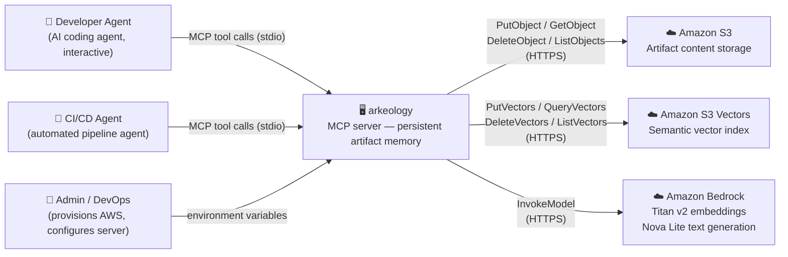

# Arkeology — Architecture Overview

Arkeology is a Python MCP server that gives AI agents persistent and searchable artifact memory,
backed by Amazon S3 (content storage), Amazon S3 Vectors (semantic index), and Amazon Bedrock
(embeddings and text generation). Agents connect via the Model Context Protocol to write, search,
and recall structured artifacts across sessions and across team boundaries.

---

## System Context

The server is deployment-agnostic: it is given resource names via environment variables and uses
whichever AWS credentials are present. One server process serves one MCP client over stdio.

---

## Internal Layers

---

## Layer Responsibilities

| Layer | Key files | Responsibility |
|---|---|---|
| Entry point | `__main__.py` | Logging, config parsing, client construction, startup validation, tool registration, server start |
| Server | `server.py` | FastMCP app instance; tool registration closures that bind injected clients |
| Configuration | `config.py` | All env-var parsing and validation (pydantic-settings); computed properties |
| Startup validation | `startup.py` | Eight sequential checks; hard `sys.exit(1)` on any failure |
| Domain | `artifact.py` | `Artifact` model, deterministic ID generation, section parsing — zero AWS dependencies |
| Tools | `tools/*.py` | MCP tool implementations; receive `settings`, `s3`, `vectors`, `bedrock` as injected dependencies |
| Search helper | `tools/_search_helper.py` | Shared re-fetch loop used by both `search_artifacts` and `synthesise_artifacts` |
| Client interfaces | `clients/interfaces.py` | `typing.Protocol` contracts for S3, S3 Vectors, and Bedrock |
| AWS adapters | `clients/s3.py`, `clients/vectors.py`, `clients/bedrock.py` | Concrete boto3 implementations; credential error wrapping |
| Test fakes | `clients/fakes/fake_bedrock.py` | `FakeBedrockClient` — deterministic hash-derived embeddings for unit tests |
| In-process filter | `clients/filter.py` | Metadata filter evaluator for `list_vectors_by_metadata` — comparison operators (`$eq`, `$in`, `$nin`, `$gte`, `$lte`) **and** the logical combinators `$and` / `$or`, on which the gate's server-side form (`build_scope_filter`) and `find_referrers` both depend |
| MCP Resources | `resources.py` | Always-current schema, tier model, type catalogue, and query strategy guidance |
| Failure log | `failure_log.py` | JSONL partial-write failure log; appended when S3 write succeeds but vector write fails |
| Errors | `errors.py` | Typed exceptions: `ArkeologyError`, `CredentialError`, `StartupValidationError`, `VectorIndexNotFoundError` |

---

## Scope and Access Control Model

Artifacts are organised by an S3 key prefix (`WRITE_PREFIX`). The server may be configured to
read from additional prefixes (`READ_PREFIXES`) belonging to other teams or projects.

Access across scope boundaries is governed by artifact tier and visibility:

| Tier | Visibility | Own scope | Foreign scope |
|---|---|---|---|
| 2 (project-local) | any | Readable and writable | **Never accessible** |
| 3 (permanent) | `hidden` | Readable and writable | **Never accessible** |
| 3 (permanent) | `shared` | Readable and writable | **Read-only** |

Enforcement is server-side (soft control). IAM can hard-bound S3 *content* per prefix, but it
cannot discriminate within a shared vector index — S3 Vectors authorization is all-or-nothing
per index, so sharing an index implies mutual trust between participating teams at the
metadata, description, and embedding level (see ADR-007, revision 2026-07-02).
Cross-scope semantic search requires all participating deployments to share the same S3 Vectors
index and embedding model.

---

## Startup Validation Sequence

The server performs eight checks in order before entering the MCP event loop. Any failure is a
hard stop — the server never starts in a partially functional state.

```mermaid
graph LR
    C1["Check 1\nCredentials valid\nhead_bucket on ARTIFACT_BUCKET"]
    C2["Check 2\nWRITE_PREFIX readable\nand writable (probe object)"]
    C3["Check 3\nEach READ_PREFIX\nlistable"]
    C4["Check 4\nVector index exists\ndescribe_index"]
    C5["Check 5\nEmbedding model dimension\nmatches index dimension"]
    C6["Check 6\nEmbedding model probe\nembeds a probe string, asserts dimension"]
    C7["Check 7\nBEDROCK_TEXT_MODEL\naccessible (when configured)"]
    C8["Check 8\nS3 object annotations\nput/get/list/delete round trip"]
    READY["Server ready\nMCP event loop"]

    C1 --> C2 --> C3 --> C4 --> C5 --> C6 --> C7 --> C8 --> READY
```

---

## Architecture Decisions

Key architectural choices are recorded as ADRs in this directory:

| ADR | Decision |
|---|---|
| [ADR-001](adr-2026-05-29-fastmcp-framework.md) | FastMCP as the MCP server framework |
| [ADR-002](adr-2026-05-29-aws-backend-selection.md) | AWS S3 + S3 Vectors + Bedrock as the backend |
| [ADR-003](adr-2026-05-29-hexagonal-architecture.md) | Layered architecture with Protocol-based client interfaces |
| [ADR-004](adr-2026-05-29-stdio-transport.md) | stdio as the primary MCP transport |
| [ADR-005](adr-2026-05-29-deterministic-artifact-ids.md) | Deterministic slug-based artifact identifiers *(amendment proposed by ADR-016, draft)* |
| [ADR-006](adr-2026-05-29-section-level-embedding.md) | Section-level embedding at H2 boundaries |
| [ADR-007](adr-2026-05-29-tier-based-access-control.md) | Tier-based cross-scope access control model *(amendment proposed by ADR-016, draft)* |
| [ADR-008](adr-2026-06-02-async-concurrent-embedding.md) | Async semaphore-bounded concurrent embedding |
| [ADR-009](adr-2026-06-16-artifact-commit-traceability.md) | Artifact commit traceability — ULID timestamps, vector-only commit links, agent-driven protocol *(vector-only commit-link storage superseded by ADR-011; ULID + AGENTS.md protocol still in force)* |
| [ADR-010](adr-2026-06-24-mcp-apps-visual-reading-interface.md) | MCP Apps as the visual reading interface — `arkeology_studio` tool via `fastmcp[apps]`, Direction 4 AWS-hosted SPA retired |
| [ADR-011](adr-2026-07-03-annotation-backed-link-storage.md) | Annotation-backed durable storage for the mutable link fields (`commit_refs` + `references`) — annotations are the sole source of truth and vector `commit_refs` is a derived filter index only, `link_metadata` generalizes `link_commit`, reconcile rebuilds from annotations, overwrite preservation, availability enforced as a hard startup gate *(amendment proposed by ADR-016, draft)* |
| [ADR-012](adr-2026-07-03-artifact-cross-referencing.md) | Artifact cross-referencing design — `references` promoted to a first-class `Artifact` field (resolved bare ids, `$eq`-queryable); frontmatter-only migration rewrite with bounded normalization; `arkeology://artifact/{id}` content-rewrite format; forward-reference resolution via a manifest-wide path→id map; mutability split by representation; deferred backfill skill; unified own-scope `referenced_by` delete/archive warning *(storage mechanism recorded in ADR-011)* *(amendment proposed by ADR-016, draft)* |
| [ADR-013](adr-2026-08-12-studio-link-resolution.md) | Studio-side resolution of `arkeology://artifact/{id}` links on the human read surface — a click loads the target in the studio's own detail view via the existing `read_artifact` call; a read-surface convenience, not a second addressing mechanism; non-artifact, malformed, and raw-path links render as inert text; no client-side access control (the ADR-007 gate stays sole authority) *(does not re-open ADR-012's rewrite format or its mixed-addressing steady state)* *(amendment proposed by ADR-016, draft)* |
| [ADR-014](adr-2026-08-12-status-all-sentinel-convention.md) | `status="all"` as a cross-tool convention — a pre-validation sentinel meaning "omit the status clause entirely" (never a literal match against a non-existent stored status), binding on every query-shaped tool exposing a `status` parameter; extended from `list_artifacts` to `search_artifacts` as a strict widening, with unrecognised values still failing validation and the active-only default unchanged *(amendment proposed by ADR-016, draft)* |
| [ADR 2026-08-13](adr-2026-08-13-vector-metadata-budget-hardening-and-self-heal.md) | Vector metadata budget hardening — the budget guard runs at every vector-write chokepoint; `references` leaves vector metadata and `commit_refs`'s vector copy is capped at the most recent 20 (real-AWS calibrated); `migrate_artifacts` detects and retries unindexed partial writes; failure-log replay gives up loudly after a bounded number of attempts *(amendment proposed by ADR-016, draft)* |
| [ADR-015](adr-2026-09-14-malformed-persisted-data-policy.md) | How malformed and ambiguous persisted data is treated, as one cross-cutting policy keyed on the shape of the call — the cross-scope gate is total and denies on an unparseable `tier`/`visibility`; an iterating tool skips a malformed candidate and reports `skipped_malformed_count` (present only when non-zero); `read_artifact` fails loudly with a typed `corrupt_metadata` naming the field rather than defaulting it; an ambiguous not-found from the durable link store raises rather than reporting "no links" *(amendment proposed by ADR-016, draft)* |
| [ADR-016](adr-2026-09-25-okf-v02-adoption.md) | **Draft, awaiting review.** Full OKF v0.2 adoption as one breaking release — archive marker renamed `archived: bool` and OKF lifecycle `status` ingested, with an in-force default view keyed on each artifact's own lifecycle, never on `supersedes`; first-class `generated`/`revised` provenance, `verified` and revision history in their own annotations; `sources` + `relationships` in one structured annotation, gated across scopes with a counted `{withheld: n}` marker; supplied ids used verbatim as keys; open type list; store migration by a dedicated skill |
