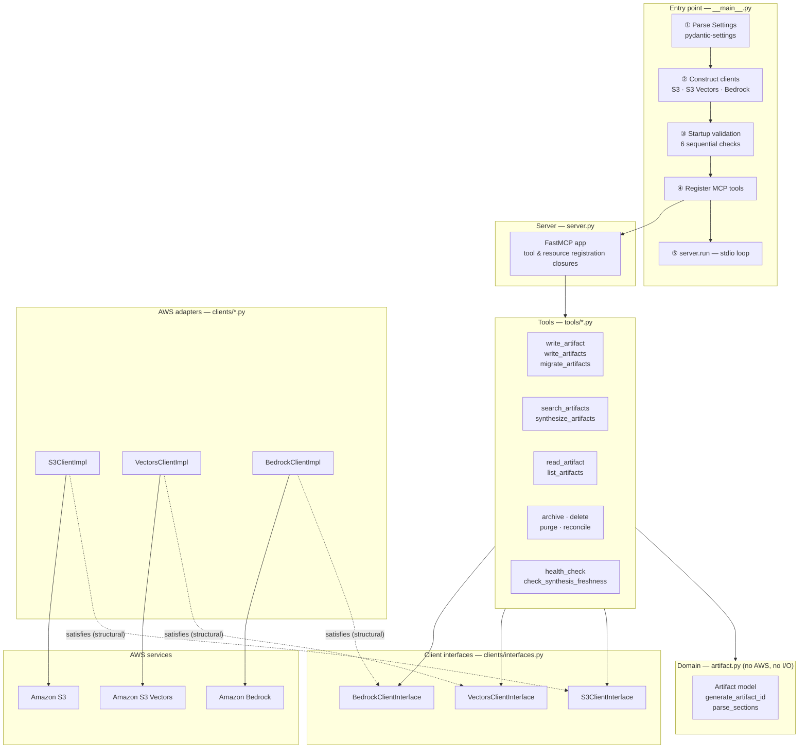
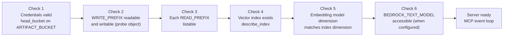

# cairn-mcp — Architecture Overview

cairn-mcp is a Python MCP server that gives AI agents persistent and searchable artifact memory,
backed by Amazon S3 (content storage), Amazon S3 Vectors (semantic index), and Amazon Bedrock
(embeddings and text generation). Agents connect via the Model Context Protocol to write, search,
and recall structured artifacts across sessions and across team boundaries.

---

## System Context

The server is deployment-agnostic: it is given resource names via environment variables and uses
whichever AWS credentials are present. One server process serves one MCP client over stdio.

---

## Internal Layers

---

## Layer Responsibilities

| Layer | Key files | Responsibility |
|---|---|---|
| Entry point | `__main__.py` | Logging, config parsing, client construction, startup validation, tool registration, server start |
| Server | `server.py` | FastMCP app instance; tool registration closures that bind injected clients |
| Configuration | `config.py` | All env-var parsing and validation (pydantic-settings); computed properties |
| Startup validation | `startup.py` | Six sequential checks; hard `sys.exit(1)` on any failure |
| Domain | `artifact.py` | `Artifact` model, deterministic ID generation, section parsing — zero AWS dependencies |
| Tools | `tools/*.py` | MCP tool implementations; receive `settings`, `s3`, `vectors`, `bedrock` as injected dependencies |
| Search helper | `tools/_search_helper.py` | Shared re-fetch loop used by both `search_artifacts` and `synthesise_artifacts` |
| Client interfaces | `clients/interfaces.py` | `typing.Protocol` contracts for S3, S3 Vectors, and Bedrock |
| AWS adapters | `clients/s3.py`, `clients/vectors.py`, `clients/bedrock.py` | Concrete boto3 implementations; credential error wrapping |
| Test fakes | `clients/fakes/fake_bedrock.py` | `FakeBedrockClient` — deterministic hash-derived embeddings for unit tests |
| In-process filter | `clients/filter.py` | Metadata filter evaluator (`$eq`, `$in`, `$nin`, `$gte`, `$lte`) for `list_vectors_by_metadata` |
| MCP Resources | `resources.py` | Always-current schema, tier model, type catalogue, and query strategy guidance |
| Failure log | `failure_log.py` | JSONL partial-write failure log; appended when S3 write succeeds but vector write fails |
| Errors | `errors.py` | Typed exceptions: `CairnError`, `CredentialError`, `StartupValidationError`, `VectorIndexNotFoundError` |

---

## Scope and Access Control Model

Artifacts are organised by an S3 key prefix (`WRITE_PREFIX`). The server may be configured to
read from additional prefixes (`READ_PREFIXES`) belonging to other teams or projects.

Access across scope boundaries is governed by artifact tier and visibility:

| Tier | Visibility | Own scope | Foreign scope |
|---|---|---|---|
| 2 (project-local) | any | Readable and writable | **Never accessible** |
| 3 (permanent) | `hidden` | Readable and writable | **Never accessible** |
| 3 (permanent) | `shared` | Readable and writable | **Read-only** |

Enforcement is server-side (soft control). IAM can hard-bound S3 *content* per prefix, but it
cannot discriminate within a shared vector index — S3 Vectors authorization is all-or-nothing
per index, so sharing an index implies mutual trust between participating teams at the
metadata, description, and embedding level (see ADR-007, revision 2026-07-02).
Cross-scope semantic search requires all participating deployments to share the same S3 Vectors
index and embedding model.

---

## Startup Validation Sequence

The server performs six checks in order before entering the MCP event loop. Any failure is a
hard stop — the server never starts in a partially functional state.

---

## Architecture Decisions

Key architectural choices are recorded as ADRs in this directory:

| ADR | Decision |
|---|---|
| [ADR-001](adr-2026-05-29-fastmcp-framework.md) | FastMCP as the MCP server framework |
| [ADR-002](adr-2026-05-29-aws-backend-selection.md) | AWS S3 + S3 Vectors + Bedrock as the backend |
| [ADR-003](adr-2026-05-29-hexagonal-architecture.md) | Layered architecture with Protocol-based client interfaces |
| [ADR-004](adr-2026-05-29-stdio-transport.md) | stdio as the primary MCP transport |
| [ADR-005](adr-2026-05-29-deterministic-artifact-ids.md) | Deterministic slug-based artifact identifiers |
| [ADR-006](adr-2026-05-29-section-level-embedding.md) | Section-level embedding at H2 boundaries |
| [ADR-007](adr-2026-05-29-tier-based-access-control.md) | Tier-based cross-scope access control model |
| [ADR-008](adr-2026-06-02-async-concurrent-embedding.md) | Async semaphore-bounded concurrent embedding |
| [ADR-009](adr-2026-06-16-artifact-commit-traceability.md) | Artifact commit traceability — ULID timestamps, vector-only commit links, agent-driven protocol |
| [ADR-010](adr-2026-06-24-mcp-apps-visual-reading-interface.md) | MCP Apps as the visual reading interface — `cairn_studio` tool via `fastmcp[apps]`, Direction 4 AWS-hosted SPA retired |
