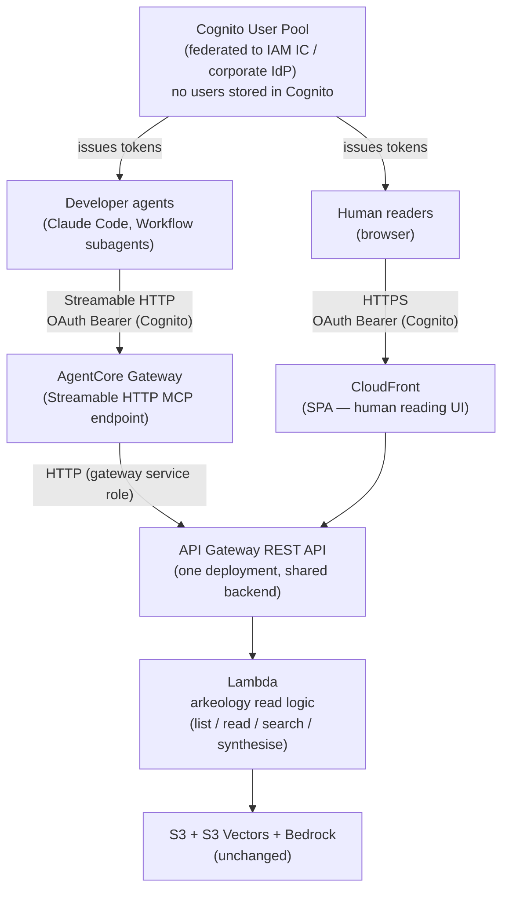
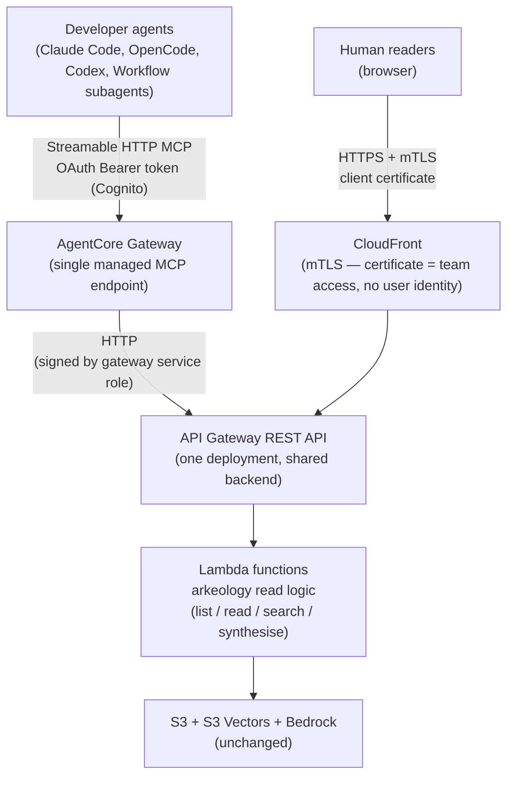
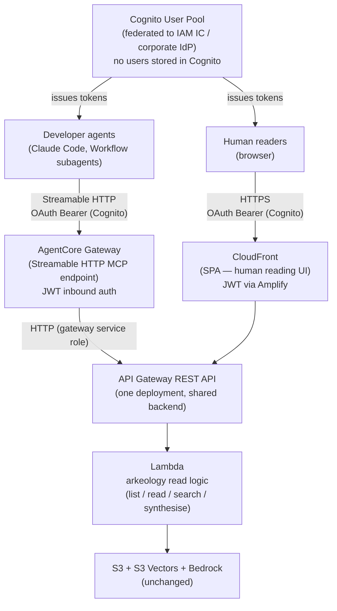

# Visual Reading / Browsing Interface for Arkeology Artifacts

## Description

Arkeology moved artifact content to AWS S3 and made it searchable to *agents* via S3
Vectors behind an MCP server. Humans (operators) still need to **read** those artifacts —
ADRs, specs, code reviews, session summaries — and since the files no longer live on disk,
there is no user-friendly way to open and render them. This session explores how to give
humans a visual reading/browsing surface that can list/search many documents, apply
multi-facet filters (e.g. type + date), select a document, and render markdown **and**
mermaid diagrams. It deliberately considers a reframe the user invited: a future where the
MCP server (or a read-only twin of its logic) no longer runs only on the operator's machine
but is hosted in AWS.

## Summary

This document records the full exploration of how humans should read Arkeology artifacts now that content lives in S3. The problem was worked across five sessions (2026-06-14 through 2026-06-23), moving from divergent ideation to a confirmed two-stage direction.

### What was decided

**Two approaches were selected and staged:**

**Pull content, read with existing tools (ships first).** *(Refined from Direction 3 exploration.)* Reuses existing Arkeology internals and third-party tools — no new infrastructure, no new UI to build or maintain:

- **MCP data resources** — Arkeology already registers resource endpoints (e.g. `arkeology://artifact/{id}`) in the MCP server but they currently return no data. This surface wires them to the existing `read_artifact` / `list_artifacts` logic so MCP-aware host tools (MCP Inspector, Claude Desktop) can list and open Arkeology artifacts natively, with no additional build beyond a few lines of code.
- **Obsidian + Remotely Save pull-only** — continuous S3 → local vault sync via the Remotely Save plugin configured in pull-only mode. Artifacts appear in the operator's Obsidian vault automatically as S3 is updated, with full markdown and mermaid rendering, backlinks, and search — all without Arkeology owning any sync tooling. Tested and confirmed working.
- **Web reading interface** — a dedicated visual reading UI (browser-based, markdown + mermaid rendering). The exact delivery mechanism (MCP App vs standalone) is subject to a follow-on brainstorm. No TUI.
- **On-demand export** — handled by the agent on request (ask the agent to fetch and write an artifact to disk). No dedicated export CLI.

**Hosted MCP server and reading UI (future).** *(Refined from Direction 4 exploration.)* A single AWS deployment serving both agent and human consumption paths, with one shared Cognito user pool as the auth layer:



- **AgentCore Gateway** exposes a standard Streamable HTTP MCP endpoint — agents (Claude Code, Workflow subagents) connect directly, each with its own independent HTTP connection, enabling full parallelisation.
- **CloudFront + SPA** serves the human reading UI — developers log in once per machine via the standard browser OAuth flow; the browser handles token refresh automatically.
- **One Cognito user pool, federated to IAM Identity Center** (or another corporate OIDC-compatible IdP). No users are stored in Cognito. Developer lifecycle (onboarding, offboarding) is managed entirely in the corporate IdP. One-time federation setup requires coordination with the IdP team; ongoing user management requires none.
- **One Lambda deployment** containing Arkeology's read logic (`list`, `read`, `search`, `synthesise`) serves both paths — no code duplication.

### What was ruled out

| Candidate | Reason ruled out |
|---|---|
| Publish-on-write static site (Direction 1) | Sync management — write/delete/archive/visibility triggers and CloudFront invalidation deemed too complex |
| Local companion web reader (anchor) | Cannot produce shareable URLs; serves only the operator running the server |
| `arkeology export` CLI | Redundant — agents handle on-demand export; Remotely Save handles continuous sync |
| CloudFront mTLS for human UI | ACM Private CA required (~$400/mo) |
| IAM IC as OIDC provider | Token audience mismatch + SigV4 token endpoint + cross-team coordination required |
| IAM IC federated through Cognito | Same cross-team coordination blocker; deferred to future iteration |
| CloudFront signed cookies | Renewal requires an identity mechanism — defers rather than solves the auth problem |
| Cognito M2M via Backend-For-Frontend | No per-user gate (network access = content access); not supported by Claude Code's OAuth implementation |
| IAM/SigV4 via `mcp-proxy-for-aws` for agents | Proxy is stdio — structurally incompatible with Workflow subagent parallelisation; human UI auth then has no clean solution |

### What remains open

| Decision | Question |
|---|---|
| D2 | Is the hosted MCP server and UI actually needed, or do the pull-and-read tools satisfy the team's reading needs? |
| D3 | Is live semantic search a v1 requirement for the hosted UI, or is faceted + lexical search sufficient? |
| D6 | Should the local stdio server eventually migrate to Streamable HTTP, or stay stdio permanently? |
| D7 | Should the hosted MCP server and UI ship inside `arkeology` or as a separate `arkeology-lens` companion repo? |
| D8 | How does the Lambda-packaged Arkeology version stay in lockstep with the version agents write with? |
| D11 | How does the Lambda derive the caller's scope under the hosted model — from a Cognito JWT claim, or from an explicit scope parameter passed by the agent? |

---

## Session 2026-06-14

### Problem Statement

How should humans read Arkeology artifacts now that content lives in S3 with no local file to
open? The desired capabilities: list/search multiple documents, multi-facet listing/search
(document type & date, plus team/project/tier/tags), select a specific document, and render
markdown + mermaid. The method for this session: the lead analyst proposed an **anchor
idea** (a local companion web reader) and five analyst subagents each proposed one
alternative idea **and** adversarially challenged the anchor's hidden assumptions. The lead
then answered every challenge (cross-pollinating across ideas) and selected the most
promising directions.

### Known Constraints

| Constraint | Source |
|---|---|
| Arkeology runs locally today, one process per project, stdio transport, scoped by `WRITE_PREFIX` | stdio-transport ADR |
| Artifact content lives in S3; embeddings + metadata in S3 Vectors; embeddings via Bedrock Titan v2 | AGENTS.md |
| Rich metadata already exists: type, tier (2/3), visibility (shared/hidden), team/project, date-anchored IDs, feature_tags, commit_refs | artifact model |
| The tier+visibility cross-scope gate is a **soft** server-side control; IAM is the hard boundary | tier-based-access-control ADR |
| HTTP transport is a one-line FastMCP change but currently undecided | transport-strategy brainstorm (in-progress) |
| MCP resources are registered but currently **schema-only** (no AWS calls) | T18 spec + resources.py |
| `list_artifacts` already performs server-side faceted filtering (type/tier/team/project/tags/commit_refs/status) behind the scope gate | list tool |
| The package is already a Python CLI (`uvx arkeology`); CI is pytest/ruff/mypy — no JS toolchain today | AGENTS.md |
| Deployment-agnostic stance today: no infra owned by the project | AGENTS.md |

### Ideas Explored

**Anchor (lead) — Local companion web reader.**
A `--web` mode on the already-running Arkeology process. The same process reuses its
S3/S3-Vectors/Bedrock clients and scope/tier gates and serves a read-only SPA on
`localhost:PORT`. Lists artifacts, multi-facet filter, full-text + semantic search, select a
doc, fetch markdown from S3, render markdown + mermaid client-side. No AWS deploy, binds to
localhost, reuses local AWS credentials. *Outcome of the session: dominated on every axis —
see Challenge Synthesis. Retained only as a possible component of the in-session engineer
experience, not as the primary answer.*

**Idea 1 — Serverless AWS knowledge portal ("Arkeology Atlas").**
Relocate Arkeology's **read path** into AWS as a durable, multi-user portal at a stable team URL.
Static React/Next SPA on S3 + CloudFront (OAC); read API on API Gateway + Lambda packaging a
read-only subset of Arkeology's existing Python logic (`list`/`read`/`search`/`synthesise`/
`freshness`), reusing the Protocol-based, dependency-injected clients, the `filter.py`
evaluator, and the scope gate unchanged. Semantic + multi-facet search served from the *same*
S3 Vectors index and Bedrock model agents already use — single source of truth, zero sync.
Auth via Cognito federated to corporate SSO (IAM Identity Center / Okta / Entra); a Lambda
authorizer maps the user's SSO group claims to an "own-scope set" and applies the existing
foreign-scope gate (tier-3 + shared only). CDK stack; read-only IAM role is the only S3
principal. The local MCP server is unchanged for agents.
*Unique unlocks: shareable deep-links, always-on, zero per-operator setup, cross-team
discovery, mobile, centralized audit, and it upgrades the soft gate into an enforced one
(humans never hold AWS creds).*
*Costs: real build + ops (SSO federation, domain/cert, a read-only twin to keep in lockstep),
Lambda cold-start + Bedrock embed latency floor, a public (even if authenticated) attack
surface, drift risk between the twin and the MCP server.*

**Idea 2 — IDE-native reader (VS Code extension + `arkeology open` CLI).**
Render artifacts inside the editor engineers already live in. A "Arkeology" activity-bar view:
filterable tree (type/date/tags/tier) + semantic search box; selecting an artifact opens a
webview rendering markdown + mermaid. `commit_refs` become clickable jump-to-code links — a
structural advantage no browser tab has. Talks to Arkeology via the local MCP server / MCP
resources (preferred: thin presentation layer, reuses the gate), with spawn-on-demand
fallback so reading never depends on an active agent session. A `arkeology open <id>` CLI covers
non-VS-Code/terminal users.
*Unique unlocks: zero context switch, code↔artifact deep-linking, reuse of editor creds,
distribution via Marketplace/Open VSX.*
*Costs: editor lock-in (VS Code beachhead; JetBrains/Neovim/Emacs unserved), webview still
ships markdown+mermaid assets, non-engineers unserved, marketplace publishing overhead.*

**Idea 3 — "Reuse, don't build" (MCP data resources + on-demand export).**
Challenge the premise of building a UI at all.
- *Surface A — data resources (near-zero build):* upgrade the schema-only resources to
  data resources (`arkeology://artifact/{id}`, `arkeology://artifacts`, `arkeology://artifacts/type/{t}`)
  backed by the existing `read_artifact`/`list_artifacts` code paths. Rendered for free by
  MCP Inspector, Claude Desktop, IDE MCP panels. ~tens of lines; reuses the gate verbatim.
  Weakness: most MCP host UIs don't execute mermaid; faceting limited to host capability.
- *Surface B — `arkeology export`/`publish` (re-materialize files on demand):* a human-facing CLI
  that walks the scope-gated listing, fetches content, and writes a folder of `.md`
  (front-matter preserved) or a static-site bundle. Open with tools that already render
  mermaid natively: **GitHub** (native since 2022), **Obsidian** (native; tags/backlinks/
  search for free; the highest-leverage target), **MkDocs Material** (pure-Python, built-in
  lunr search + mermaid via one config line), or Docusaurus.
- *Surface C — presigned S3 + thin shim:* `arkeology share <id>` returns a time-boxed presigned
  URL — an escape hatch, not a product.
*Unique unlocks: minimal code, mermaid + faceted search + full-text "for free" from mature
renderers, stack-fit (MkDocs Material is pure Python).*
*Costs: snapshot (no live freshness), re-materializes files (partially undoes "content lives
in S3"), semantic search lost (lexical only), gate applied once at export then ungoverned.*

**Idea 4 — `` terminal-native reader (no browser, no server).**
A read-mode subcommand set in the same Python package, reusing clients + gate in-process:
`arkeology browse` (interactive Textual TUI: filterable list pane + rendered-markdown pane),
`arkeology read <id>`, `arkeology search <q> [--json]`, `arkeology ls`. Markdown via Rich. The honest
mermaid story is graceful degradation: (1) show syntax-highlighted source; (2) on-demand
render-and-open a PNG/SVG/HTML in the OS viewer; (3) inline pixels on sixel/kitty/iTerm2
terminals; (4) `arkeology export <id> --html` as the pressure-relief valve.
*Unique unlocks: zero deploy/auth/port/CORS, headless/SSH/CI native, single Python package
(no JS toolchain, no mermaid.js to track), one code path for the gate, pipe-composable.*
*Costs: mermaid never renders as live pixels in a bare terminal, wide tables/diagrams clip,
no shareable URL, nothing for non-terminal humans.*

**Idea 5 — Publish-on-write static knowledge site (S3 + CloudFront, zero read-time backend).**
Invert the anchor's "live query backend" assumption: artifact memory is a slowly-changing
corpus read many times, so do the expensive work once at write time. On `write_artifact`
(and a backfill via reconcile/migrate), a publisher renders markdown→HTML and **pre-renders
every mermaid block to inline SVG server-side**, writes rendered HTML to a `SITE_BUCKET`,
updates per-facet browse manifests (by type/date/team/tags), incrementally rebuilds a
client-side search index (Pagefind preferred; Lunr simpler), and invalidates CloudFront.
Recommended placement: **S3-event-triggered Lambda** (keeps the local write path light and
decoupled), with a batch `publish_site` pass for backfill/disaster-recovery/template changes.
Access control becomes **publish-time partitioning**: shared artifacts → team distribution;
hidden/scope-private → a separate distribution/prefix reachable only by the owning scope's
principals (separate CloudFront+OAC, Cognito group, or scoped signed-URL issuer). Visibility
changes require an explicit un-publish/move + invalidation.
*Unique unlocks: shareable stable URLs; mermaid rendered once (no client JS, no version
drift, failures caught in one place, diagrams become selectable/searchable/accessible SVG
text); zero read-time infra; survives the MCP server being offline and even Bedrock/Vectors
being degraded; one canonical render for the whole team; pennies cost (compute only at write
time).*
*Costs: semantic/vector search lost (client-side index is lexical) — mitigated by
precomputing per-doc "related artifacts" via one Bedrock call at publish time; staleness /
rebuild-trigger management; new infra to own (contradicts the current no-infra stance).*

### Clusters

- **Cluster 1 — In-session engineer surfaces (local, reuse the running context):** Anchor
  (local web reader), Idea 4 (TUI), parts of Idea 2 (IDE extension). Serve the engineer who
  already has a process/creds; cannot serve non-engineers or produce shareable links.
- **Cluster 2 — Team/org reader surfaces (hosted in AWS, durable & shareable):** Idea 1
  (serverless portal), Idea 5 (publish-on-write static site). Require the MCP-in-AWS reframe;
  deliver shareable URLs, non-engineer access, single team-wide view, enforced gate.
- **Cluster 3 — Build-as-little-as-possible (reuse existing renderers/surfaces):** Idea 3
  (data resources + export). Near-free; validates demand; leans on mature renderers.

### Selected Directions

The challenges established two distinct audiences — the **in-session engineer** and the
**team/org reader** (including non-engineers) — and that the anchor served neither well. The
three most promising directions span low→high investment and can be staged.

*Ranking note (lead analyst, independent re-rank confirmed 2026-06-14):* the order below is
deliberate. Direction 1 (static site) ranks first because it satisfies **every** stated
capability — list/search, faceted by type + date, select, render markdown **and** mermaid,
and shareable URLs — at the lowest ongoing cost while serving all reader audiences. Direction
2 (portal) ranks second because its principal addition over the static site is *live*
semantic search, judged a power-user nicety for human reading rather than a core need (see
D3). Direction 3 (lean baseline) ranks third as an *end-state* but is the recommended *first
increment* (cheapest, demand-validating). The IDE-native reader (Idea 2) is retained as an
explicit honourable mention below — kept in this document at the operator's request as a
candidate for the in-session-engineer surface and a likely future companion to Direction 1.

#### ~~Direction 1~~ — ~~Publish-on-write static knowledge site (Idea 5)~~ — **Ruled out (2026-06-17)**

> **Operator decision:** synchronization management is too painful. CloudFront invalidation,
> per-event manifest rebuilds, delete/archive/visibility change triggers, and backfill all
> require owned infra and ongoing maintenance that outweighs the value. This direction is
> eliminated.

**Why it ranked first (retained for context):** best ratio of delivered value to ongoing cost
for the audience the request centers on. Directly satisfies every stated capability —
list/search, multi-facet browse (type & date), select, render markdown **and** mermaid —
while solving the anchor's fatal gaps: shareable stable URLs, non-engineer access, no
"is the server running?" dependency, and one canonical render. Mermaid pre-rendered to SVG
eliminates the "JS bundle in a Python wheel" maintenance/CVE burden entirely.
**What it would have required:** a `SITE_BUCKET` + CloudFront (OAC), a publisher (S3-event
Lambda with server-side mermaid rendering) + a batch backfill pass, client-side search index
generation, publish-time access partitioning mapped from tier/visibility, and CDK to own it.
**Key trade-off accepted (moot):** semantic search replaced by faceted + lexical + precomputed
neighbours. Staleness/rebuild triggers (write, delete/archive, visibility change, template
change) must be handled explicitly — this last point is what ruled it out.

#### Direction 2 — Serverless AWS knowledge portal (Idea 1) — *Superseded by Direction 4 (2026-06-17)*

> **Note:** Direction 4 (API Gateway MCP proxy + CloudFront mTLS) replaces the Cognito/SSO
> auth model described here. The read API + Lambda architecture remains valid; only the
> identity layer changes. Retained for context.

**Why promising:** the richest *visual app* and the natural premium evolution of Direction 1
— it can read the same S3/S3-Vectors backend. Adds what the static site sacrifices: **live
semantic search** in the UI and a centrally **enforced** access gate (users hold no AWS
creds; one read-only Lambda role; per-identity gate). Best fit if cross-team governance,
live concept-search, or always-fresh reads prove to be hard requirements.
**What it requires:** a read API (API Gateway + Lambda over a read-only twin of Arkeology's
logic), ~~Cognito↔SSO federation~~ → replaced by CloudFront mTLS in Direction 4, a
per-request identity→scope mapping (D5), domain/cert, and lockstep maintenance of the
read-only twin.
**Key trade-off:** materially higher build + ops cost and a new authenticated internet
surface, for benefits (live semantic search) that may be a power-user nicety rather than a
core human-reading need (D3).

#### Direction 3 — Lean reuse baseline: MCP data resources + on-demand export (Idea 3), with TUI companion (Idea 4)

**Why promising:** near-zero build, ships now, and **de-risks the larger bets** by validating
how often and how humans actually read before investing in hosted infra. Surface A (data
resources backed by existing read/list code) makes the browse→select→read loop work in MCP
Inspector / Claude Desktop today. The Idea 4 TUI (`arkeology browse`/`read`/`search`) serves
the terminal-first, SSH/headless engineer with no server, port, or auth surface. Continuous
local sync to Obsidian is handled by Remotely Save pull-only mode (S3 → vault, no export CLI
needed). On-demand export is handled by the agent itself: an agent can fetch any artifact from
the MCP server and write it to disk without a dedicated CLI command.
**What it requires:** upgrade resources from schema-only to data resources (~tens of lines);
optionally a Rich/Textual TUI. All pure Python, reusing the in-process gate — no JS toolchain,
no new infra, no export CLI.
**Key trade-off:** lexical-only search via MCP host or Obsidian; not a single hosted shareable
surface on its own.

**Staging (revised 2026-06-17):** Direction 3 first (cheap, immediate, demand-validating) →
Direction 4 (hosted reader with API Gateway MCP proxy + CloudFront mTLS, replacing Direction
1 and the Cognito/SSO model from Direction 2) if a durable, shareable, team-wide surface is
needed. Direction 2 (serverless portal + Cognito/SSO) is superseded by Direction 4 if mTLS
proves viable. Direction 1 is ruled out.

**Considered but not selected as primary:**
- *Anchor (local web reader):* dominated — heavier than the TUI for the engineer, unable to
  serve the team reader. Retained at most as an optional local view; superseded by Idea 4 for
  the in-session case.
- *IDE-native reader (Idea 2) — honourable mention, explicitly retained for further study:*
  the strongest answer for the *in-session engineer* specifically, and the only option with a
  structural capability none of the selected directions have — turning `commit_refs` (and
  file paths) inside an artifact into **clickable jump-to-code** actions, and conversely
  enabling a future "which ADRs touch this file?" lens because the editor knows the open file.
  Preferred wiring is a thin presentation layer over the local MCP server / MCP resources
  (reusing the scope gate, no duplicated logic), with spawn-on-demand fallback so reading
  never depends on an active agent session; a `arkeology open <id>` CLI covers non-VS-Code users.
  Why it is not the primary answer: editor lock-in (VS Code beachhead; JetBrains/Neovim/Emacs
  unserved without separate plugins), it still ships markdown+mermaid assets (inside a `.vsix`
  rather than a wheel), it does nothing for non-engineers, and it produces no shareable URL.
  **Best role:** a companion to Direction 1/2 once a hosted reading surface exists — giving
  engineers in-editor reading + code-linking while the hosted site serves everyone else.
  Worth a dedicated follow-up brainstorm if the in-session-engineer audience (D1) is
  prioritised.

### Challenge Synthesis (assumptions stress-tested, with the lead's answers)

The subagents posed ~50 questions; they reduce to eight load-bearing assumptions in the
anchor. Each was answered using other ideas in the set (cross-pollination).

1. **"localhost can produce no shareable/deep-link."** Conceded — the anchor's biggest
   structural flaw. Solved by Directions 1 & 5 (stable CloudFront URLs / signed URLs).
2. **"The reader is the engineer running the server."** Conceded — excludes PMs, architects,
   leadership, other teams (no process, no AWS creds). Only a hosted surface reaches them.
   Reframes the problem into two audiences.
3. **"Per-process scope is the right unit."** Conceded — `WRITE_PREFIX`+`READ_PREFIXES` gives
   a per-project keyhole; a team view requires multi-scope, which is most of the way to a
   hosted portal. Identity-derived scope (Idea 1) is the clean answer.
4. **"Reading can depend on a live agent session."** Conceded — Idea 2 spawn-on-demand,
   Idea 4 CLI, and hosted Directions all decouple reading from an agent runtime.
5. **"Bundling a SPA + mermaid.js into the Python wheel is acceptable."** Rejected — Idea 5's
   publish-time SVG (zero client JS, no drift, one logged failure point) and Idea 3's reuse of
   self-patching renderers both avoid the maintenance/CVE burden. Do not embed a bespoke SPA
   in the Python package.
6. **"We must build a bespoke UI."** Rejected as the first move — Idea 3 Surface A is nearly
   free and should likely exist regardless, validating demand before any SPA is built.
7. **"Local creds + in-process gate are fine."** Partially defended (in-process reuse passes
   the same gate; grants nothing beyond existing IAM) but a hosted portal (Idea 1) *upgrades*
   the soft gate into an enforced one — strictly better for cross-team governance.
8. **"Live semantic search is needed for human reading."** Rejected as a strong requirement —
   humans mostly navigate by type/date/team/tag/title; faceted + lexical (plus precomputed
   semantic neighbours) covers most needs, making Idea 5's sacrifice acceptable and weakening
   the anchor's main differentiator.

Bonus reframes surfaced: render-once-vs-live (Idea 5), the HTTP-transport slippery slope
("if you serve HTTP at all, why stop at localhost?" → favours Direction 1/2 over the anchor),
and code↔artifact deep-linking as a unique IDE-native advantage (Idea 2).

### Open Questions

1. **Audience scope for v1 (D1):** in-session engineer, team/org reader, or both? This
   single decision selects the cluster.
2. **Local vs hosted (D2):** does the team accept the MCP-in-AWS reframe and the
   accompanying infra ownership (contradicting the current deployment-agnostic stance)?
3. **Is live semantic search a v1 requirement (D3)** or is faceted + lexical + precomputed
   neighbours sufficient for human reading? (Selects Direction 5 vs Direction 1.)
4. **Ship the lean baseline regardless? (D4)** Data resources + export are cheap and
   demand-validating — adopt independently of the larger direction?
5. **Identity→scope mapping for a hosted gate (D5):** how do SSO group claims map onto the
   existing tier/visibility model, and how is "own scope" derived per request?
6. **Transport coupling (D6):** does adding any HTTP surface force resolution of the open
   stdio-vs-HTTP transport question? Genuinely unresolved pending the transport brainstorm.
7. **Read frequency / usage evidence:** how often do humans actually read artifacts, and do
   artifacts contain enough wide diagrams to justify rich rendering over a TUI? No data yet.

## Session 2026-06-14 — Follow-up: self-hosted single-container reader (operator-requested)

### Problem Statement

The operator asked whether a small, locally-run container packaging a web frontend (SPA) +
a FastAPI/Python backend-for-frontend (BFF) that talks to Arkeology is a viable reading surface,
and to brainstorm it in the same adversarial-challenge format. A dedicated analyst subagent
(grounded in `server.py` and `resources.py`) fleshed it out and challenged the lead's
assumptions; the lead answered. This refines the deployment spectrum named in the first
session (in-process localhost ↔ hosted AWS) by filling the **self-hosted middle**.

### Idea 6 — "Arkeology Lens": single self-hosted Docker image (SPA + FastAPI BFF)

A single OCI image runs a static-served SPA (markdown + mermaid rendering, faceted
list/search/read UI) and a FastAPI BFF behind one port. The operator runs `docker compose up`
and opens `localhost:PORT`. The BFF is the only component touching Arkeology's data plane; the
browser never sees AWS. Runs against the operator's local AWS credentials (mounted), with no
AWS deployment pipeline. Intended as the **fast path to a working visual reader** that is
portable to a small shared internal host or ECS/Fargate later.

### Wiring options (how the BFF reaches Arkeology's data) — and the verdict

- **Option A — BFF spawns Arkeology as a stdio subprocess and acts as MCP client.** Keeps
  stdio (no transport decision forced) but the BFF inherits MCP session + subprocess
  lifecycle management (single session per process → serialize or pool subprocesses) that
  has nothing to do with serving a GUI.
- **Option B — Arkeology runs over Streamable HTTP as a second process/container; BFF
  connects by URL.** The "clean decoupling" story, but it *forces the currently-undecided
  HTTP transport into a hard dependency of the human UI*, adds an authenticated network
  listener, and means two containers + a private network — no longer "a single small
  container."
- **Option C — BFF imports Arkeology's read logic in-process** (S3/Vectors/Bedrock clients +
  the `_inner` read/list/search functions + the metadata filter, wired as `__main__.py`
  already does). No JSON-RPC hop, no transport decision, no LLM-shaped envelope; the BFF
  shapes its own paginated/faceted/sorted human API.

**Verdict (lead): Option C.** Arkeology's MCP tool contract is *not* a more stable boundary than
its Python modules — same repo, same release, same team, they change together — so
connecting "as an MCP client" buys ~nothing and costs either fragile subprocess management
(A) or forcing HTTP transport (B). **Consequently this idea is explicitly NOT "a web
interface that pulls from an MCP server" — it is a reader that reuses Arkeology's read logic as a
library, packaged in Docker.**

A dedicated MCP-UI prior-art scan (see the *Addendum* in `research-visual-reading-interface.md`)
**confirms Option C as an informed choice**: no mature human "MCP resource browser" product
exists (only dev/debug tools — MCP Inspector, mcp-explorer, a VS Code extension — mostly
JSON-first, no mermaid); the dominant MCP→web bridge (mcpo) exposes *tools, not resources*; and
Anthropic's own guidance steers away from direct MCP/tool consumption (LLM-shaped I/O) toward
code APIs. The one nuance: *if* MCP coupling were ever wanted, couple to MCP **resources**
(spec-designed for human display: `text/markdown` mimeType, `audience:["user"]`) via the FastMCP
client — never the LLM-shaped tool layer.

### Lead's answers to the subagent's challenges (synthesized)

1. **MCP-client coupling (challenges 1, 2, 8, 10):** dropped. Option C is correct; the
   container's honest delta over a `arkeology --web` in-process mode is **packaging +
   frontend-dependency isolation + portability to a shared host/ECS** — not a different data
   architecture. Assumptions 1 and 2 are retracted.
2. **MCP-as-human-API mismatch (challenges 3, 4):** disappears under Option C — the BFF calls
   the underlying clients + filter and builds its own pagination/facet-counts/sort, so the
   **agent tool schemas are NOT polluted** with UI-only parameters. Fetch-and-count in the
   BFF is fine at Arkeology's realistic per-scope corpus sizes (hundreds–low thousands).
3. **Scope / auth / creds (challenges 5, 6, 7):** conceded. One container = one `WRITE_PREFIX`
   scope + one credential identity = one project's view (own + shared tier-3). It does **not**
   become a team reader by changing the bind address; that needs an authn/authz/per-user-scope
   identity model the gate doesn't express — exactly where Direction 2 (serverless portal,
   Cognito/SSO→scope) takes over. "Minimal auth" is honest only at loopback; a shared
   multi-project host reintroduces the auth/CORS/multi-tenant problem the anchor avoided.
4. **Single image + scope creep (challenges 9, 11, 12):** a single image (SPA + FastAPI) is
   fine; the win is that the **agents' `arkeology` wheel stays lean** (frontend deps live in
   the image, patched by rebuild), not "no JS to maintain." Two real risks: **version sync**
   (D8 — pin the Arkeology dependency, read defensively, surface a version indicator) and **scope
   creep** (D7 — shipping a frontend build + image-publish + infra into a project that "owns
   no infra" argues for a **separate companion repo**, e.g. `arkeology-lens`).

### Where it sits — refined deployment spectrum

```
in-process @ localhost   ──►   self-hosted Docker          ──►   serverless in AWS
  (anchor, --web mode)         (Idea 6, single-operator)         (Direction 2 portal)
```

Idea 6 is the **self-hosted middle**: lower ceremony than the portal (no AWS deploy, runs
offline against existing creds), more portable/isolated than the in-process anchor. It is a
credible **first hosted-ish increment** — but it is honestly a *single-scope* reader, not the
team/org surface. As a selected direction it slots beside Direction 3 (lean baseline) as a
pragmatic build target; if/when many humans across teams need access, it is superseded by
Direction 2 (portal), not extended into it.

### Open Questions (added)

- **D7** — package home: inside Arkeology vs a separate `arkeology-lens` companion repo.
- **D8** — version-sync between the Arkeology baked into the image and the Arkeology agents write with.
- ~~Does Idea 6 (Option C) make Direction 1 (static publish-on-write site) redundant for the
  single-operator case, or are they complementary?~~ *Moot — Direction 1 ruled out 2026-06-17.*

> Internet research into comparable self-hosted/containerized knowledge-base readers (Onyx,
> Khoj, AnythingLLM, AWS Bedrock KB sample UIs, ADR/doc viewers, mermaid rendering norms) is
> compiled separately in `research-visual-reading-interface.md`.

---

## Session 2026-06-17 — Operator feedback: direction refinement and new ideas

### Operator decisions and signals

Following review of the 2026-06-14 output, the operator provided three pieces of feedback:
one decision (Direction 1 ruled out), one directional preference (Direction 3 is the right
immediate path), and two new ideas to investigate (Obsidian bidirectional sync; AWS API
Gateway MCP proxy + CloudFront mTLS auth).

### Decision: Direction 1 ruled out

**Reason:** managing the synchronization between artifact writes and the static site is too
painful. The triggers — write, delete, archive, visibility change, and template change —
each require a distinct handler: CloudFront cache invalidation, per-facet manifest rebuild,
index regeneration, and for visibility changes an explicit un-publish + move. The batch
backfill pass and disaster-recovery path add further maintenance surface. This operational
burden outweighs the benefits over a live-query hosted approach (Direction 2 / Direction 4).

The decision does not affect Direction 3 or Direction 2. The API Gateway + mTLS direction
(Direction 4 below) is the candidate to fill the "hosted team surface" role Direction 1 was
filling.

### New idea: Obsidian pull-only continuous sync (new feature, distinct from Direction 3 / Surface B)

> **Design constraint (decided 2026-06-17, updated 2026-06-23):** the local copy is
> **pull-only** — S3 → local. Local edits must never propagate back to S3. Write-back is
> explicitly out of scope. This is a **new feature**, distinct from Arkeology's MCP agent
> tools.
>
> *Update (2026-06-23):* the original plan was to enforce pull-only at the IAM layer
> (read-only credentials). Testing showed this is not viable: Remotely Save writes a
> metadata file during setup and fails if `s3:PutObject` is denied. The pull-only guarantee
> is enforced at the **plugin configuration level** (Remotely Save's native one-way sync
> option), not via IAM. The plugin requires write credentials during setup but does not push
> back once configured to pull-only.

The operator noted that Obsidian has a sync plugin ecosystem and asked whether an
automatic, continuous pull from S3 into a local Obsidian vault is viable. The goal is
convenience — artifacts appear in Obsidian automatically as S3 is updated, with no manual
re-export step — while keeping the write boundary entirely inside Arkeology.

**What it would look like:** a dedicated read-only S3 prefix (or a separate vault bucket)
holds the exported markdown. An Obsidian sync plugin polls that prefix and materialises new
or updated files into the local vault. The plugin's credentials have read-only IAM
permissions: it cannot write back to S3 even if it tries. The two most plausible plugin
candidates:

- **[Remotely Save](https://github.com/remotely-save/remotely-save):** supports S3, Azure
  Blob, Dropbox, OneDrive; delta sync on a schedule or on-open; open-source; widely used.
  Designed as bidirectional; now has a native one-way sync option (pull-only or push-only).
  *Chosen approach — tested and confirmed working (2026-06-23).*
- **`arkeology export --watch`:** ~~an alternative that avoids the third-party plugin entirely~~
  *Dropped (2026-06-23) — see below.*

**Tested and resolved (2026-06-23) — D9 closed:**

The pull-only approach via Remotely Save works, but **not** through IAM-layer enforcement.
The key findings from testing:

- **Read-only IAM is not viable for setup**: Remotely Save writes a metadata file during
  initial configuration. If `s3:PutObject` is denied, the plugin setup fails with an error.
  IAM-only enforcement cannot be the mechanism.
- **Remotely Save pull-only mode works**: the plugin now has a native one-way sync option
  — configurable as pull-only (S3 → local) or push-only (local → S3). With pull-only mode
  configured in the plugin settings, the sync works correctly end-to-end. Tested and
  confirmed working.
- **Practical guarantee**: the pull-only direction is enforced at the **plugin configuration
  level**, not the IAM layer. The plugin requires write credentials during setup, but once
  configured to pull-only it never pushes back.

Self-hosted LiveSync is not a candidate (bidirectional real-time sync is its core model,
with no viable one-way mode).

The `arkeology export --watch` alternative is also **dropped** (see Direction 3 update below):
on-demand export is handled by the agent directly (fetch from MCP + write to disk), and
continuous sync is handled by Remotely Save pull-only. No export CLI will be built.

### New future direction: AWS-hosted reader with API Gateway MCP proxy + CloudFront mTLS (Direction 4)

The operator surfaced two AWS capabilities that together materially change the cost and
complexity of the hosted direction relative to Direction 2 (serverless portal + Cognito/SSO).

#### Capability 1 — AWS API Gateway MCP server proxy

API Gateway can expose a REST/HTTP backend as an MCP server endpoint, making the read API
(list/read/search) accessible as a hosted, always-on MCP tool surface — not just a web UI
backend. This means:

- Agents (Claude Desktop, IDE MCP panels) could connect to a stable team URL instead of the
  local stdio process, enabling cross-machine and cross-session artifact access without any
  agent-side config change (just a different transport URL).
- The read Lambda packaging Arkeology's read logic already exists in Direction 2's design; the
  API Gateway MCP proxy layer would sit on top, translating MCP tool calls into Lambda
  invocations.
- Agents and human readers share the same hosted endpoint — one deployment serves both
  audiences without separate read APIs.

#### Capability 2 — CloudFront mutual TLS (mTLS) instead of Cognito/SSO

CloudFront supports mTLS: the client presents a TLS client certificate; CloudFront validates
it against a configured trust store (ACM Private CA). Access control becomes certificate
possession rather than identity management. The operator's framing: "the concept of users
is useless for the app" — what is needed is that only legitimate clients (team machines, CI/CD
pipelines, approved developers) can reach the endpoint, not that each caller is individually
identified.

**Why this matters for Direction 2:**
- Eliminates D5 (SSO group → scope mapping) entirely. No Cognito user pool, no federation
  with Okta/Entra, no group claims, no per-user scope derivation. Access = valid certificate.
- Reduces Direction 2's build/ops cost: the SSO federation layer, Cognito configuration, and
  per-request identity model are all gone.
- mTLS is enforced at the CloudFront edge, before the request reaches API Gateway or Lambda.
  The read Lambda sees an already-authenticated call; it never processes auth tokens.
- Certificate-based access is opaque to the application: no auth middleware, no JWT
  validation, no claim parsing.

**Trade-offs to surface (D10):**

- *Certificate lifecycle vs user management:* issuance, rotation, and revocation replace
  password resets and SSO reconfiguration. Simpler in some ways (no IdP dependency) but
  requires a private CA (ACM Private CA adds ~$400/mo for the CA endpoint) and a cert
  distribution policy for team members and CI systems.
- *Access ≠ identity:* mTLS provides yes/no access but not "who is calling". Per-user audit
  trails are lost; only the certificate subject (e.g. team name, machine name) is logged.
  If the team ever needs per-user action attribution, mTLS is insufficient.
- *Scope gate under mTLS:* the existing tier/visibility cross-scope gate applies read
  restrictions based on artifact scope. Without per-user identity, the gate can only be
  enforced at the certificate subject level (certificate subject → allowed scope set). Whether
  that granularity is acceptable is unresolved (D5, updated).
- *API Gateway MCP proxy maturity:* the capability is relatively new. Tool count limits,
  schema size constraints, pricing at scale, and operational observability need investigation
  before committing to it as the agent access mechanism.

**Open questions (D10):**
- What does the API Gateway MCP proxy expose — tools, resources, or both? Does it support
  FastMCP's existing tool registrations without adaptation?
- How does the mTLS trust store integrate with ACM PCA? What is the operational model for
  cert issuance to developers vs CI/CD machines?
- Does this direction collapse Direction 2 (hosted portal) and Direction 3 (data resources)
  into one endpoint — the same Lambda serving MCP tool calls from agents and HTTP requests
  from a human reader frontend?
- Can a certificate subject (`CN=team-alpha/project-arkeology`) replace SSO group claims for
  scope gate enforcement, or is the gate meaningless without finer-grained identity?

**Relationship to existing directions:**

Direction 4 replaces Direction 2's auth model (Cognito/SSO → mTLS) and extends it with the
API Gateway MCP proxy capability. Direction 3 (lean baseline) is unaffected. The API Gateway
MCP proxy angle also creates a potential bridge between the local stdio server (Direction 3,
in-process) and the hosted equivalent: agents connecting to the hosted MCP endpoint would use
the same tool call interface as the local stdio server, with no code change — only a different
transport URL.

### Updated direction ranking (as of 2026-06-17)

| Rank | Direction | Timing | Status |
|---|---|---|---|
| 1 | **Direction 3** — MCP data resources + on-demand export (incl. Obsidian investigation) + TUI | Now | Preferred immediate path |
| 2 | **Direction 4** — AWS-hosted reader, AgentCore Gateway (Streamable HTTP MCP) + CloudFront mTLS (UI) + Cognito OAuth | Future | Architecture crystallised 2026-06-18 |
| — | Direction 2 — serverless portal + Cognito/SSO | Superseded | Direction 4 is the candidate if mTLS is viable |
| — | ~~Direction 1~~ — publish-on-write static site | Ruled out | Sync management too painful |

### Open questions added this session

- **D9** — Local continuous sync mechanism (pull-only): does Remotely Save degrade gracefully
  under read-only IAM credentials, or does it fail during setup? Does it preserve plain
  markdown without proprietary serialisation? Does its pull-only mode actually work in practice?
  *→ Resolved 2026-06-23. Read-only IAM is not viable (setup fails); Remotely Save pull-only
  mode works when configured at the plugin level. Tested and confirmed. See Session 2026-06-23.*
- **D10** — API Gateway MCP proxy + CloudFront mTLS: what does the proxy expose
  (tools/resources/both)? Can a certificate subject substitute for SSO group claims in the
  scope gate? What is the ACM PCA operational cost and cert lifecycle model?
  *→ Closed 2026-06-18. See Session 2026-06-18 and decisions_closed_not_applicable.*

---

## Session 2026-06-18 — Deep investigation: Direction 4 architecture and developer client access

### Investigation trigger

The operator surfaced a concern: AWS API Gateway MCP proxy support may only be accessible
from agents running inside AgentCore Runtime, making it unsuitable for developers using
Claude Code, OpenCode, or Codex. The session investigated this claim in depth using AWS
official documentation, and in the process crystallised the Direction 4 architecture and
resolved D5, D6 (partially), and D10.

### Finding 1 — "API Gateway MCP proxy" is a misnaming

The December 2025 AWS announcement *"Amazon API Gateway adds MCP proxy support"* is **not**
a feature where API Gateway independently serves MCP protocol. It is a console shortcut —
a "Create MCP target" button in the API Gateway UI — that registers an API Gateway stage as
a *target* inside an existing **AgentCore Gateway** instance. API Gateway remains a plain
HTTP backend. The MCP endpoint is always AgentCore Gateway's managed URL
(`https://<gateway-id>.gateway.bedrock-agentcore.<region>.amazonaws.com/mcp`). The feature
name is misleading; the mental model "API Gateway ≈ MCP server" is incorrect.

### Finding 2 — AgentCore Gateway exposes a standard Streamable HTTP MCP endpoint

AgentCore Gateway is a managed Amazon Bedrock service that:

- Exposes a **standard Streamable HTTP MCP endpoint** compatible with MCP protocol versions
  2025-03-26, 2025-06-18, and 2025-11-25
- Aggregates multiple *targets* (Lambda functions, API Gateway stages, OpenAPI specs,
  existing MCP servers) behind a unified tool catalog
- Handles **inbound authentication** independently of targets: JWT/OAuth (any OIDC-compliant
  IdP — Cognito, Okta, Entra, custom), IAM/SigV4, or None
- When JWT inbound auth is configured, returns `401 + WWW-Authenticate` with RFC 6750 /
  RFC 9728 scope advertisement — exactly what MCP-compliant clients use for OAuth discovery

The endpoint is **not locked to AgentCore Runtime**. Any Streamable HTTP-capable MCP
client can connect, subject to inbound auth. The operator's concern was unfounded on this
point.

### Finding 3 — Three auth options for developer tools, with a critical transport trade-off

Three inbound auth options exist for AgentCore Gateway, with different implications for
developer tooling:

| Inbound auth | Claude Code connects | Local proxy needed? | Cognito / IdP? | Parallelisation for Workflow subagents |
|---|---|---|---|---|
| **JWT / OAuth (Cognito)** | ✅ natively via Streamable HTTP | No | Yes (Cognito or any OIDC) | ✅ full — each subagent opens its own HTTP connection |
| **IAM / SigV4** | Via `mcp-proxy-for-aws` stdio proxy | Yes | No | ⚠️ proxy is stdio — same structural problem as local Arkeology |
| **None** | ✅ directly | No | No | ✅ full — dev/testing only |

The IAM path was initially attractive (no Cognito, reuses existing AWS credentials). Two
rounds of analysis revised this:

1. **First revision**: *"Each subagent spawns its own proxy process"* — initially
   appeared to preserve parallelisation under IAM. Assumed to be true.
2. **Second revision (correct)**: Workflow subagents are **independent API calls**, not
   child processes. They do not inherit the parent session's stdio MCP connections
   and cannot share them. stdio is a point-to-point pipe (one client, one server).
   A stdio proxy has exactly the same structural limitation as the local Arkeology stdio
   server. Parallelisation across independent Workflow subagents is broken for any
   stdio-based connection — including the IAM proxy.

The migration use case (x100s of documents, parallel subagents) directly requires
Streamable HTTP. With OAuth inbound auth, Claude Code connects directly — no proxy, no
shared pipe, no bottleneck.

**Cognito Authorization Code (OAuth 2.0) was selected** as the inbound auth approach.
Developer machine authorisation: one browser login per machine per deployment; Claude Code
stores refresh tokens and handles all subsequent auth natively. No ongoing user management
beyond initial add/remove from the Cognito user pool. The user pool can be federated to an
existing corporate IdP if available.

Why not Cognito M2M (client credentials grant): Claude Code's MCP OAuth implementation
follows the Authorization Code + PKCE flow (RFC 9728 / MCP spec). It does not natively
handle client credentials grant. Using client credentials would require a custom
token-fetch wrapper, effectively re-introducing the proxy problem from a different angle.

### Direction 4 architecture (crystallised)



**Key properties of this architecture:**

- **No code duplication**: one Lambda deployment serves both consumption paths. Arkeology's
  read logic (`list`, `read`, `search`, `synthesise`) is packaged once, invoked from two
  entry points.
- **Two independent auth layers, each appropriate to its audience**: Cognito OAuth for
  agents (machine identity, browser-once per developer); CloudFront mTLS for humans
  (certificate = access, no concept of users, no password management).
- **Transport migration benefit**: the hosted Streamable HTTP endpoint directly solves
  the parallelisation gap identified in `brainstorming-2026-06-10-mcp-transport-strategy.md`.
  The local stdio server can stay stdio; only the hosted path adopts Streamable HTTP
  (D6 partially answered — no forced migration of the local server).
- **AgentCore Gateway pricing** (as of 2026-06-18): $0.005/1,000 API invocations
  (list/invoke/ping), $0.025/1,000 search queries, $0.02/100 tools indexed per month.
  Negligible at Arkeology's realistic usage scale.

### Relationship to open questions

- **D5** — closed: mTLS certificate subject as scope gate replacement is moot. CloudFront
  mTLS is UI-only; the MCP path uses Cognito JWT. Scope under the hosted model is a new
  open question (D11).
- **D6** — partially answered: Direction 4 independently adopts Streamable HTTP via
  AgentCore Gateway without requiring the local stdio server to migrate. The local server
  can remain stdio.
- **D10** — closed: AgentCore Gateway exposes tools (from the API Gateway REST targets)
  over Streamable HTTP. The human UI is a separate frontend consuming the same API Gateway —
  not an MCP client. Both paths share one Lambda deployment but are otherwise independent.

### Open questions added this session

- **D11** — Scope gate under the hosted model: how does the Lambda derive the caller's
  scope? Three options: (a) extract from the Cognito JWT claim — requires a claim→scope
  mapping in the Cognito user pool / app client; (b) extract the mTLS certificate CN
  forwarded by API Gateway for the UI path — CN encodes scope, PKI-controlled; (c) explicit
  scope parameter passed by the agent (already carried in AGENTS.md, conceptually equivalent
  to the current per-process `WRITE_PREFIX`). The right answer may differ per path. The
  existing tier/visibility soft gate is unchanged; only the *source* of the scope value
  changes.
- **D12** — Cognito user pool topology: one pool per Arkeology deployment or shared across
  projects in the same AWS account? How are new developers onboarded (self-registration vs
  admin-provisioned)? How is de-provisioning handled when a developer leaves a project?

---

## Session 2026-06-23 — Operator feedback: Remotely Save test, Direction 4 auth trade-off, Direction 3 scope

### Operator signals

The operator provided four pieces of feedback following the 2026-06-18 session:

1. **Remotely Save pull-only tested and working** (resolves D9) — see updated section in Session 2026-06-17 above.
2. **Cognito reuse for human readers** — a new trade-off question for Direction 4 (D13).
3. **Direction 3 Surface B dropped** — no `arkeology export` CLI; the agent handles on-demand export natively.
4. **Use mermaid for diagrams** — apply to all new and existing diagrams in this document.

### D9 — Resolved: Remotely Save pull-only mode (outcome recorded above)

See the updated "Tested and resolved (2026-06-23)" block in the Session 2026-06-17 Obsidian section. D9 is closed: Remotely Save pull-only mode is the mechanism; IAM-layer enforcement is not viable for setup. No `arkeology export --watch` CLI will be built.

### D13 — New trade-off: Cognito for human readers instead of mTLS

**The question:** Direction 4 chose CloudFront mTLS for human readers specifically to avoid needing Cognito. But Cognito is now required for AgentCore Gateway inbound auth (agent path). If the Cognito user pool already exists, why not reuse it for the human reading UI instead of deploying a separate mTLS/PKI layer?

**Cognito for humans (reuse the existing pool):**

| Aspect | Cognito (reuse) | CloudFront mTLS |
|---|---|---|
| Cost | No ACM PCA needed (~$400/mo saved) | ~$400/mo ACM Private CA |
| Onboarding | Add user to pool — no cert issuance | Issue and distribute client cert |
| Revocation | Disable/delete user in pool | CRL/OCSP or cert rotation |
| Identity | Per-user (audit trail available) | Certificate subject only (no user identity) |
| Scope gate | JWT claim → scope (D11 already open) | CN → scope (separate mapping) |
| Auth model | Unified — same Cognito pool for agents and humans | Split — OAuth for agents, PKI for humans |
| Complexity | One auth system to operate | Two independent auth systems |

**mTLS for humans (retain original model):**

The original rationale was "no concept of users" — certificate = team access, no password management, no IdP dependency for the UI. This reasoning was strongest when Cognito was *optional*. With Cognito now *required* for the agent path, the marginal cost of adding humans to the pool is much lower than operating ACM PCA.

**Tension to preserve:** mTLS keeps the UI semantics clean ("you are a team member with a valid cert, full stop") and avoids any risk of Cognito user pool scope creep (D12 — pool topology, onboarding/offboarding — becomes relevant for both paths if humans join the pool). If the team wants a strict separation between machine-identity (agents) and human-identity (readers), two auth systems may be the right answer regardless of cost.

**This is not yet a decision (D13 open).** The operator surfaced it as a question; trade-offs are captured above. The right answer depends on whether per-user reader identity is desirable and whether the team prefers a unified or split auth model.

### Direction 3 — Surface B dropped

No `arkeology export` CLI will be built. The rationale: when a human wants a document, the natural workflow is to ask the agent ("pull me documents about xyz"). The agent can fetch the artifact from the MCP server and write it to disk on demand — no dedicated CLI is needed. For continuous local access, Remotely Save pull-only mode serves the same role without an arkeology-owned CLI. Direction 3 now consists of:

- **Surface A** — MCP data resources (upgraded from schema-only, ~tens of lines, renders in MCP Inspector / Claude Desktop)
- **TUI companion** — `arkeology browse` / `arkeology read` / `arkeology search` (Idea 4, terminal-first, SSH/headless)
- **Obsidian integration** — Remotely Save pull-only mode (no arkeology-owned CLI, operator-configured)

Surface B (`arkeology export` CLI, `arkeology export --watch`) is eliminated.

---

## Session 2026-06-23 — Auth investigation and direction consolidation

### Investigation: alternatives to a Cognito user pool

The operator's desire to avoid managing users in a Cognito user pool triggered a systematic investigation of every viable alternative for both the agent path (AgentCore Gateway) and the human reading UI (CloudFront SPA). Each path was researched against the MCP spec, AWS documentation, and the AgentCore Gateway JWT authorizer requirements.

#### IAM Identity Center as OIDC provider

Investigated as the primary "no user management" candidate — developers already exist in IAM IC for AWS SSO access, requiring no new user lifecycle management.

Two hard technical blockers were found:

- **Token audience mismatch**: IAM IC access tokens carry AWS-internal audience claims (designed to access AWS account entitlements via `GetRoleCredentials`). AgentCore Gateway validates the `aud` claim against its configured allowed audiences — IAM IC tokens are rejected regardless of how the auth flow completes.
- **Token endpoint requires SigV4**: `CreateTokenWithIAM` (the IAM IC endpoint for custom applications) requires the caller to SigV4-sign the token request. Claude Code performs Authorization Code + PKCE but cannot SigV4-sign a token endpoint call. The IAM IC OIDC service is built for AWS CLI/SDK access to AWS accounts, not for arbitrary MCP clients.

A third blocker was organizational: registering a custom application in IAM IC requires coordination with the team managing Identity Center — cross-team friction that is not available to the Arkeology team. This rules it out independently of the technical blockers.

**IAM IC federated through Cognito** (users authenticate via IAM IC, nothing stored in the Cognito pool) was also investigated. It eliminates user management in Cognito entirely, but registering the federation in IAM IC requires the same cross-team coordination. Closed for v1; can be revisited when self-service IAM IC access becomes available.

#### CloudFront mTLS without ACM Private CA

mTLS was the original human UI auth model (certificate = team access, no user concept). Research confirmed that ACM Private CA is required to provision a CloudFront mTLS trust store. ACM Private CA costs approximately $400/month for the CA endpoint alone, making it non-viable for an internal team tool. mTLS is closed on cost grounds.

#### CloudFront signed cookies

Signed cookies achieve the same access semantics as mTLS — possession = access, no user identity — using CloudFront's own RSA key pair mechanism (no CA required). The renewal problem surfaces immediately: when a cookie expires, the user needs a new one. Issuing a new cookie requires authenticating the requester. That authentication step reintroduces the same identity problem the signed cookies were meant to avoid. Signed cookies defer the problem rather than solve it.

#### Cognito M2M (client credentials grant) via a Backend-For-Frontend

M2M allows a server-side Lambda (a "Backend For Frontend") to authenticate to AgentCore Gateway as a machine — it holds the Cognito app client ID and secret, fetches tokens via the client credentials grant, and proxies requests from the browser. No users in the Cognito pool; no browser OAuth flow.

The limitation: M2M authenticates the server application, not the human. Anyone who can reach the BFF URL gets read access — there is no per-user gate. For a read-only internal tool this may be acceptable, but it introduces "network access = content access" semantics that grow riskier as the deployment scales. Separately, Claude Code's MCP OAuth implementation only supports Authorization Code + PKCE — it cannot use client credentials grant natively, so M2M cannot serve the agent path either.

#### Conclusion: Cognito user pool is the pragmatic choice

Every investigated alternative carries a meaningful trade-off:

| Alternative | Why it fails |
|---|---|
| IAM IC direct | Token audience mismatch + SigV4 token endpoint + cross-team coordination |
| IAM IC via Cognito federation | Cross-team coordination (same blocker) |
| CloudFront mTLS | ACM Private CA ~$400/mo |
| CloudFront signed cookies | Renewal reintroduces an identity mechanism |
| Cognito M2M via BFF | No per-user gate; does not serve the agent path |

A Cognito user pool **federated to IAM Identity Center** (or another corporate OIDC-compatible IdP) avoids all of these: Cognito provides standard JWTs for AgentCore Gateway and the browser SPA; the corporate IdP is the sole identity source — no users are ever stored in Cognito. Developer lifecycle (onboarding, offboarding) is managed in the IdP that the team already uses for AWS access. The one-time federation setup requires coordination with the IdP team, but ongoing user management requires none. **D12 and D13 are resolved.**

---

### Direction summary (as of 2026-06-23)

#### Direction 3 — Lean reuse baseline (immediate increment, D4 resolved)

Ships first, independently of any hosted direction. Three surfaces, all built on existing Arkeology internals:

- **MCP data resources (Surface A)** — upgrade schema-only resources to data resources backed by the existing `read_artifact` / `list_artifacts` code paths (~tens of lines). Renders in MCP Inspector and Claude Desktop today without any additional build.
- **Obsidian + Remotely Save pull-only** — continuous S3 → local vault sync via the Remotely Save plugin configured in pull-only mode. No arkeology-owned CLI. Tested and confirmed working (2026-06-23). Developers configure the plugin themselves; Arkeology ships no sync tooling.
- **Web reading interface** — a dedicated reading UI (form to be determined in follow-on brainstorm). No TUI; the visual reading surface is a web interface.
- **On-demand export** — when a human wants a document on disk, the natural workflow is to ask the agent. The agent fetches the artifact from the MCP server and writes it to disk. No dedicated CLI command.

#### Direction 4 — Hosted team surface (future)

Two variants are documented. The **primary variant (Cognito)** is recommended. The **alternative variant (IAM/SigV4)** is documented for reference.

##### Primary variant — single Cognito user pool (recommended)

One self-managed Cognito user pool serves both consumption paths. The Arkeology team provisions developers directly; no external teams required. IAM IC federation can be added in a future iteration when self-service access becomes available.



**Key properties:**

- **No code duplication** — one Lambda deployment, two entry points (AgentCore Gateway for agents, CloudFront SPA for humans).
- **Full Workflow parallelisation** — agents connect over Streamable HTTP; each subagent opens its own independent HTTP connection. No stdio bottleneck.
- **Unified auth** — one Cognito user pool, one login per developer per machine. Claude Code stores refresh tokens; browsers handle renewal via the Amplify OAuth flow.
- **No ACM PCA, no private CA** — Cognito handles all token issuance; no certificate infrastructure required.
- **Zero ongoing user management** — developer lifecycle (onboarding, offboarding) is managed entirely in the corporate IdP (IAM IC or equivalent). One-time federation setup requires coordination with the IdP team; no Arkeology team involvement thereafter.

##### Alternative variant — IAM/SigV4 for agents, no Cognito user pool (not recommended)

This variant was investigated for teams that want to avoid a Cognito user pool entirely and can accept the trade-offs.

**Agent path**: developers use `mcp-proxy-for-aws` (IAM/SigV4). The proxy reads local AWS credentials (from `aws sso login`, already managed) and signs all requests to AgentCore Gateway. No Cognito, no OAuth browser login.

**Why it loses Workflow parallelisation**: `mcp-proxy-for-aws` is a stdio proxy — a point-to-point pipe between one MCP client and one server. Workflow subagents are independent API calls that do not inherit the parent session's stdio connections and cannot share them. Each subagent would need its own proxy process, which they cannot spawn. The parallelisation benefit of AgentCore Gateway is lost.

**Human UI auth — no clean solution found**: with no Cognito user pool:
- *mTLS*: ACM PCA required (~$400/mo) — too expensive.
- *Signed cookies*: renewal reintroduces an identity mechanism — defers rather than solves the problem.
- *Cognito M2M via BFF*: no per-user gate — network access = content access.
- *WAF IP allowlist*: only viable for fixed office/VPN IPs, breaks for remote access.

None of these is clean. The combination solves the user-pool aversion but trades it for lost parallelisation and an unresolved human UI auth problem. **This variant is only appropriate if parallelisation is genuinely not a requirement and the team is comfortable with a "network access = content access" model for the reading UI.**
